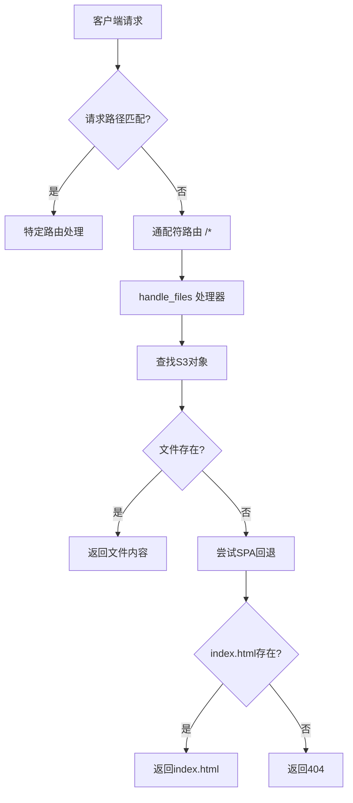
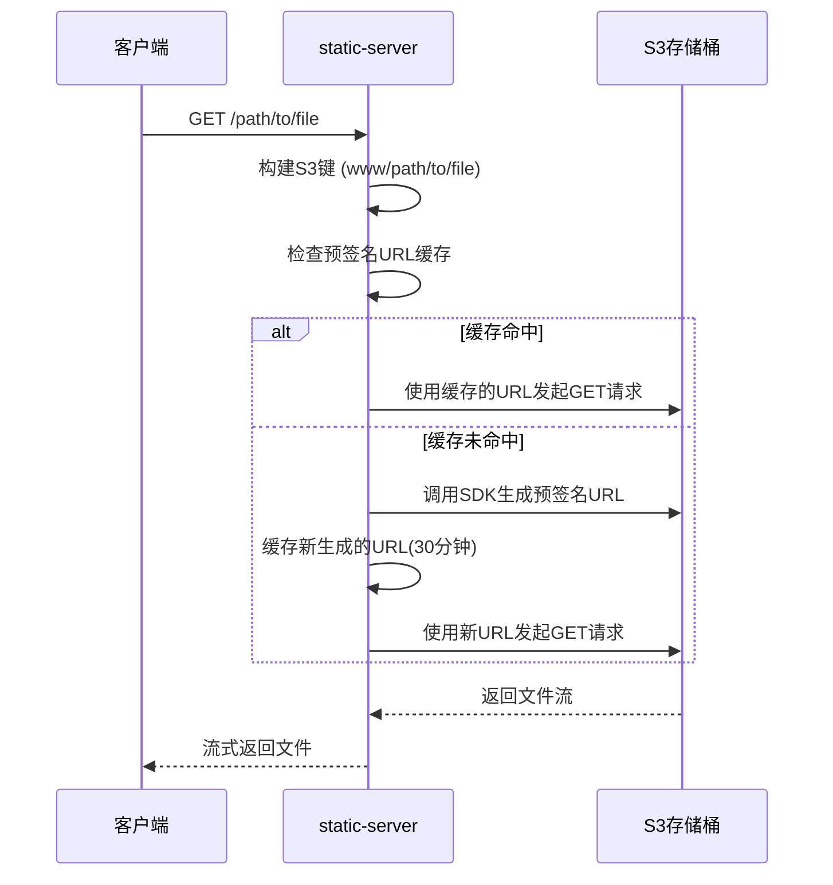

# API参考

<cite>
**本文档中引用的文件**  
- [main.rs](file://src/main.rs)
- [lib.rs](file://src/lib.rs)
- [files.rs](file://src/handlers/files.rs)
- [headers.rs](file://src/utils/headers.rs)
- [path.rs](file://src/utils/path.rs)
- [s3.rs](file://src/utils/s3.rs)
</cite>

## 目录
1. [简介](#简介)
2. [路由端点](#路由端点)
3. [请求处理流程](#请求处理流程)
4. [HTTP方法支持](#http方法支持)
5. [请求头处理规则](#请求头处理规则)
6. [响应状态码](#响应状态码)
7. [响应头](#响应头)
8. [路径解析与S3对象键映射](#路径解析与s3对象键映射)
9. [预签名URL生成逻辑](#预签名url生成逻辑)
10. [流式响应机制](#流式响应机制)
11. [请求/响应示例](#请求响应示例)
12. [公共接口函数](#公共接口函数)

## 简介
`static-server` 是一个基于 Rust 和 Axum 构建的高性能静态文件服务器，能够从 S3 兼容存储桶提供文件服务。它支持单页应用（SPA）路由、智能缓存控制、MIME 类型自动检测和跨域资源共享（CORS）。本 API 参考文档详细描述了服务器暴露的 HTTP 接口，包括路由端点、请求/响应处理规则、状态码、头部信息以及内部公共函数的使用方式，旨在为客户端开发者和维护人员提供全面的技术参考。

## 路由端点
服务器暴露一个通配符路由端点 `/*`，用于处理所有静态文件请求。该端点通过 `fallback` 机制捕获所有未被其他路由匹配的请求，专门用于从 S3 存储桶中提供静态资源。



**Diagram sources**
- [lib.rs](file://src/lib.rs#L56-L57)
- [files.rs](file://src/handlers/files.rs#L243-L292)

**Section sources**
- [lib.rs](file://src/lib.rs#L55-L60)
- [files.rs](file://src/handlers/files.rs#L230-L292)

## 请求处理流程
当客户端发起请求时，服务器遵循以下流程进行处理：
1.  **路径解析**：提取请求的 URI 路径，并去除首尾的斜杠。
2.  **S3键构建**：在解析后的路径前添加 `www` 前缀，形成 S3 对象键。
3.  **直接文件获取**：尝试使用构建的 S3 键从存储桶中获取文件。
4.  **404回退处理**：如果直接获取返回 404，触发 SPA 回退逻辑，查找对应一级目录下的 `index.html`。
5.  **响应生成**：获取到文件后，处理响应头并流式返回内容。

**Section sources**
- [files.rs](file://src/handlers/files.rs#L243-L292)

## HTTP方法支持
服务器支持以下 HTTP 方法：
-   **GET**: 用于获取文件内容。这是最常用的方法，支持流式传输和断点续传。
-   **HEAD**: 用于获取文件的元信息（如 Content-Length, Content-Type），而不传输文件体。这对于客户端预检非常有用。

**Section sources**
- [files.rs](file://src/handlers/files.rs#L254-L266)

## 请求头处理规则
服务器在将请求转发给 S3 时，会根据黑名单规则过滤请求头，以确保安全性和正确性。

### 过滤规则
采用黑名单模式，移除以下类别的请求头，保留所有其他头部：
-   **连接管理**：`Connection`, `Transfer-Encoding`, `Upgrade`
-   **代理相关**：`Proxy-Authorization`
-   **主机信息**：`Host` (由 HTTP 客户端自动设置)
-   **认证信息**：`Authorization`, `Cookie` (认证由 S3 预签名 URL 处理)
-   **源信息**：`Origin`, `Referer` (避免泄露内部信息)
-   **缓存控制**：`Cache-Control`, `Pragma` (由服务器程序统一控制)

此逻辑由 `filter_headers_blacklist` 函数实现。

**Section sources**
- [files.rs](file://src/handlers/files.rs#L50-L77)
- [headers.rs](file://src/utils/headers.rs#L17-L32)

## 响应状态码
服务器返回以下 HTTP 状态码：

| 状态码 | 含义 | 说明 |
| :--- | :--- | :--- |
| `200 OK` | 成功 | 请求已成功处理，文件内容在响应体中。 |
| `404 Not Found` | 未找到 | 请求的文件在 S3 存储桶中不存在，且 SPA 回退也未找到 `index.html`。 |
| `500 Internal Server Error` | 服务器内部错误 | 服务器在处理请求时发生内部错误，例如响应体构建失败。 |
| `502 Bad Gateway` | 网关错误 | 服务器作为网关或代理时，从上游 S3 服务收到无效响应，例如预签名 URL 生成失败或代理请求失败。 |

**Section sources**
- [files.rs](file://src/handlers/files.rs#L125-L126)
- [files.rs](file://src/handlers/files.rs#L135-L136)
- [files.rs](file://src/handlers/files.rs#L162-L165)
- [files.rs](file://src/handlers/files.rs#L276-L277)

## 响应头
服务器会处理并返回以下响应头：

### 复制与过滤
-   **复制规则**：服务器会复制 S3 响应中的大部分头部。
-   **过滤规则**：采用黑名单模式，移除以下头部：
    -   **跨域相关**：`Access-Control-Allow-Origin`, `Access-Control-Allow-Methods` 等。
    -   **缓存控制**：`Cache-Control`, `Expires`, `Pragma`, `Age`。
    此逻辑由 `filter_headers_blacklist` 函数实现，防止 S3 的 CORS 和缓存策略干扰服务器自身的配置。

### 添加的响应头
服务器会根据情况添加以下头部：
-   **`Content-Type`**: 如果 S3 响应中没有 `Content-Type` 头部，服务器会根据文件扩展名自动猜测并添加。
-   **`Cache-Control`**: 对于成功响应（200）且非 HTML 文件的静态资源（如 CSS, JS, 图片），服务器会添加 `public, max-age=2592000`（30天缓存）的头部。

**Section sources**
- [files.rs](file://src/handlers/files.rs#L27-L44)
- [files.rs](file://src/handlers/files.rs#L141-L145)
- [files.rs](file://src/handlers/files.rs#L147-L157)
- [headers.rs](file://src/utils/headers.rs#L17-L32)

## 路径解析与S3对象键映射
请求路径到 S3 对象键的映射遵循以下规则：
1.  **路径提取**：从请求的 URI 中提取路径部分，并使用 `trim_start_matches('/')` 和 `trim_end_matches('/')` 去除首尾的斜杠。
2.  **前缀添加**：在处理后的路径前添加固定的 `www` 前缀。
3.  **S3键形成**：最终的 S3 对象键为 `www/{处理后的路径}`。

例如，对路径 `/css/style.css` 的请求，其 S3 对象键为 `www/css/style.css`。

**Section sources**
- [files.rs](file://src/handlers/files.rs#L244-L251)

## 预签名URL生成逻辑
为了安全地访问 S3 存储桶中的私有对象，服务器使用预签名 URL 机制。

### 生成过程
1.  **调用函数**：`fetch_and_proxy_file` 函数调用 `generate_presigned_url`。
2.  **配置过期时间**：设置预签名 URL 的有效期为 1 小时（3600 秒）。
3.  **生成URL**：使用 AWS SDK 的 `presigned` 方法生成一个包含临时访问凭证的 URL。
4.  **缓存**：生成的预签名 URL 会被缓存 30 分钟（1800 秒），以减少对 AWS SDK 的重复调用，提高性能。



**Diagram sources**
- [files.rs](file://src/handlers/files.rs#L123-L126)
- [s3.rs](file://src/utils/s3.rs#L29-L46)

**Section sources**
- [files.rs](file://src/handlers/files.rs#L115-L167)
- [s3.rs](file://src/utils/s3.rs#L29-L46)

## 流式响应机制
服务器采用流式响应机制来高效处理大文件和实现断点续传。

### 工作原理
-   **流式传输**：服务器不将整个文件加载到内存中，而是通过 `Body::from_stream(response.bytes_stream())` 将 S3 返回的字节流直接作为响应体。
-   **支持Range请求**：由于请求是直接代理到 S3 的，S3 服务原生支持 `Range` 请求头。客户端可以通过发送 `Range: bytes=0-1023` 等请求来获取文件的特定部分，实现断点续传和分片下载。
-   **内存效率**：此机制极大地降低了服务器的内存占用，使其能够高效处理任意大小的文件。

**Section sources**
- [files.rs](file://src/handlers/files.rs#L160-L161)

## 请求/响应示例
### 示例1：成功获取CSS文件
```
GET /css/main.css HTTP/1.1
Host: localhost:3000
```

```
HTTP/1.1 200 OK
Content-Type: text/css
Content-Length: 12345
Cache-Control: public, max-age=2592000
... (其他头部)

/* CSS文件内容 */
```

### 示例2：SPA路由回退
```
GET /app/dashboard HTTP/1.1
Host: localhost:3000
```

```
HTTP/1.1 200 OK
Content-Type: text/html
... (无Cache-Control头部)

<!DOCTYPE html>
<html>... SPA应用入口 ...</html>
```

### 示例3：文件不存在
```
GET /nonexistent.txt HTTP/1.1
Host: localhost:3000
```

```
HTTP/1.1 404 Not Found
```

**Section sources**
- [files.rs](file://src/handlers/files.rs#L254-L292)

## 公共接口函数
以下是 `static-server` 库中可供外部调用的公共接口函数。

### `handle_files`
处理文件请求的主要处理器函数。

**参数**:
-   `State(state)`: `AppState` 类型的应用状态，包含共享的 S3 客户端、HTTP 客户端和存储桶名称。
-   `req`: `Request` 类型的 HTTP 请求对象。

**返回值**:
-   实现 `IntoResponse` trait 的类型，可直接转换为 HTTP 响应。

**异常处理**:
-   内部通过 `Result` 类型处理错误，并转换为相应的 HTTP 状态码（如 404, 500, 502）返回给客户端。

**Section sources**
- [files.rs](file://src/handlers/files.rs#L243-L292)

### `fetch_and_proxy_file`
从 S3 获取文件内容并代理响应的核心函数。

**参数**:
-   `s3_client`: `Arc<S3Client>` 类型的 S3 客户端实例。
-   `http_client`: `Arc<Client>` 类型的 HTTP 客户端实例。
-   `bucket_name`: `&str` 类型的 S3 存储桶名称。
-   `headers`: `&HeaderMap` 类型的原始请求头部。
-   `key`: `&str` 类型的 S3 对象键。

**返回值**:
-   `Result<Response<Body>, (StatusCode, String)>`：成功时返回响应，失败时返回状态码和错误信息。

**异常处理**:
-   捕获 S3 预签名 URL 生成错误，返回 `502 Bad Gateway`。
-   捕获代理请求发送错误，返回 `502 Bad Gateway`。
-   捕获响应体构建错误，返回 `500 Internal Server Error`。

**Section sources**
- [files.rs](file://src/handlers/files.rs#L115-L167)

### `generate_presigned_url`
为 S3 对象生成预签名 URL 的工具函数。

**参数**:
-   `s3_client`: `Arc<Client>` 类型的 S3 客户端实例。
-   `bucket_name`: `&str` 类型的 S3 存储桶名称。
-   `object`: `&str` 类型的 S3 对象键。

**返回值**:
-   `Result<String>`：成功时返回预签名 URL 字符串，失败时返回错误。

**异常处理**:
-   使用 `anyhow::Result` 包装所有可能的错误（如 SDK 调用失败）。

**Section sources**
- [s3.rs](file://src/utils/s3.rs#L29-L46)