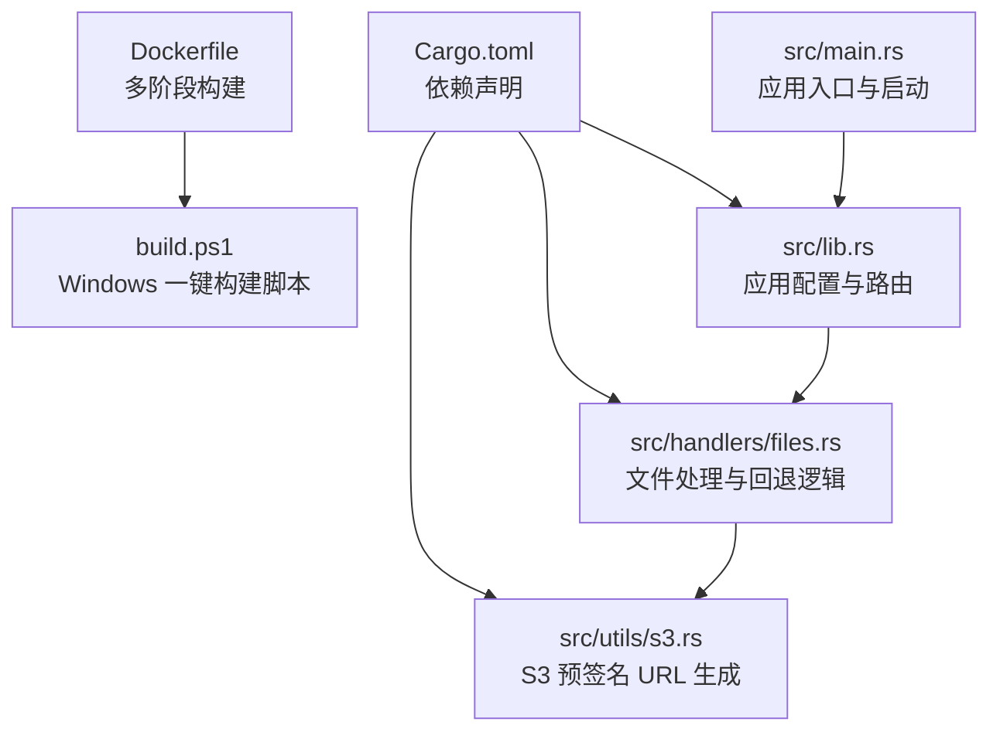
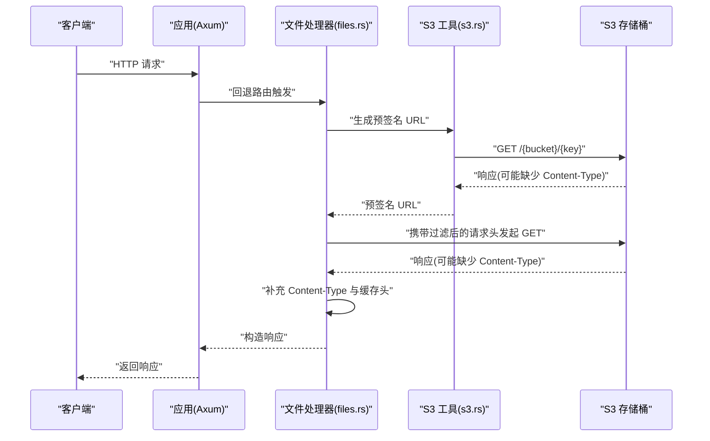
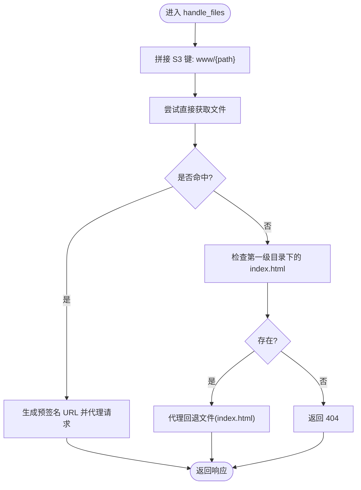
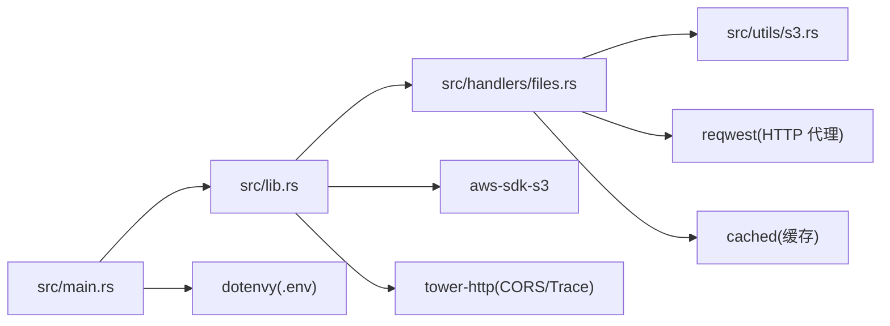

# 快速开始

<cite>
**本文引用的文件**
- [README.md](file://README.md)
- [Cargo.toml](file://Cargo.toml)
- [Dockerfile](file://Dockerfile)
- [build.ps1](file://build.ps1)
- [src/main.rs](file://src/main.rs)
- [src/lib.rs](file://src/lib.rs)
- [src/handlers/files.rs](file://src/handlers/files.rs)
- [src/utils/s3.rs](file://src/utils/s3.rs)
</cite>

## 目录
1. [简介](#简介)
2. [项目结构](#项目结构)
3. [核心组件](#核心组件)
4. [架构总览](#架构总览)
5. [详细组件分析](#详细组件分析)
6. [依赖关系分析](#依赖关系分析)
7. [性能与行为特性](#性能与行为特性)
8. [故障排查指南](#故障排查指南)
9. [结论](#结论)
10. [附录：命令与配置清单](#附录命令与配置清单)

## 简介
本指南面向新手，帮助你快速完成 static-server 的本地开发与 Docker 部署。你将学会：
- 准备本地开发环境（Rust 工具链）
- 配置必要的环境变量（AWS_ACCESS_KEY_ID、AWS_SECRET_ACCESS_KEY、AWS_REGION、AWS_ENDPOINT_URL、AWS_BUCKET）
- 使用 cargo 构建与运行（开发模式与生产模式）
- 使用 Docker 构建镜像并运行可执行文件
- Windows 与类 Unix 系统的差异提示与常见配置错误规避

## 项目结构
该仓库采用标准 Rust 项目布局，核心入口位于 src/main.rs，应用配置与路由在 src/lib.rs 中，文件处理逻辑集中在 src/handlers/files.rs，S3 相关工具在 src/utils/s3.rs。Dockerfile 提供多阶段构建，build.ps1 为 Windows 提供一键构建脚本。

图表来源
- [src/main.rs](file://src/main.rs#L1-L26)
- [src/lib.rs](file://src/lib.rs#L1-L61)
- [src/handlers/files.rs](file://src/handlers/files.rs#L1-L293)
- [src/utils/s3.rs](file://src/utils/s3.rs#L1-L47)
- [Dockerfile](file://Dockerfile#L1-L25)
- [build.ps1](file://build.ps1#L1-L18)
- [Cargo.toml](file://Cargo.toml#L1-L20)

章节来源
- [README.md](file://README.md#L124-L147)
- [Cargo.toml](file://Cargo.toml#L1-L20)

## 核心组件
- 应用入口与启动：在 src/main.rs 中初始化日志、加载环境变量、创建应用并绑定监听地址。
- 应用配置与路由：在 src/lib.rs 中创建 AppState（包含 S3 客户端、HTTP 客户端、存储桶名），配置 CORS 与请求追踪层，并注册回退路由。
- 文件处理与回退：在 src/handlers/files.rs 中实现：
  - 从 S3 获取对象并代理响应（预签名 URL）
  - 根据扩展名决定缓存策略
  - 当请求文件不存在时，按 SPA 规则回退到第一级目录下的 index.html
- S3 工具：在 src/utils/s3.rs 中实现预签名 URL 生成与缓存，提升访问安全性与性能。

章节来源
- [src/main.rs](file://src/main.rs#L1-L26)
- [src/lib.rs](file://src/lib.rs#L1-L61)
- [src/handlers/files.rs](file://src/handlers/files.rs#L1-L293)
- [src/utils/s3.rs](file://src/utils/s3.rs#L1-L47)

## 架构总览
下图展示了从客户端请求到 S3 的完整调用链，包括预签名 URL 生成、请求头过滤、响应头处理与缓存控制。

图表来源
- [src/handlers/files.rs](file://src/handlers/files.rs#L96-L167)
- [src/utils/s3.rs](file://src/utils/s3.rs#L1-L47)

## 详细组件分析

### 组件一：应用入口与启动（src/main.rs）
- 初始化日志与时间格式
- 加载环境变量（dotenvy）
- 调用 app() 构建应用
- 绑定 0.0.0.0:3000 并启动服务

章节来源
- [src/main.rs](file://src/main.rs#L1-L26)

### 组件二：应用配置与路由（src/lib.rs）
- 从环境加载 AWS 配置并创建 S3 客户端
- 读取 AWS_BUCKET 并校验其存在性
- 创建 AppState 并注入到路由
- 注册 TraceLayer 与 CorsLayer

章节来源
- [src/lib.rs](file://src/lib.rs#L1-L61)

### 组件三：文件处理与回退（src/handlers/files.rs）
- 预签名 URL 生成与代理转发
- 请求头与响应头黑名单过滤
- MIME 类型推断与缓存控制
- SPA 回退逻辑：优先检查第一级目录下的 index.html

图表来源
- [src/handlers/files.rs](file://src/handlers/files.rs#L230-L293)

章节来源
- [src/handlers/files.rs](file://src/handlers/files.rs#L1-L293)

### 组件四：S3 工具（src/utils/s3.rs）
- 为 S3 对象生成预签名 URL（默认 1 小时有效期）
- 使用缓存宏缓存预签名 URL，降低重复生成开销

章节来源
- [src/utils/s3.rs](file://src/utils/s3.rs#L1-L47)

## 依赖关系分析
- Rust 版本与工具链：项目使用 2024 版本，Tokio 全功能运行时，Axum 作为 Web 框架。
- AWS SDK：aws-config 与 aws-sdk-s3 用于加载配置与访问 S3。
- HTTP 客户端：reqwest 用于代理 S3 请求。
- 日志与配置：tracing/tracing-subscriber 用于日志输出；dotenvy 用于加载 .env。
- 缓存：cached 用于预签名 URL 与路径查找结果缓存。

图表来源
- [Cargo.toml](file://Cargo.toml#L1-L20)
- [src/main.rs](file://src/main.rs#L1-L26)
- [src/lib.rs](file://src/lib.rs#L1-L61)
- [src/handlers/files.rs](file://src/handlers/files.rs#L1-L293)
- [src/utils/s3.rs](file://src/utils/s3.rs#L1-L47)

章节来源
- [Cargo.toml](file://Cargo.toml#L1-L20)

## 性能与行为特性
- 异步与流式传输：基于 Tokio 的异步架构与流式响应体，降低内存占用。
- 缓存策略：静态资源（如 CSS、JS、图片、字体）缓存 30 天；HTML/HTM 不缓存，避免 SPA 路由问题。
- 预签名 URL：通过预签名 URL 访问 S3，避免暴露密钥，提高安全性。
- 请求头过滤：移除不必要的头部（如 Cookie、Authorization、Origin 等），减少泄露风险并避免冲突。
- 多级缓存：预签名 URL 与路径查找结果缓存，减少 S3 API 调用次数。

章节来源
- [src/handlers/files.rs](file://src/handlers/files.rs#L23-L77)
- [src/handlers/files.rs](file://src/handlers/files.rs#L88-L100)
- [src/utils/s3.rs](file://src/utils/s3.rs#L1-L47)
- [README.md](file://README.md#L81-L112)

## 故障排查指南
- 环境变量缺失
  - 症状：启动时报错提示必须设置 AWS_BUCKET。
  - 解决：在运行前设置 AWS_BUCKET，以及 AWS_ACCESS_KEY_ID、AWS_SECRET_ACCESS_KEY、AWS_REGION、AWS_ENDPOINT_URL（可选）。
- 端口占用
  - 症状：绑定 3000 端口失败。
  - 解决：更换端口或释放占用端口。
- S3 访问失败
  - 症状：代理请求返回 502 或 S3 错误。
  - 解决：确认 S3 凭据、区域、Endpoint 与存储桶名称正确；检查网络连通性与防火墙。
- 预签名 URL 无效
  - 症状：浏览器无法下载文件。
  - 解决：确认预签名 URL 未过期（默认 1 小时），检查 S3 权限与对象可见性。
- Windows 与类 Unix 差异
  - Windows：使用 PowerShell 执行 build.ps1 或直接 docker build。
  - 类 Unix：使用 bash/zsh 执行 docker build；注意路径分隔符与权限问题。

章节来源
- [src/lib.rs](file://src/lib.rs#L43-L53)
- [src/handlers/files.rs](file://src/handlers/files.rs#L115-L167)
- [src/utils/s3.rs](file://src/utils/s3.rs#L29-L47)
- [README.md](file://README.md#L27-L41)
- [README.md](file://README.md#L42-L58)
- [README.md](file://README.md#L60-L79)

## 结论
通过本指南，你可以完成 static-server 的本地开发与 Docker 部署。建议在本地先用开发模式验证环境变量与 S3 连通性，再切换到生产模式与 Docker 部署。遇到问题时，优先检查环境变量、端口占用与 S3 权限。

## 附录：命令与配置清单

- 环境变量（运行前必须设置）
  - AWS_ACCESS_KEY_ID
  - AWS_SECRET_ACCESS_KEY
  - AWS_REGION
  - AWS_ENDPOINT_URL（可选，S3 兼容服务 Endpoint）
  - AWS_BUCKET（必填）

- 本地开发
  - 构建：cargo build
  - 开发模式运行：cargo run
  - 生产模式运行：cargo run --release

- Docker 部署
  - Windows：执行 build.ps1
  - 类 Unix：docker build -t static-server .
  - 运行可执行文件：./target/static-server（开发构建）或 dist/static-server（Docker 构建产物）

章节来源
- [README.md](file://README.md#L27-L41)
- [README.md](file://README.md#L42-L58)
- [README.md](file://README.md#L60-L79)
- [build.ps1](file://build.ps1#L1-L18)
- [Dockerfile](file://Dockerfile#L1-L25)