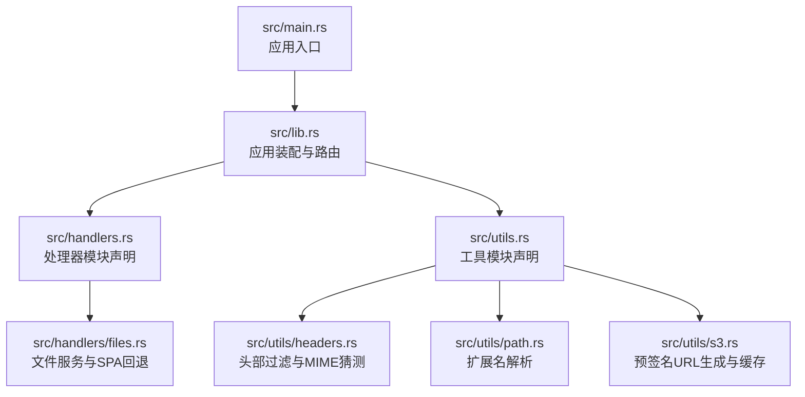
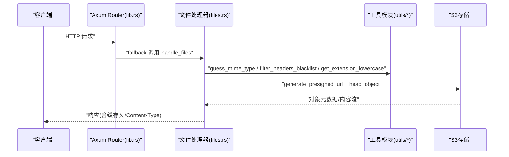
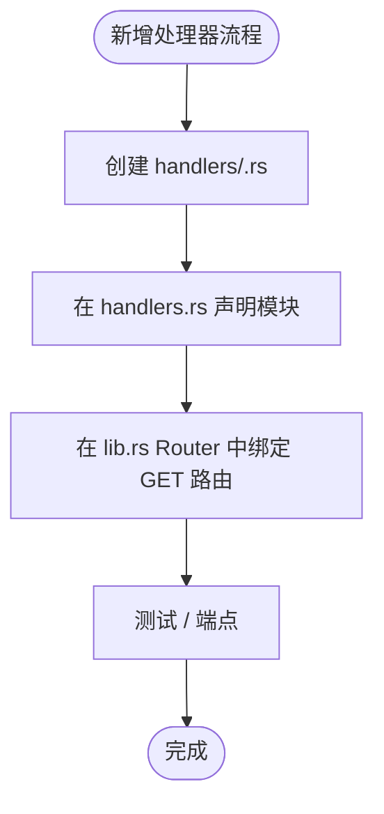
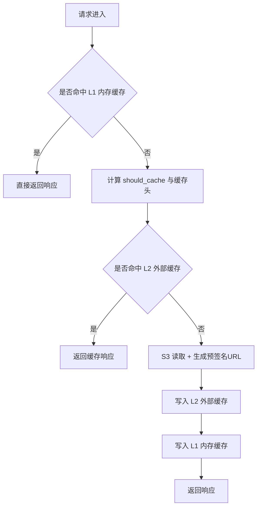
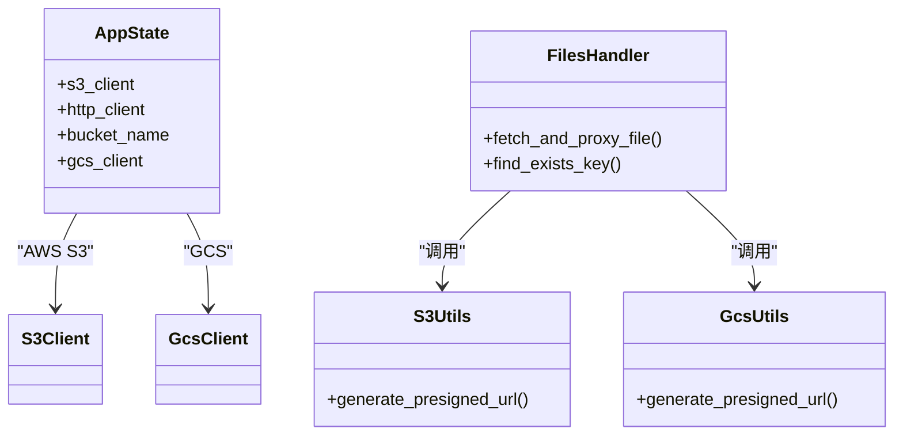
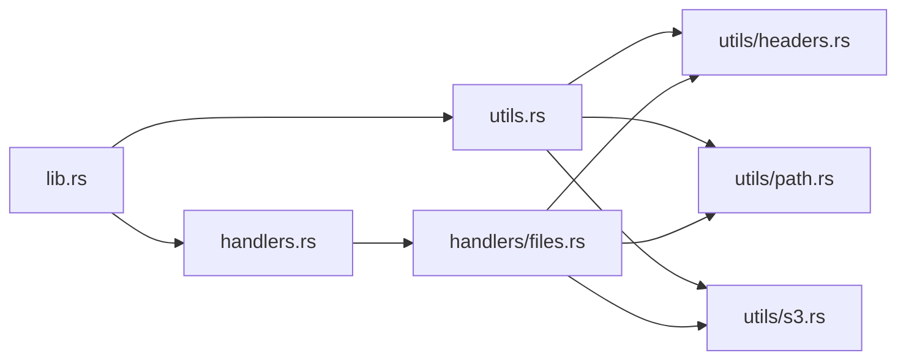

# 扩展与定制

<cite>
**本文引用的文件**
- [src/main.rs](file://src/main.rs)
- [src/lib.rs](file://src/lib.rs)
- [src/handlers.rs](file://src/handlers.rs)
- [src/handlers/files.rs](file://src/handlers/files.rs)
- [src/utils.rs](file://src/utils.rs)
- [src/utils/headers.rs](file://src/utils/headers.rs)
- [src/utils/path.rs](file://src/utils/path.rs)
- [src/utils/s3.rs](file://src/utils/s3.rs)
- [Cargo.toml](file://Cargo.toml)
- [README.md](file://README.md)
</cite>

## 目录
1. [简介](#简介)
2. [项目结构](#项目结构)
3. [核心组件](#核心组件)
4. [架构总览](#架构总览)
5. [详细组件分析](#详细组件分析)
6. [依赖关系分析](#依赖关系分析)
7. [性能考量](#性能考量)
8. [故障排查指南](#故障排查指南)
9. [结论](#结论)
10. [附录](#附录)

## 简介
本指南面向希望对 static-server 进行功能扩展与定制化的开发者，重点说明 handlers.rs 与 utils.rs 作为模块声明文件的作用，演示如何新增请求处理器（如新增 /metrics 或 /health 端点）或工具函数（如自定义日志格式化），并通过新增 handlers 子模块（如 metrics.rs）并在 handlers.rs 中声明该模块的方式实现新功能。同时探讨如何扩展缓存策略、修改 MIME 类型映射规则或集成其他存储后端（如 Google Cloud Storage），并给出代码组织的最佳实践，确保新增代码符合现有架构风格，鼓励模块化设计，避免修改核心逻辑，提升可维护性。

## 项目结构
该项目采用清晰的分层与模块化组织：
- 入口与应用装配：main.rs 负责初始化日志与启动服务；lib.rs 负责创建并配置 Axum Router、应用状态与中间件。
- 处理器模块：handlers.rs 作为模块声明文件，集中导出各处理器子模块；handlers/files.rs 实现文件服务与 SPA 回退逻辑。
- 工具模块：utils.rs 作为模块声明文件，集中导出 headers/path/s3 等工具子模块。
- 依赖与配置：Cargo.toml 定义依赖；README.md 提供环境变量、部署与功能说明。

图表来源
- [src/main.rs](file://src/main.rs#L1-L26)
- [src/lib.rs](file://src/lib.rs#L1-L61)
- [src/handlers.rs](file://src/handlers.rs#L1-L9)
- [src/handlers/files.rs](file://src/handlers/files.rs#L1-L293)
- [src/utils.rs](file://src/utils.rs#L1-L11)
- [src/utils/headers.rs](file://src/utils/headers.rs#L1-L47)
- [src/utils/path.rs](file://src/utils/path.rs#L1-L30)
- [src/utils/s3.rs](file://src/utils/s3.rs#L1-L47)

章节来源
- [src/main.rs](file://src/main.rs#L1-L26)
- [src/lib.rs](file://src/lib.rs#L1-L61)
- [src/handlers.rs](file://src/handlers.rs#L1-L9)
- [src/utils.rs](file://src/utils.rs#L1-L11)
- [README.md](file://README.md#L126-L147)

## 核心组件
- 应用状态 AppState：封装 S3 客户端、HTTP 客户端与存储桶名称，通过 with_state 注入到 Router。
- 路由与中间件：lib.rs 中创建 Router 并注册 TraceLayer 与 CORS 中间件，fallback 到文件处理器。
- 文件处理器：handlers/files.rs 实现文件查找、预签名 URL 生成、代理转发、头部过滤、MIME 类型猜测与缓存控制。
- 工具函数：utils/headers.rs 提供头部黑名单过滤与 MIME 类型猜测；utils/path.rs 提供扩展名解析；utils/s3.rs 提供预签名 URL 生成与缓存。

章节来源
- [src/lib.rs](file://src/lib.rs#L19-L60)
- [src/handlers/files.rs](file://src/handlers/files.rs#L1-L293)
- [src/utils/headers.rs](file://src/utils/headers.rs#L1-L47)
- [src/utils/path.rs](file://src/utils/path.rs#L1-L30)
- [src/utils/s3.rs](file://src/utils/s3.rs#L1-L47)

## 架构总览
下图展示了从请求进入至响应返回的关键流程，以及与工具模块的交互关系。

图表来源
- [src/lib.rs](file://src/lib.rs#L55-L60)
- [src/handlers/files.rs](file://src/handlers/files.rs#L112-L167)
- [src/utils/headers.rs](file://src/utils/headers.rs#L1-L47)
- [src/utils/s3.rs](file://src/utils/s3.rs#L1-L47)

## 详细组件分析

### 新增请求处理器：/metrics 或 /health 端点
目标：在不修改核心逻辑的前提下，新增独立的监控或健康检查端点。

实现步骤
1. 新建 handlers 子模块文件
   - 在 src/handlers 下新增 metrics.rs（或 health.rs），实现对应处理器函数与路由绑定。
   - 保持处理器函数签名与现有风格一致，使用 State 提取 AppState，返回实现 IntoResponse 的类型。
2. 在 handlers.rs 中声明新模块
   - 在 handlers.rs 中添加 pub mod metrics;（或 pub mod health;）。
3. 在 lib.rs 中注册路由
   - 在 Router 上新增 get(...) 路由绑定，指向新处理器函数。
4. 可选：复用工具模块
   - 如需统一日志格式，可在新处理器中使用 tracing 日志接口，或在 lib.rs 中增加 TraceLayer 层以统一记录。

章节来源
- [src/handlers.rs](file://src/handlers.rs#L1-L9)
- [src/lib.rs](file://src/lib.rs#L55-L60)
- [src/handlers/files.rs](file://src/handlers/files.rs#L230-L293)

### 新增工具函数：自定义日志格式化
目标：在不改动核心业务逻辑的情况下，增强日志输出能力。

实现步骤
1. 在 utils.rs 中声明新模块
   - 在 utils.rs 中添加 pub mod logging;（或在 headers.rs 中扩展）。
2. 在 utils/ 下新增对应文件
   - 新增 utils/logging.rs，提供日志格式化工具函数（如时间格式、上下文字段注入等）。
3. 在需要的地方调用
   - 在新处理器或现有处理器中引入并使用该工具，保持与现有 tracing 使用方式一致。
4. 注意事项
   - 避免在核心业务函数中直接拼接日志字符串，优先通过 tracing 接口传递结构化字段。

章节来源
- [src/utils.rs](file://src/utils.rs#L1-L11)
- [src/main.rs](file://src/main.rs#L1-L26)

### 扩展缓存策略
当前缓存策略要点
- 静态资源（除 html/htm）默认 30 天缓存。
- 路径查找结果缓存 120 秒，预签名 URL 生成缓存 1800 秒。
- 可通过修改 should_cache 与 NO_CACHE_EXTS 来调整缓存范围。

扩展建议
- 新增按文件类型或路径前缀的差异化缓存策略
  - 在 utils/path.rs 中扩展扩展名判断逻辑，或将策略参数化传入 should_cache。
- 新增缓存头策略
  - 在 handlers/files.rs 中新增常量或参数，控制不同资源的 Cache-Control 值。
- 新增缓存后端
  - 可引入外部缓存（如 Redis/Memcached）作为 L2 缓存，结合现有 L1 内存缓存（cached 宏）。
  - 在 AppState 中注入缓存客户端，并在文件处理器中按需查询/写入。

章节来源
- [src/handlers/files.rs](file://src/handlers/files.rs#L71-L122)
- [src/handlers/files.rs](file://src/handlers/files.rs#L185-L231)
- [src/utils/s3.rs](file://src/utils/s3.rs#L1-L47)

### 修改 MIME 类型映射规则
当前 MIME 类型检测
- 当 S3 响应缺少 Content-Type 时，使用 guess_mime_type 根据扩展名猜测。
- guess_mime_type 基于 mime_guess，支持数百种常见类型。

定制建议
- 扩展映射规则
  - 在 utils/headers.rs 中新增自定义映射表（如针对特定扩展名或路径前缀），在 guess_mime_type 中优先匹配。
- 保持向后兼容
  - 若 S3 已提供 Content-Type，优先保留原值，仅在缺失时进行补充。

章节来源
- [src/utils/headers.rs](file://src/utils/headers.rs#L1-L47)
- [src/handlers/files.rs](file://src/handlers/files.rs#L148-L157)

### 集成其他存储后端（如 Google Cloud Storage）
当前存储后端
- 使用 AWS SDK for Rust 的 S3 客户端与预签名 URL 机制。

集成思路
- 引入新存储客户端
  - 在 utils/s3.rs 中抽象出通用的“预签名 URL 生成”接口，或新增 gcs.rs 实现 GCS 的预签名逻辑。
  - 在 AppState 中新增存储客户端字段（如 GcsClient），并在 lib.rs 中按需初始化。
- 统一接口
  - 在 handlers/files.rs 中通过 trait 或枚举选择具体存储实现，避免分支散落各处。
- 配置与环境变量
  - 通过环境变量区分存储类型与凭证，保证与现有 AWS 配置解耦。

图表来源
- [src/lib.rs](file://src/lib.rs#L19-L60)
- [src/handlers/files.rs](file://src/handlers/files.rs#L112-L167)
- [src/utils/s3.rs](file://src/utils/s3.rs#L1-L47)

## 依赖关系分析
- 模块耦合与内聚
  - handlers.rs 与 utils.rs 作为声明文件，降低上层模块对具体实现的感知，提高内聚性。
  - 文件处理器与工具模块之间为单向依赖，避免循环引用。
- 外部依赖
  - AWS SDK for Rust、Reqwest、cached、mime_guess、tower-http、axum 等。
- 可能的循环依赖
  - 当前结构清晰，未见循环导入；新增模块时需遵循“声明文件集中导出”的原则。

图表来源
- [src/lib.rs](file://src/lib.rs#L1-L61)
- [src/handlers.rs](file://src/handlers.rs#L1-L9)
- [src/utils.rs](file://src/utils.rs#L1-L11)
- [src/handlers/files.rs](file://src/handlers/files.rs#L1-L293)
- [src/utils/headers.rs](file://src/utils/headers.rs#L1-L47)
- [src/utils/path.rs](file://src/utils/path.rs#L1-L30)
- [src/utils/s3.rs](file://src/utils/s3.rs#L1-L47)

章节来源
- [Cargo.toml](file://Cargo.toml#L1-L20)
- [src/lib.rs](file://src/lib.rs#L1-L61)

## 性能考量
- 缓存策略
  - L1 内存缓存（cached 宏）：预签名 URL 与路径查找均有缓存，减少 S3 API 调用。
  - L2 外部缓存：可引入 Redis/Memcached 作为热点数据缓存，进一步降低延迟。
- 流式传输
  - 使用 bytes_stream 进行响应体流式传输，降低内存占用。
- 头部过滤
  - 采用黑名单模式过滤敏感或冗余头部，减少不必要的网络开销。
- 中间件
  - TraceLayer 与 CORS 中间件为可观测性与跨域提供基础保障。

章节来源
- [src/handlers/files.rs](file://src/handlers/files.rs#L112-L167)
- [src/utils/headers.rs](file://src/utils/headers.rs#L1-L47)
- [README.md](file://README.md#L81-L112)

## 故障排查指南
- 常见错误与定位
  - S3 相关错误：预签名 URL 生成失败或代理请求失败，返回 BAD_GATEWAY；检查 AWS 凭证、端点与存储桶名称。
  - 404 未命中：确认路径前缀与 www 前缀约定；检查 SPA 回退逻辑是否生效。
  - MIME 类型缺失：若 S3 未设置 Content-Type，系统会基于扩展名猜测；如仍缺失，检查扩展名与映射规则。
- 日志与追踪
  - 使用 tracing_subscriber 输出结构化日志，结合 TraceLayer 记录请求链路。
- 环境变量
  - 确认 AWS_ACCESS_KEY_ID、AWS_SECRET_ACCESS_KEY、AWS_REGION、AWS_ENDPOINT_URL、AWS_BUCKET 等已正确设置。

章节来源
- [src/handlers/files.rs](file://src/handlers/files.rs#L112-L167)
- [src/main.rs](file://src/main.rs#L1-L26)
- [README.md](file://README.md#L27-L41)

## 结论
通过模块声明文件 handlers.rs 与 utils.rs 的集中导出，static-server 形成了清晰的模块边界与职责划分。新增端点与工具函数应遵循“新增子模块 + 在声明文件中导出 + 在 lib.rs 中注册路由”的模式，避免侵入核心逻辑。缓存策略、MIME 类型映射与存储后端的扩展均可在工具模块与处理器中以参数化或抽象接口的方式实现，既保证灵活性又维持架构一致性。建议在新增功能时优先考虑可插拔与可配置的设计，持续提升系统的可维护性与可演进性。

## 附录
- 新增端点最佳实践
  - 在 handlers.rs 中声明新模块；在 lib.rs 中注册路由；在新处理器中使用 State 提取 AppState；返回实现 IntoResponse 的类型。
- 新增工具函数最佳实践
  - 在 utils.rs 中声明模块；在 utils/ 下新增对应文件；在需要的处理器中按需引入；保持与 tracing 的一致使用方式。
- 缓存与 MIME 映射扩展参考位置
  - 缓存策略：should_cache、NO_CACHE_EXTS、find_exists_key 缓存配置、generate_presigned_url 缓存配置。
  - MIME 映射：guess_mime_type、get_extension_lowercase。
- 存储后端扩展参考位置
  - S3 客户端初始化与 AppState；预签名 URL 生成与缓存；文件代理与头部过滤。

章节来源
- [src/handlers.rs](file://src/handlers.rs#L1-L9)
- [src/lib.rs](file://src/lib.rs#L19-L60)
- [src/handlers/files.rs](file://src/handlers/files.rs#L71-L122)
- [src/handlers/files.rs](file://src/handlers/files.rs#L185-L231)
- [src/utils/headers.rs](file://src/utils/headers.rs#L1-L47)
- [src/utils/path.rs](file://src/utils/path.rs#L1-L30)
- [src/utils/s3.rs](file://src/utils/s3.rs#L1-L47)