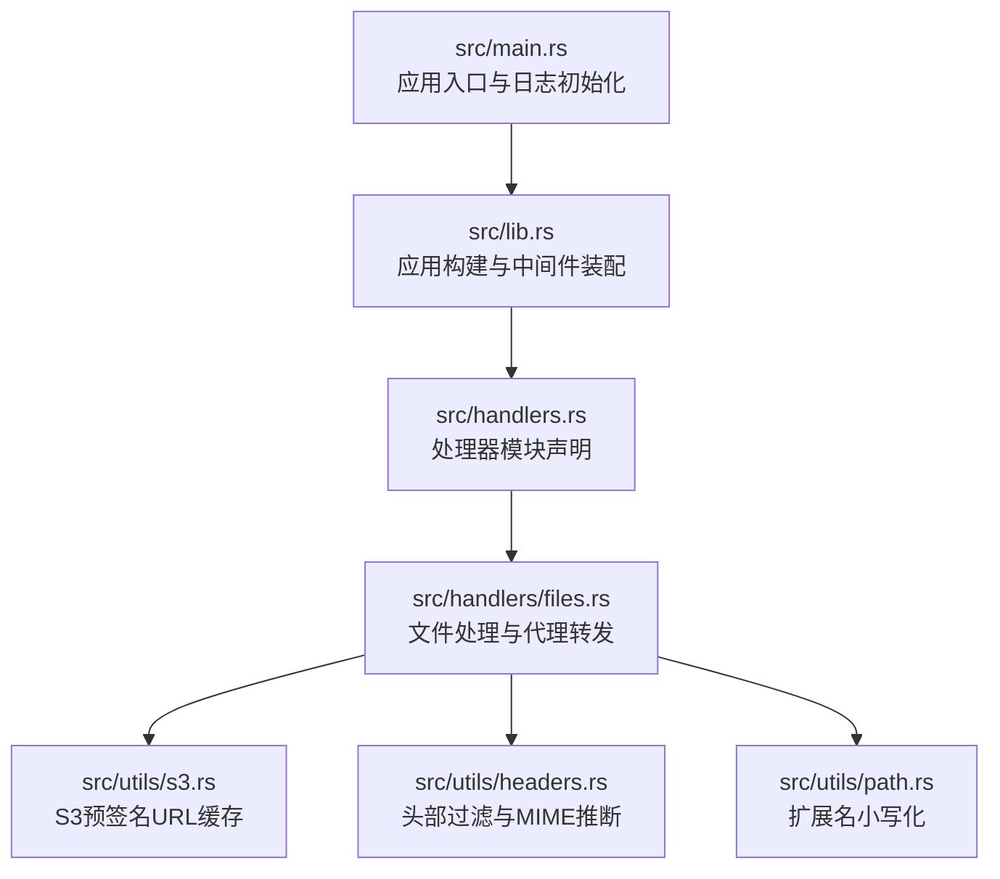
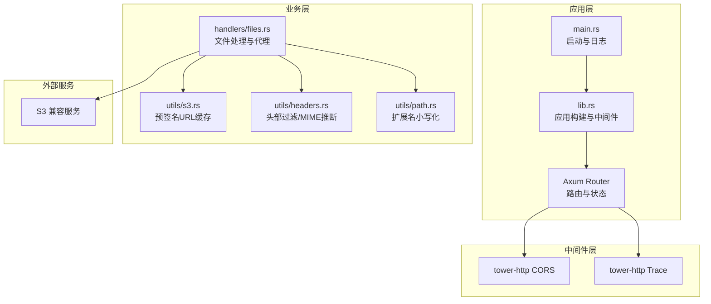
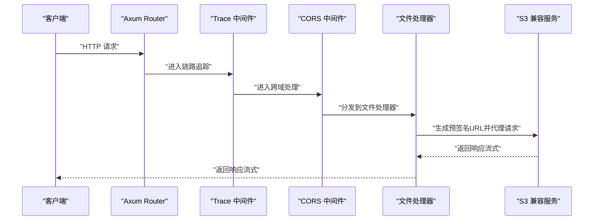
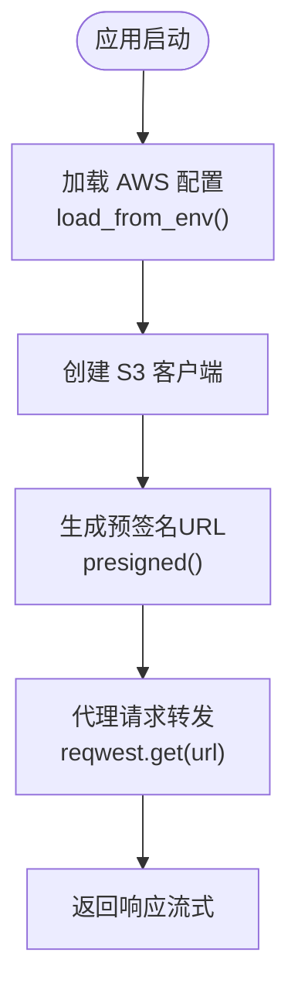
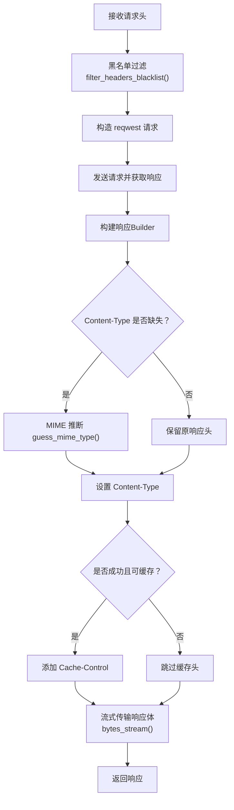
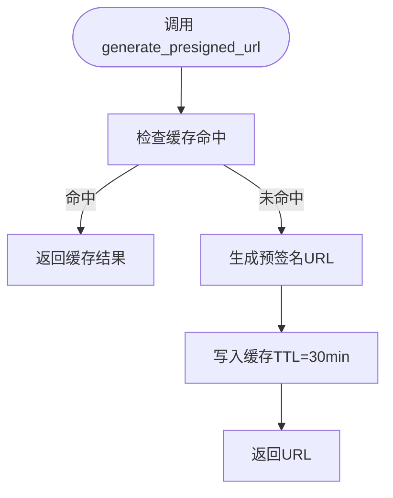
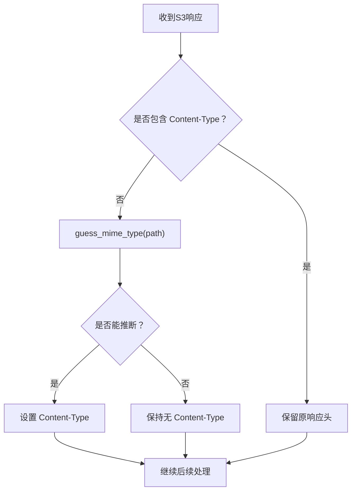
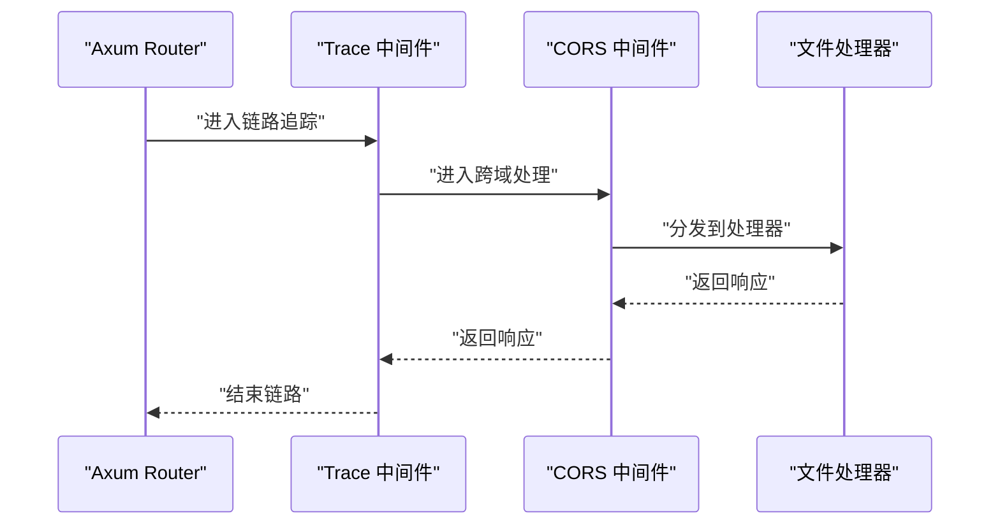
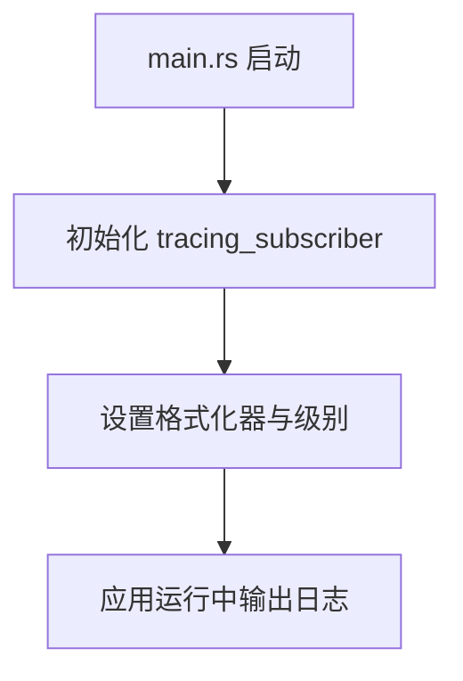
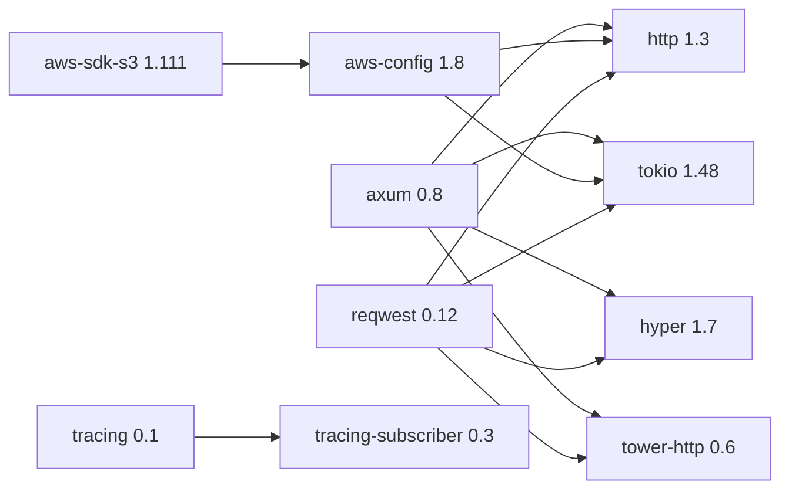

# 技术栈与依赖

<cite>
**本文引用的文件**
- [Cargo.toml](file://Cargo.toml)
- [Cargo.lock](file://Cargo.lock)
- [src/main.rs](file://src/main.rs)
- [src/lib.rs](file://src/lib.rs)
- [src/handlers.rs](file://src/handlers.rs)
- [src/handlers/files.rs](file://src/handlers/files.rs)
- [src/utils/s3.rs](file://src/utils/s3.rs)
- [src/utils/headers.rs](file://src/utils/headers.rs)
- [src/utils/path.rs](file://src/utils/path.rs)
- [README.md](file://README.md)
</cite>

## 目录
1. [简介](#简介)
2. [项目结构](#项目结构)
3. [核心组件](#核心组件)
4. [架构总览](#架构总览)
5. [详细组件分析](#详细组件分析)
6. [依赖关系分析](#依赖关系分析)
7. [性能考量](#性能考量)
8. [故障排查指南](#故障排查指南)
9. [结论](#结论)
10. [附录](#附录)

## 简介
本文件围绕 static-server 的技术栈与依赖展开，基于 Cargo.toml 中的依赖项进行系统化梳理。重点覆盖：
- Axum 作为异步 Web 框架在路由与中间件集成中的角色
- aws-sdk-s3 与 aws-config 如何实现与 S3 兼容服务的安全通信
- reqwest 在代理请求转发中的流式处理能力
- cached 库通过方法级缓存提升路径查找性能
- mime_guess 在 Content-Type 缺失时的 MIME 类型自动推断机制
- tower-http 提供的 CORS 与 Trace 中间件如何增强安全性与可观测性
- tracing 与 tracing-subscriber 在日志记录方面的应用
- 版本兼容性与配置注意事项，帮助理解系统构建基础

## 项目结构
项目采用按功能模块划分的组织方式，核心入口位于 src/main.rs，应用配置与路由在 src/lib.rs，业务处理集中在 src/handlers/files.rs，工具函数分布在 src/utils 下。

图表来源
- [src/main.rs](file://src/main.rs#L1-L26)
- [src/lib.rs](file://src/lib.rs#L1-L61)
- [src/handlers.rs](file://src/handlers.rs#L1-L9)
- [src/handlers/files.rs](file://src/handlers/files.rs#L1-L293)
- [src/utils/s3.rs](file://src/utils/s3.rs#L1-L47)
- [src/utils/headers.rs](file://src/utils/headers.rs#L1-L47)
- [src/utils/path.rs](file://src/utils/path.rs#L1-L30)

章节来源
- [src/main.rs](file://src/main.rs#L1-L26)
- [src/lib.rs](file://src/lib.rs#L1-L61)
- [src/handlers.rs](file://src/handlers.rs#L1-L9)
- [src/handlers/files.rs](file://src/handlers/files.rs#L1-L293)
- [src/utils/s3.rs](file://src/utils/s3.rs#L1-L47)
- [src/utils/headers.rs](file://src/utils/headers.rs#L1-L47)
- [src/utils/path.rs](file://src/utils/path.rs#L1-L30)

## 核心组件
- 异步 Web 框架：Axum（0.8），启用 macros 特性，提供高效路由与中间件集成
- 中间件层：tower-http（0.6），启用 cors 与 trace，分别提供 CORS 与链路追踪
- S3 客户端：aws-sdk-s3（1.111）与 aws-config（1.8），后者启用 rustls 与 behavior-version-latest，确保与 S3 兼容服务的安全通信
- HTTP 客户端：reqwest（0.12），启用 stream 特性，支持响应体流式传输
- 缓存：cached（0.56），启用 async 特性，结合方法级缓存提升路径查找性能
- MIME 推断：mime_guess（2.0），在 Content-Type 缺失时自动推断
- 日志：tracing（0.1）、tracing-subscriber（0.3），配合本地时间与时长格式化
- 运行时：Tokio（1.48），启用 full 特性，提供异步运行时
- 配置：dotenvy（0.15），加载环境变量

章节来源
- [Cargo.toml](file://Cargo.toml#L1-L20)
- [src/lib.rs](file://src/lib.rs#L1-L61)
- [src/main.rs](file://src/main.rs#L1-L26)

## 架构总览
整体架构围绕“请求进入 -> 中间件处理 -> 路由分发 -> 业务处理 -> S3 代理 -> 响应返回”的流程展开。Axum 负责路由与中间件，tower-http 提供 CORS 与 Trace，业务逻辑在文件处理器中完成，S3 交互通过 aws-sdk-s3 与预签名 URL 实现，代理转发通过 reqwest 流式传输，缓存与 MIME 推断分别由 cached 与 mime_guess 提供。

图表来源
- [src/main.rs](file://src/main.rs#L1-L26)
- [src/lib.rs](file://src/lib.rs#L1-L61)
- [src/handlers/files.rs](file://src/handlers/files.rs#L1-L293)
- [src/utils/s3.rs](file://src/utils/s3.rs#L1-L47)
- [src/utils/headers.rs](file://src/utils/headers.rs#L1-L47)
- [src/utils/path.rs](file://src/utils/path.rs#L1-L30)

## 详细组件分析

### Axum：异步 Web 框架与中间件集成
- 角色定位
  - 作为应用入口与路由核心，负责请求生命周期管理与中间件装配
  - 在应用构建函数中注册 Trace 与 CORS 中间件，统一增强可观测性与跨域能力
- 路由处理
  - 使用 fallback 统一处理所有未匹配请求，交由文件处理器进行 SPA 回退与代理转发
- 中间件集成
  - TraceLayer::new_for_http() 提供 HTTP 请求/响应的链路追踪
  - CorsLayer::permissive() 提供宽松的跨域策略，便于开发与测试

图表来源
- [src/lib.rs](file://src/lib.rs#L30-L61)
- [src/handlers/files.rs](file://src/handlers/files.rs#L112-L167)

章节来源
- [src/lib.rs](file://src/lib.rs#L1-L61)
- [src/handlers/files.rs](file://src/handlers/files.rs#L1-L293)

### AWS SDK 与 AWS Config：S3 兼容服务的安全通信
- aws-config
  - 通过 load_from_env() 从环境变量加载配置，启用 rustls 与 behavior-version-latest，确保与 S3 兼容服务的安全通信
  - 支持 AWS_ACCESS_KEY_ID、AWS_SECRET_ACCESS_KEY、AWS_REGION、AWS_ENDPOINT_URL 等标准环境变量
- aws-sdk-s3
  - 使用 Client::new(&config) 创建 S3 客户端实例，用于生成预签名 URL 与 HEAD/OBJECT 操作
  - 预签名 URL 有效期设置为 1 小时，避免长期暴露凭证

图表来源
- [src/lib.rs](file://src/lib.rs#L30-L53)
- [src/utils/s3.rs](file://src/utils/s3.rs#L1-L47)
- [src/handlers/files.rs](file://src/handlers/files.rs#L112-L167)

章节来源
- [src/lib.rs](file://src/lib.rs#L30-L53)
- [src/utils/s3.rs](file://src/utils/s3.rs#L1-L47)
- [README.md](file://README.md#L27-L40)

### Reqwest：代理请求转发与流式处理
- 代理转发
  - 文件处理器通过 reqwest 客户端发起 GET 请求至预签名 URL，使用黑名单模式过滤请求头，避免泄露敏感信息与不必要的头部
- 流式处理
  - 使用 bytes_stream() 将远端响应体转为流，再通过 Body::from_stream() 构建响应体，实现大文件的低内存占用传输
- 头部过滤
  - FORWARD_BLOCKED_HEADERS 黑名单移除 CONNECTION、TRANSFER_ENCODING、UPGRADE、AUTHORIZATION、COOKIE、ORIGIN、REFERER 等头部，确保安全与一致性

图表来源
- [src/handlers/files.rs](file://src/handlers/files.rs#L38-L77)
- [src/handlers/files.rs](file://src/handlers/files.rs#L112-L167)
- [src/utils/headers.rs](file://src/utils/headers.rs#L1-L47)
- [src/utils/path.rs](file://src/utils/path.rs#L1-L30)

章节来源
- [src/handlers/files.rs](file://src/handlers/files.rs#L38-L77)
- [src/handlers/files.rs](file://src/handlers/files.rs#L112-L167)
- [src/utils/headers.rs](file://src/utils/headers.rs#L1-L47)
- [src/utils/path.rs](file://src/utils/path.rs#L1-L30)

### Cached：方法级缓存提升路径查找性能
- 预签名 URL 缓存
  - generate_presigned_url 使用 cached 宏缓存，键为 “bucket_name:object”，最大容量 8192，过期时间 30 分钟，缓存 Result 类型，显著降低重复请求的成本
- 路径查找缓存
  - find_exists_key 使用 cached 宏缓存，键为 “bucket_name:pathname”，最大容量 32768，过期时间 120 秒，减少 S3 API 调用频率，提升 SPA 回退逻辑性能

图表来源
- [src/utils/s3.rs](file://src/utils/s3.rs#L1-L47)
- [src/handlers/files.rs](file://src/handlers/files.rs#L192-L228)

章节来源
- [src/utils/s3.rs](file://src/utils/s3.rs#L1-L47)
- [src/handlers/files.rs](file://src/handlers/files.rs#L192-L228)

### MIME Guess：Content-Type 缺失时的自动推断
- 机制说明
  - 当 S3 响应缺少 Content-Type 时，使用 mime_guess::MimeGuess::from_path() 基于文件扩展名推断 MIME 类型
  - 仅在缺失时补充，保留原有 Content-Type，保证向后兼容
- 适用范围
  - 支持数百种常见文件类型，涵盖 CSS、JS、PNG、JSON 等，确保浏览器正确处理与渲染

图表来源
- [src/handlers/files.rs](file://src/handlers/files.rs#L148-L157)
- [src/utils/headers.rs](file://src/utils/headers.rs#L34-L47)

章节来源
- [src/handlers/files.rs](file://src/handlers/files.rs#L148-L157)
- [src/utils/headers.rs](file://src/utils/headers.rs#L34-L47)

### Tower HTTP：CORS 与 Trace 中间件
- CORS
  - 在应用构建时启用 CorsLayer::permissive()，提供宽松的跨域策略，便于前端开发与多域名访问
- Trace
  - 启用 TraceLayer::new_for_http()，对每个请求/响应进行链路追踪，便于问题定位与性能分析

图表来源
- [src/lib.rs](file://src/lib.rs#L55-L61)

章节来源
- [src/lib.rs](file://src/lib.rs#L55-L61)

### 日志：Tracing 与 Tracing Subscriber
- 日志初始化
  - 在 main.rs 中通过 tracing_subscriber::fmt() 初始化日志输出，启用 pretty、本地时间与时长格式化、最大级别 DEBUG
- 应用集成
  - 在应用启动与运行过程中使用 tracing::info! 等接口输出运行信息，便于运维与排障

图表来源
- [src/main.rs](file://src/main.rs#L7-L16)

章节来源
- [src/main.rs](file://src/main.rs#L7-L16)

## 依赖关系分析
- 直接依赖
  - Axum 依赖 hyper、tokio、tower、tower-http 等
  - aws-sdk-s3 依赖 aws-config 与 aws-types
  - reqwest 依赖 hyper、tokio、tower、tower-http 等
  - tracing-subscriber 依赖 tracing
- 版本兼容性
  - Cargo.lock 显示各依赖的精确版本与传递依赖，确保编译期确定性
  - 关键兼容点：http（1.3）、hyper（1.7）、tokio（1.48）、tower-http（0.6）等版本组合在锁文件中得到验证

图表来源
- [Cargo.lock](file://Cargo.lock#L477-L540)
- [Cargo.lock](file://Cargo.lock#L1341-L1403)
- [Cargo.lock](file://Cargo.lock#L2055-L2118)
- [Cargo.toml](file://Cargo.toml#L1-L20)

章节来源
- [Cargo.toml](file://Cargo.toml#L1-L20)
- [Cargo.lock](file://Cargo.lock#L477-L540)
- [Cargo.lock](file://Cargo.lock#L1341-L1403)
- [Cargo.lock](file://Cargo.lock#L2055-L2118)

## 性能考量
- 流式传输
  - 通过 reqwest 的 bytes_stream 与 Axum Body::from_stream 实现响应体流式传输，降低内存峰值，适合大文件下载
- 缓存策略
  - 预签名 URL 缓存（TTL=30min，容量 8192）与路径查找缓存（TTL=120s，容量 32768）显著减少 S3 API 调用
  - 静态资源（CSS、JS、图片、字体）设置 30 天缓存，HTML/HTM 不缓存，平衡 SPA 路由与更新需求
- 连接与并发
  - Tokio full 特性提供完整异步运行时，Axum 基于 hyper 与 tower，具备良好的并发与连接池能力

章节来源
- [src/handlers/files.rs](file://src/handlers/files.rs#L148-L167)
- [src/utils/s3.rs](file://src/utils/s3.rs#L1-L47)
- [README.md](file://README.md#L81-L112)

## 故障排查指南
- S3 访问失败
  - 检查 AWS_ACCESS_KEY_ID、AWS_SECRET_ACCESS_KEY、AWS_REGION、AWS_ENDPOINT_URL、AWS_BUCKET 等环境变量是否正确设置
  - 确认预签名 URL 生成与请求转发过程中的错误返回码（如 BAD_GATEWAY）
- CORS 问题
  - 若跨域受限，检查 CORS 中间件配置；当前为 permissive 策略，建议在生产环境调整为更严格的策略
- MIME 类型异常
  - 若 Content-Type 缺失导致浏览器渲染异常，确认 mime_guess 推断逻辑是否生效，或在 S3 上设置正确的 Content-Type
- 日志定位
  - 使用 DEBUG 级别日志输出，结合 Trace 中间件查看请求链路，快速定位问题

章节来源
- [src/lib.rs](file://src/lib.rs#L44-L53)
- [src/handlers/files.rs](file://src/handlers/files.rs#L112-L167)
- [src/main.rs](file://src/main.rs#L7-L16)
- [README.md](file://README.md#L27-L40)

## 结论
static-server 基于现代 Rust 生态构建，以 Axum 为核心，结合 tower-http、aws-sdk-s3、reqwest、cached、mime_guess、tracing 等库，形成一套高性能、可观测、安全可控的静态文件服务方案。通过预签名 URL、流式传输与两级缓存，有效平衡了安全性与性能；通过 CORS 与 Trace 中间件增强了跨域支持与可观测性；通过清晰的模块化设计与环境变量配置，便于在不同 S3 兼容服务上部署与维护。

## 附录
- 环境变量清单
  - AWS_ACCESS_KEY_ID、AWS_SECRET_ACCESS_KEY、AWS_REGION、AWS_ENDPOINT_URL、AWS_BUCKET
- 版本兼容性要点
  - http（1.3）、hyper（1.7）、tokio（1.48）、tower-http（0.6）、axum（0.8）、aws-sdk-s3（1.111）、reqwest（0.12）、cached（0.56）、mime_guess（2.0）、tracing（0.1）、tracing-subscriber（0.3）

章节来源
- [README.md](file://README.md#L27-L40)
- [Cargo.toml](file://Cargo.toml#L1-L20)
- [Cargo.lock](file://Cargo.lock#L477-L540)
- [Cargo.lock](file://Cargo.lock#L1341-L1403)
- [Cargo.lock](file://Cargo.lock#L2055-L2118)