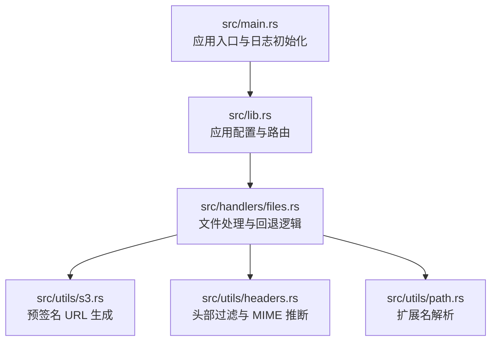
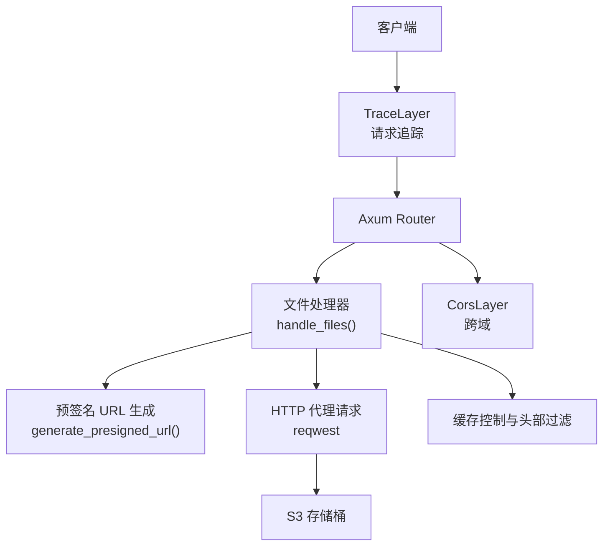
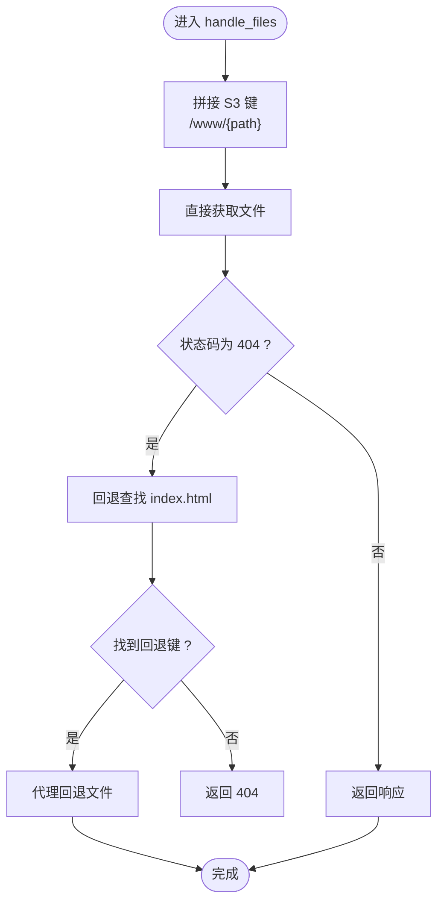
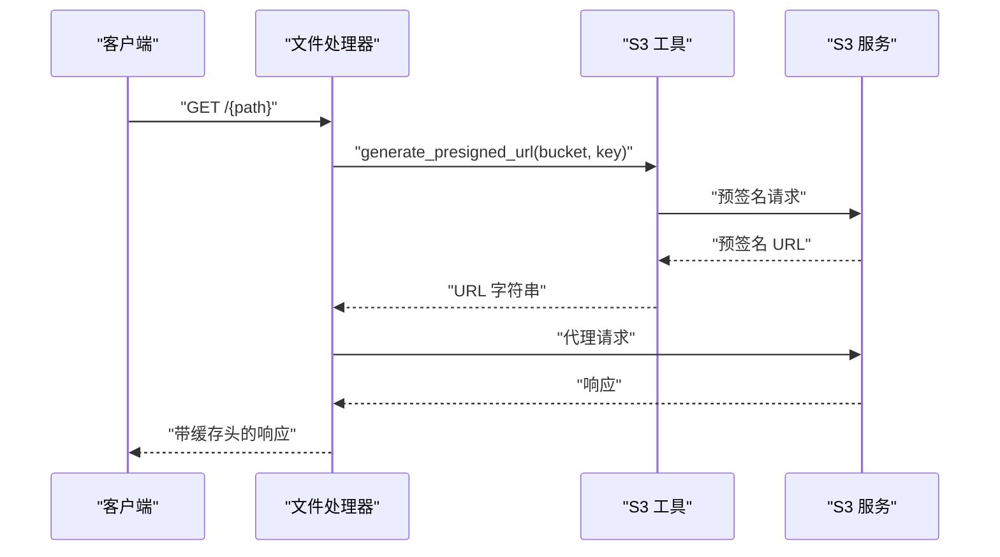
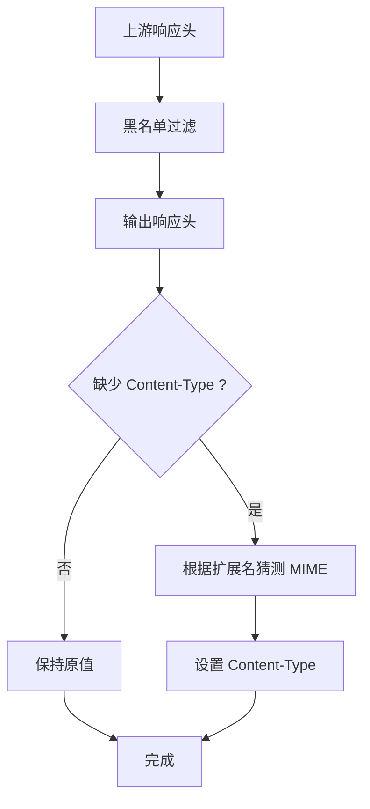
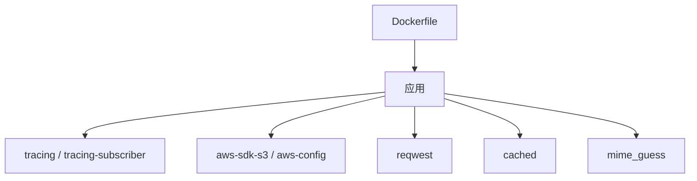

# 故障排除

<cite>
**本文引用的文件**
- [src/main.rs](file://src/main.rs)
- [src/lib.rs](file://src/lib.rs)
- [src/handlers/files.rs](file://src/handlers/files.rs)
- [src/utils/s3.rs](file://src/utils/s3.rs)
- [src/utils/headers.rs](file://src/utils/headers.rs)
- [src/utils/path.rs](file://src/utils/path.rs)
- [Cargo.toml](file://Cargo.toml)
- [Dockerfile](file://Dockerfile)
- [README.md](file://README.md)
</cite>

## 目录
1. [简介](#简介)
2. [项目结构](#项目结构)
3. [核心组件](#核心组件)
4. [架构总览](#架构总览)
5. [详细组件分析](#详细组件分析)
6. [依赖关系分析](#依赖关系分析)
7. [性能注意事项](#性能注意事项)
8. [故障排除指南](#故障排除指南)
9. [结论](#结论)
10. [附录](#附录)

## 简介
本指南面向使用该静态文件服务器的运维与开发人员，聚焦于常见问题的诊断与解决。我们将围绕以下典型问题展开：
- 环境变量未正确加载导致 S3 认证失败
- 存储桶名称错误
- 网络连接超时
- CORS 策略阻止前端访问
- 缓存头未正确设置导致浏览器重复请求
- 预签名 URL 生成失败或过期
- 回退逻辑未触发或命中缓存导致误判

同时，提供基于 tracing 日志的定位方法、调试技巧（启用详细日志、使用 curl 测试 API、验证 Docker 容器环境变量注入）、以及使用 Rust debug 模式与 anyho 的错误堆栈追踪建议。

## 项目结构
该项目采用模块化组织，核心入口、应用配置、处理器与工具函数分别位于不同模块中，便于定位问题来源与复现流程。

图表来源
- [src/main.rs](file://src/main.rs#L1-L26)
- [src/lib.rs](file://src/lib.rs#L1-L61)
- [src/handlers/files.rs](file://src/handlers/files.rs#L1-L293)
- [src/utils/s3.rs](file://src/utils/s3.rs#L1-L47)
- [src/utils/headers.rs](file://src/utils/headers.rs#L1-L47)
- [src/utils/path.rs](file://src/utils/path.rs#L1-L30)

章节来源
- [src/main.rs](file://src/main.rs#L1-L26)
- [src/lib.rs](file://src/lib.rs#L1-L61)

## 核心组件
- 应用入口与日志
  - 启动时加载 .env 并初始化 tracing，级别为 DEBUG，便于问题定位。
- 应用状态与路由
  - 从环境变量加载 AWS_BUCKET；初始化 S3 客户端与 HTTP 客户端；注册 TraceLayer 与 CorsLayer。
- 文件处理与回退
  - 生成预签名 URL 并代理请求；根据扩展名决定缓存策略；移除敏感头部；必要时回退到 index.html。
- S3 工具
  - 生成预签名 URL，支持缓存与错误传播。
- 头部与路径工具
  - 黑名单过滤响应头部；根据扩展名猜测 MIME 类型。

章节来源
- [src/main.rs](file://src/main.rs#L1-L26)
- [src/lib.rs](file://src/lib.rs#L1-L61)
- [src/handlers/files.rs](file://src/handlers/files.rs#L1-L293)
- [src/utils/s3.rs](file://src/utils/s3.rs#L1-L47)
- [src/utils/headers.rs](file://src/utils/headers.rs#L1-L47)
- [src/utils/path.rs](file://src/utils/path.rs#L1-L30)

## 架构总览
系统采用 Axum 异步框架，通过预签名 URL 将客户端请求安全地代理到 S3，同时应用 CORS 与 tracing 中间件增强可观测性。

图表来源
- [src/lib.rs](file://src/lib.rs#L30-L61)
- [src/handlers/files.rs](file://src/handlers/files.rs#L96-L167)
- [src/utils/s3.rs](file://src/utils/s3.rs#L22-L47)

## 详细组件分析

### 组件一：文件处理与回退逻辑
- 关键职责
  - 生成预签名 URL 并代理请求
  - 根据扩展名设置缓存控制头
  - 过滤敏感响应头
  - SPA 回退：当请求文件不存在时，按规则查找 index.html
- 错误处理
  - 预签名 URL 生成失败返回 502
  - 代理请求失败返回 502
  - 构造响应体失败返回 500
  - 404 时触发回退逻辑
- 缓存策略
  - 静态资源（除 html/htm）缓存 30 天
  - html/htm 不缓存，避免 SPA 路由问题

图表来源
- [src/handlers/files.rs](file://src/handlers/files.rs#L230-L293)

章节来源
- [src/handlers/files.rs](file://src/handlers/files.rs#L96-L167)
- [src/handlers/files.rs](file://src/handlers/files.rs#L169-L191)
- [src/handlers/files.rs](file://src/handlers/files.rs#L192-L228)
- [src/handlers/files.rs](file://src/handlers/files.rs#L230-L293)

### 组件二：预签名 URL 生成
- 关键职责
  - 基于 S3 客户端与存储桶名称生成预签名 URL
  - URL 默认有效期 1 小时
  - 结果与键组合进行缓存，降低重复生成开销
- 常见问题
  - S3 客户端未正确初始化（环境变量缺失）
  - 存储桶名称错误或对象键不存在
  - 网络超时或权限不足导致生成失败

图表来源
- [src/handlers/files.rs](file://src/handlers/files.rs#L115-L167)
- [src/utils/s3.rs](file://src/utils/s3.rs#L22-L47)

章节来源
- [src/utils/s3.rs](file://src/utils/s3.rs#L1-L47)

### 组件三：头部过滤与 MIME 推断
- 关键职责
  - 过滤响应头部黑名单（跨域、缓存控制等），避免泄露或冲突
  - 若 S3 响应缺少 Content-Type，根据扩展名猜测并补充
- 常见问题
  - CORS 头部被移除导致前端跨域失败
  - Content-Type 缺失导致浏览器渲染异常

图表来源
- [src/utils/headers.rs](file://src/utils/headers.rs#L1-L47)
- [src/utils/path.rs](file://src/utils/path.rs#L1-L30)
- [src/handlers/files.rs](file://src/handlers/files.rs#L147-L157)

章节来源
- [src/utils/headers.rs](file://src/utils/headers.rs#L1-L47)
- [src/utils/path.rs](file://src/utils/path.rs#L1-L30)
- [src/handlers/files.rs](file://src/handlers/files.rs#L147-L157)

## 依赖关系分析
- 运行时依赖
  - tracing/tracing-subscriber：日志与追踪
  - aws-sdk-s3/aws-config：S3 客户端与凭据加载
  - reqwest：HTTP 代理
  - cached：预签名 URL 与路径查找缓存
  - mime_guess：MIME 类型推断
- 构建与部署
  - Docker 多阶段构建，最终镜像仅包含可执行文件

图表来源
- [Cargo.toml](file://Cargo.toml#L1-L20)
- [Dockerfile](file://Dockerfile#L1-L25)

章节来源
- [Cargo.toml](file://Cargo.toml#L1-L20)
- [Dockerfile](file://Dockerfile#L1-L25)

## 性能注意事项
- 预签名 URL 与路径查找均使用缓存，减少 S3 API 调用
- 静态资源 30 天缓存，降低带宽与延迟
- 流式传输响应体，减少内存占用
- CORS 与 Trace 中间件为调试提供便利，生产环境可根据需要调整

## 故障排除指南

### 1. 环境变量未正确加载导致 S3 认证失败
- 症状
  - 启动时报错提示必须设置 AWS_BUCKET
  - 访问接口返回 502，日志显示 S3 请求失败
- 诊断步骤
  - 确认 .env 是否存在且包含 AWS_ACCESS_KEY_ID、AWS_SECRET_ACCESS_KEY、AWS_REGION、AWS_ENDPOINT_URL、AWS_BUCKET
  - 在启动日志中查看是否打印了“Server running on ...”以及 tracing 日志
  - 使用 curl 访问根路径，观察响应状态码与日志
- 解决方案
  - 在容器环境中确保环境变量已注入（参考 Dockerfile 的构建与运行阶段）
  - 使用 docker run -e 注入环境变量，或在 compose 中通过 env_file 指定
  - 如使用自定义 endpoint，请确认格式与可用性

章节来源
- [src/lib.rs](file://src/lib.rs#L43-L53)
- [src/main.rs](file://src/main.rs#L9-L15)
- [README.md](file://README.md#L27-L41)

### 2. 存储桶名称错误
- 症状
  - 404 或 502，日志显示 S3 对象不存在或权限不足
- 诊断步骤
  - 在 handle_files 中，确认最终使用的 S3 键是否为 “/www/{path}”
  - 检查回退逻辑是否命中（当直接文件不存在时，会尝试查找第一级目录下的 index.html）
- 解决方案
  - 确认 AWS_BUCKET 与对象键命名一致
  - 确认对象键前缀为 www，且路径分隔符为正斜杠

章节来源
- [src/handlers/files.rs](file://src/handlers/files.rs#L244-L259)
- [src/handlers/files.rs](file://src/handlers/files.rs#L273-L291)

### 3. 网络连接超时
- 症状
  - 代理请求失败返回 502，日志包含网络错误
- 诊断步骤
  - 启用 DEBUG 级别日志，观察预签名 URL 生成与代理请求阶段的日志
  - 使用 curl 直接访问预签名 URL，验证 S3 可达性
  - 检查网络策略、防火墙与 DNS 解析
- 解决方案
  - 调整网络超时参数（若需要）
  - 确认 endpoint 可用，必要时更换为就近节点

章节来源
- [src/handlers/files.rs](file://src/handlers/files.rs#L122-L136)
- [src/main.rs](file://src/main.rs#L11-L15)

### 4. CORS 策略阻止前端访问
- 症状
  - 前端跨域请求失败，浏览器报跨域错误
- 诊断步骤
  - 观察响应头中是否包含跨域相关头部
  - 检查 headers 工具是否移除了 CORS 头部（当前实现为移除黑名单头部）
- 解决方案
  - 在生产环境根据需求配置合适的 CORS 策略
  - 如需保留 CORS 头部，调整黑名单列表或在上游网关统一处理

章节来源
- [src/lib.rs](file://src/lib.rs#L58-L60)
- [src/utils/headers.rs](file://src/utils/headers.rs#L1-L32)
- [src/handlers/files.rs](file://src/handlers/files.rs#L141-L146)

### 5. 缓存头未正确设置导致浏览器重复请求
- 症状
  - 静态资源频繁重新下载，或 SPA 路由不生效
- 诊断步骤
  - 检查响应头中是否包含 Cache-Control
  - 确认文件扩展名是否在不缓存列表中
- 解决方案
  - 静态资源（除 html/htm）将获得 30 天缓存
  - html/htm 不缓存，避免 SPA 路由问题

章节来源
- [src/handlers/files.rs](file://src/handlers/files.rs#L89-L94)
- [src/handlers/files.rs](file://src/handlers/files.rs#L154-L157)

### 6. 预签名 URL 生成失败或过期
- 症状
  - 生成预签名 URL 失败返回 502
  - 浏览器收到 403/401
- 诊断步骤
  - 查看 generate_presigned_url 的日志与错误传播
  - 验证 S3 凭据与权限范围
  - 检查 URL 是否过期（默认 1 小时）
- 解决方案
  - 确保凭据完整且具有读取权限
  - 如需更长有效期，调整预签名配置（注意安全影响）

章节来源
- [src/utils/s3.rs](file://src/utils/s3.rs#L22-L47)
- [src/handlers/files.rs](file://src/handlers/files.rs#L122-L126)

### 7. 回退逻辑未触发或命中缓存导致误判
- 症状
  - 404 但未回退到 index.html
  - 回退命中缓存导致旧结果
- 诊断步骤
  - 检查回退查找逻辑是否执行
  - 查看 find_exists_key 的缓存时间与键组合
- 解决方案
  - 确认路径第一级目录下存在 index.html
  - 如需强制刷新，调整缓存时间或重启服务

章节来源
- [src/handlers/files.rs](file://src/handlers/files.rs#L192-L228)
- [src/handlers/files.rs](file://src/handlers/files.rs#L273-L291)

### 8. 调试技巧与工具
- 启用详细日志
  - 使用 DEBUG 级别日志，观察请求进入、预签名 URL 生成、代理请求、响应头过滤与缓存设置全过程
- 使用 curl 测试
  - 直接访问预签名 URL，验证 S3 可达性与权限
  - 测试不同路径与扩展名，验证 MIME 推断与缓存行为
- 验证 Docker 环境变量注入
  - 构建镜像后，使用 docker inspect 查看环境变量
  - 运行容器时通过 -e 或 env_file 注入 AWS_* 与 AWS_BUCKET

章节来源
- [src/main.rs](file://src/main.rs#L11-L15)
- [README.md](file://README.md#L60-L80)
- [Dockerfile](file://Dockerfile#L1-L25)

### 9. 使用 Rust debug 模式与 anyho 进行错误堆栈追踪
- 建议
  - 在本地开发时使用 cargo run（默认 debug 模式），获得更丰富的错误上下文
  - anyho::Result 在错误传播时保留上下文，结合 tracing 的日志可快速定位问题
- 注意
  - 生产环境建议使用 release 构建以获得最佳性能

章节来源
- [src/main.rs](file://src/main.rs#L7-L10)
- [Cargo.toml](file://Cargo.toml#L1-L20)

## 结论
通过上述指南，您可以系统性地定位与解决该静态服务器在 S3 认证、存储桶配置、网络连通性、CORS、缓存与回退逻辑等方面的常见问题。建议在开发阶段充分利用 DEBUG 日志与 curl 测试，在生产阶段结合 Docker 环境变量注入与合理的 CORS/缓存策略，确保稳定可靠的线上运行。

## 附录
- 环境变量清单（来自 README）
  - AWS_ACCESS_KEY_ID、AWS_SECRET_ACCESS_KEY、AWS_REGION、AWS_ENDPOINT_URL、AWS_BUCKET
- Docker 部署要点
  - 多阶段构建，最终镜像仅包含可执行文件
  - 运行时通过环境变量注入 AWS_* 与 AWS_BUCKET

章节来源
- [README.md](file://README.md#L27-L41)
- [Dockerfile](file://Dockerfile#L1-L25)