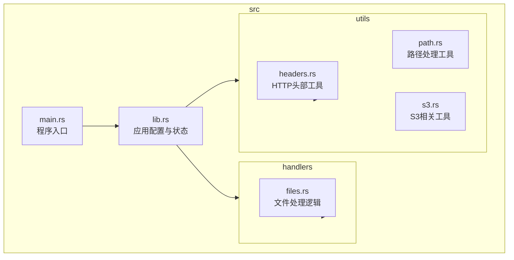
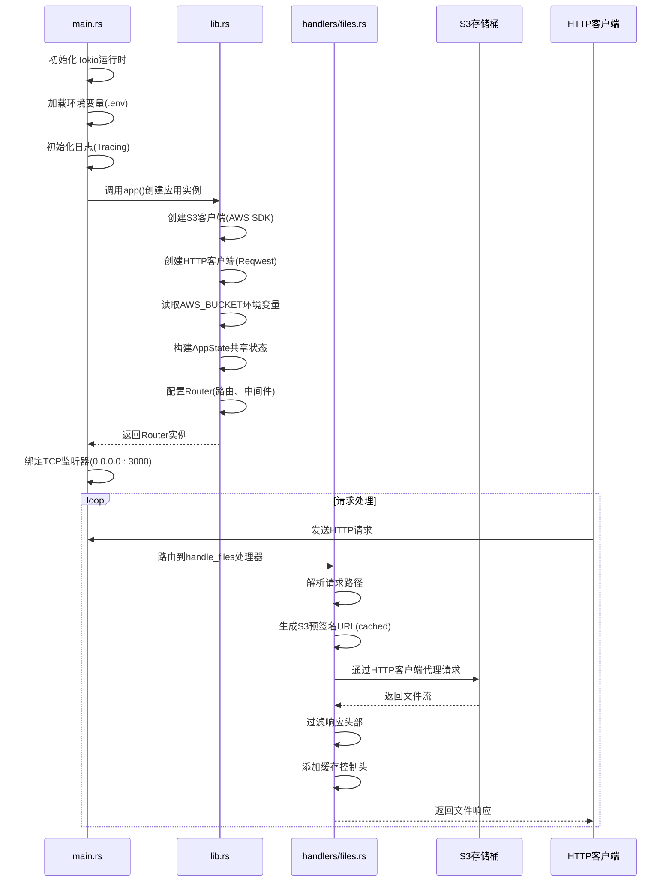
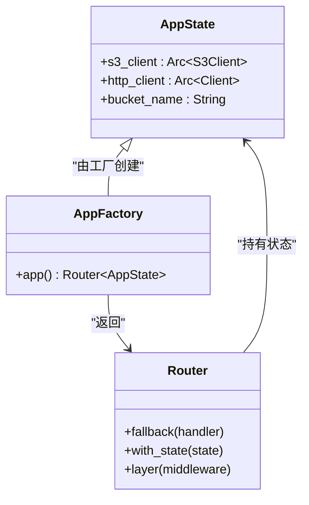
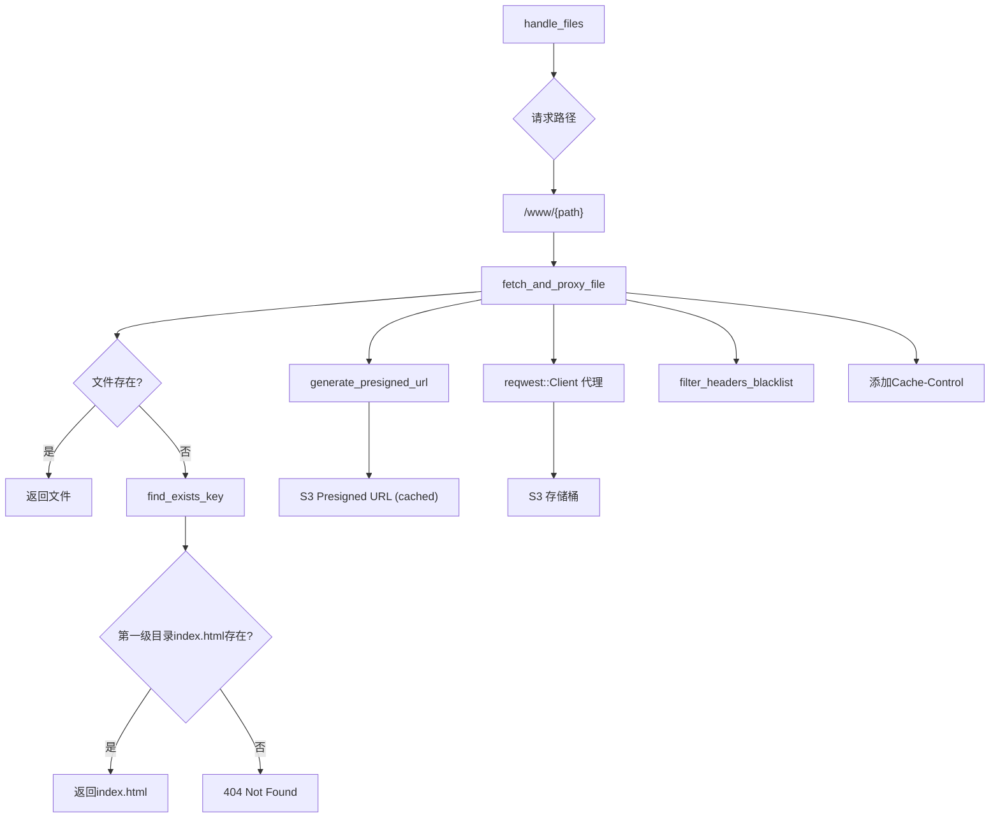
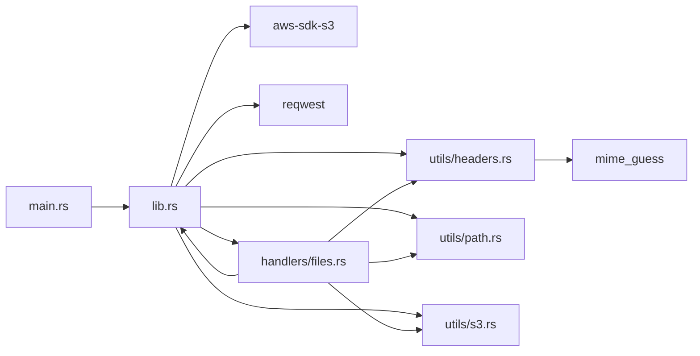

# 架构设计

<cite>
**本文档引用的文件**
- [main.rs](file://src/main.rs)
- [lib.rs](file://src/lib.rs)
- [handlers/files.rs](file://src/handlers/files.rs)
- [utils/headers.rs](file://src/utils/headers.rs)
- [utils/path.rs](file://src/utils/path.rs)
- [utils/s3.rs](file://src/utils/s3.rs)
- [Cargo.toml](file://Cargo.toml)
- [README.md](file://README.md)
</cite>

## 目录
1. [简介](#简介)
2. [项目结构](#项目结构)
3. [核心组件](#核心组件)
4. [架构概览](#架构概览)
5. [详细组件分析](#详细组件分析)
6. [依赖分析](#依赖分析)
7. [性能考虑](#性能考虑)
8. [故障排除指南](#故障排除指南)
9. [结论](#结论)

## 简介
本架构设计文档旨在全面描述static-server的模块化设计和组件交互关系。该服务器是一个基于Rust和Axum构建的高性能静态文件服务器，能够从S3兼容存储桶提供文件服务，并支持单页应用（SPA）路由和智能缓存策略。文档将深入分析程序入口如何初始化Tokio运行时、加载环境变量、构建S3和HTTP客户端，并启动Axum服务器监听。同时，将解释共享状态的封装与依赖注入机制、路由定义方式及中间件集成，并探讨设计模式的应用和异步非阻塞I/O的优势。

## 项目结构

static-server项目采用清晰的模块化结构，将功能划分为不同的模块以提高代码的可维护性和可读性。

**图示来源**
- [main.rs](file://src/main.rs)
- [lib.rs](file://src/lib.rs)
- [handlers.rs](file://src/handlers.rs)
- [utils.rs](file://src/utils.rs)
- [handlers/files.rs](file://src/handlers/files.rs)
- [utils/headers.rs](file://src/utils/headers.rs)
- [utils/path.rs](file://src/utils/path.rs)
- [utils/s3.rs](file://src/utils/s3.rs)

**本节来源**
- [README.md](file://README.md#L126-L142)

## 核心组件

static-server的核心组件包括程序入口`main.rs`、应用状态与配置`lib.rs`、文件请求处理器`handlers/files.rs`以及一系列工具函数模块。这些组件共同协作，实现了从S3存储桶高效、安全地提供静态文件服务的功能。`main.rs`负责初始化运行时环境和启动服务器，`lib.rs`封装了共享状态并通过工厂模式创建应用实例，`handlers/files.rs`实现了具体的文件服务逻辑，包括预签名URL生成、缓存控制和SPA路由支持，而工具模块则提供了MIME类型检测、头部过滤和路径处理等基础功能。

**本节来源**
- [main.rs](file://src/main.rs)
- [lib.rs](file://src/lib.rs)
- [handlers/files.rs](file://src/handlers/files.rs)
- [utils/headers.rs](file://src/utils/headers.rs)
- [utils/path.rs](file://src/utils/path.rs)
- [utils/s3.rs](file://src/utils/s3.rs)

## 架构概览

static-server采用分层架构设计，各组件职责明确，通过依赖注入实现松耦合。系统启动时，`main.rs`初始化Tokio异步运行时，加载环境变量，并调用`lib.rs`中的`app()`函数。该函数作为工厂，负责创建并配置整个Axum应用，包括初始化S3客户端、HTTP客户端和应用状态`AppState`。配置好的路由和中间件被注入到`Router`中，最终返回一个完整的应用实例。当请求到达时，Axum根据路由规则将请求分发给`handle_files`处理器，该处理器利用`AppState`中的共享资源，通过一系列异步操作从S3获取文件并返回响应。

**图示来源**
- [main.rs](file://src/main.rs#L7-L25)
- [lib.rs](file://src/lib.rs#L35-L60)
- [handlers/files.rs](file://src/handlers/files.rs#L230-L292)

## 详细组件分析

### 主程序入口分析

`main.rs`是应用程序的唯一入口点，它使用`#[tokio::main]`宏来启动Tokio异步运行时。程序首先通过`dotenvy::dotenv()`加载`.env`文件中的环境变量，然后初始化`tracing_subscriber`以启用详细的日志记录，这对于调试和监控至关重要。接着，它调用`lib.rs`中的`app()`异步函数来获取配置好的Axum应用实例。最后，程序创建一个TCP监听器并绑定到`0.0.0.0:3000`地址，通过`axum::serve`函数启动服务器，开始监听和处理传入的HTTP请求。这种设计将复杂的初始化逻辑封装在`lib.rs`中，使`main.rs`保持简洁和专注。

**本节来源**
- [main.rs](file://src/main.rs#L1-L25)
- [Cargo.toml](file://Cargo.toml#L13)

### 应用状态与配置分析

`lib.rs`是整个应用的核心配置文件，它定义了`AppState`结构体和`app()`工厂函数。`AppState`结构体使用`Arc`（原子引用计数）智能指针来封装S3客户端、HTTP客户端和存储桶名称，确保这些资源可以在多个异步任务之间安全地共享。`app()`函数遵循工厂模式，负责创建和配置整个应用。它首先从环境变量中加载AWS配置以创建S3客户端，然后创建一个`reqwest::Client`用于代理请求到S3。在构建`AppState`实例后，它通过`.with_state(state)`方法将其注入到Axum的`Router`中。此外，该函数还集成了`TraceLayer`和`CorsLayer`中间件，前者用于记录详细的请求日志，后者用于处理跨域资源共享（CORS）请求，确保服务器可以被不同源的前端应用安全访问。

**图示来源**
- [lib.rs](file://src/lib.rs#L21-L53)
- [lib.rs](file://src/lib.rs#L35-L60)

**本节来源**
- [lib.rs](file://src/lib.rs#L1-L60)
- [Cargo.toml](file://Cargo.toml#L7-L14)

### 文件处理器分析

`handlers/files.rs`模块是处理所有文件请求的核心。其主要函数`handle_files`接收一个`State<crate::AppState>`参数，从而获得对共享资源的访问。该处理器首先尝试直接获取请求的文件。如果S3返回404错误，它会触发SPA回退逻辑，调用`find_exists_key`函数。该函数使用`#[cached]`宏进行内存缓存，检查第一级目录下是否存在`index.html`，以支持单页应用的客户端路由。文件的实际获取是通过`fetch_and_proxy_file`函数完成的，该函数体现了代理模式：它不直接持有文件，而是生成一个S3预签名URL，并使用`reqwest`客户端作为代理，将请求转发到S3并流式传输响应。在此过程中，它会过滤掉S3响应中的跨域和缓存控制头部（使用`BLOCKED_HEADERS`黑名单），并为静态资源（如CSS、JS）添加自己的`Cache-Control`头部，同时保留HTML文件不缓存以确保最新内容。

**图示来源**
- [handlers/files.rs](file://src/handlers/files.rs#L230-L292)
- [handlers/files.rs](file://src/handlers/files.rs#L115-L166)
- [handlers/files.rs](file://src/handlers/files.rs#L206-L227)
- [utils/s3.rs](file://src/utils/s3.rs#L22-L46)
- [utils/headers.rs](file://src/utils/headers.rs#L17-L31)

**本节来源**
- [handlers/files.rs](file://src/handlers/files.rs#L1-L293)
- [README.md](file://README.md#L98-L104)

### 工具模块分析

工具模块`utils`提供了项目所需的基础功能。`headers.rs`模块包含`filter_headers_blacklist`函数，它采用黑名单模式过滤HTTP头部，确保从S3返回的响应不会包含可能引起安全问题或冲突的跨域和缓存头部。`guess_mime_type`函数则利用`mime_guess`库根据文件扩展名自动推断MIME类型，当S3未提供`Content-Type`时，这能确保浏览器正确处理文件。`path.rs`模块的`get_extension_lowercase`函数负责从文件路径中提取小写扩展名，用于缓存策略和MIME类型检测。`s3.rs`模块的`generate_presigned_url`函数是安全访问S3的关键，它使用`#[cached]`宏缓存生成的URL，避免了频繁的API调用，提高了性能。

**本节来源**
- [utils/headers.rs](file://src/utils/headers.rs#L1-L47)
- [utils/path.rs](file://src/utils/path.rs#L1-L30)
- [utils/s3.rs](file://src/utils/s3.rs#L1-L47)
- [Cargo.toml](file://Cargo.toml#L19)

## 依赖分析

static-server的依赖关系清晰且高效。`main.rs`依赖`lib.rs`来获取应用实例。`lib.rs`作为核心，依赖`aws-sdk-s3`、`reqwest`等外部库来创建客户端，并依赖`handlers`和`utils`模块来构建路由和使用工具函数。`handlers/files.rs`则依赖`lib.rs`的`AppState`和`utils`模块的各种工具。这种依赖结构确保了`main.rs`的极简性，同时将业务逻辑和工具函数解耦。

**图示来源**
- [Cargo.toml](file://Cargo.toml#L7-L20)
- [lib.rs](file://src/lib.rs#L12-L14)
- [handlers/files.rs](file://src/handlers/files.rs#L1-L5)

**本节来源**
- [Cargo.toml](file://Cargo.toml#L1-L20)
- [lib.rs](file://src/lib.rs#L1-L60)

## 性能考虑

static-server在设计上充分考虑了高并发场景下的性能。其核心优势在于基于Tokio的异步非阻塞I/O模型。这意味着服务器可以使用少量线程处理成千上万的并发连接，极大地提高了资源利用率和吞吐量。流式传输（`Body::from_stream`）确保了大文件不会被完全加载到内存中，而是边下载边发送，显著降低了内存占用。多级缓存机制是性能优化的关键：`cached`宏缓存了预签名URL（30分钟）和路径查找结果（60秒），大幅减少了对S3 API的调用次数。此外，智能的缓存策略（为静态资源设置30天缓存）将大部分请求的负载转移到了客户端和CDN，进一步减轻了服务器压力。

## 故障排除指南

当服务器无法正常工作时，应首先检查环境变量是否正确设置，特别是`AWS_BUCKET`、`AWS_ACCESS_KEY_ID`和`AWS_SECRET_ACCESS_KEY`。查看启动日志（由`tracing`提供）是诊断问题的第一步，它会记录服务器启动信息和详细的请求/响应过程。如果遇到404错误，需确认S3存储桶中的文件路径是否正确（文件应位于`www/`前缀下）。对于CORS问题，确保前端请求的源与服务器配置兼容，`CorsLayer::permissive()`提供了宽松的跨域策略。如果出现S3连接错误，请检查`AWS_REGION`和`AWS_ENDPOINT_URL`是否与所使用的S3兼容服务匹配。

**本节来源**
- [main.rs](file://src/main.rs#L14-L15)
- [lib.rs](file://src/lib.rs#L44-L46)
- [README.md](file://README.md#L27-L40)

## 结论

static-server通过模块化设计和现代Rust异步技术，构建了一个高效、安全且易于维护的静态文件服务器。其架构清晰地分离了关注点：`main.rs`负责启动，`lib.rs`管理状态和配置，`handlers`处理业务逻辑，`utils`提供通用工具。单例模式（`AppState`）、工厂模式（`app()`函数）和代理模式（S3文件代理）的恰当应用，提升了代码的可重用性和可测试性。异步非阻塞I/O和多级缓存机制确保了系统在高并发场景下的卓越性能。该设计不仅满足了从S3提供静态文件的基本需求，还通过SPA支持和智能缓存等特性，为现代Web应用提供了强大的后端支持。