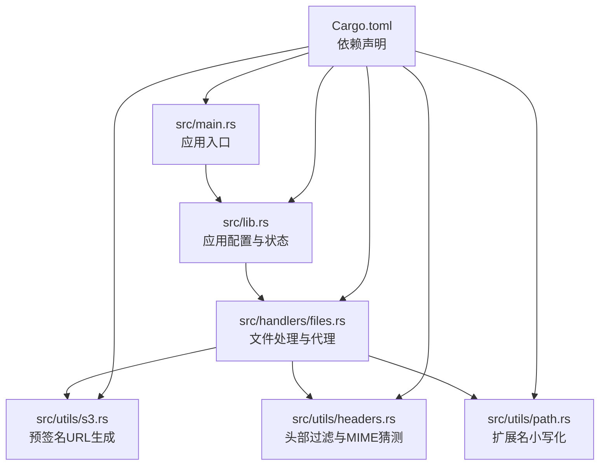
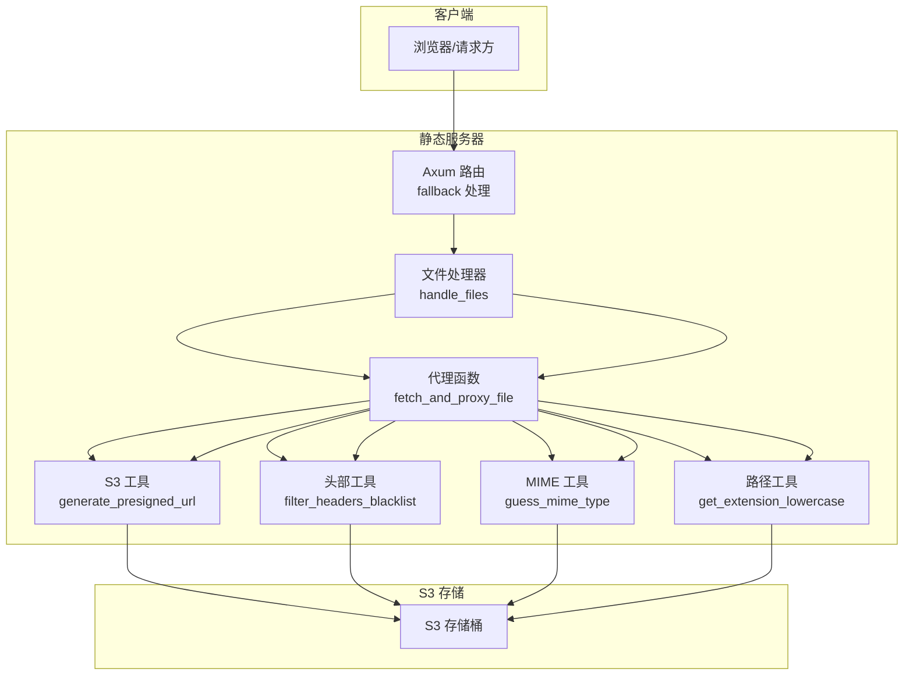
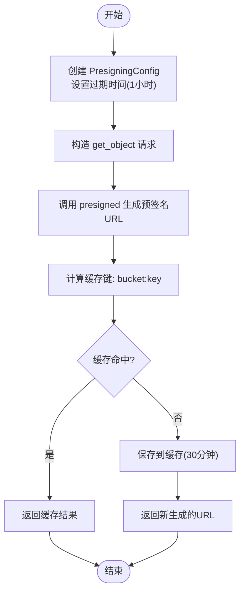
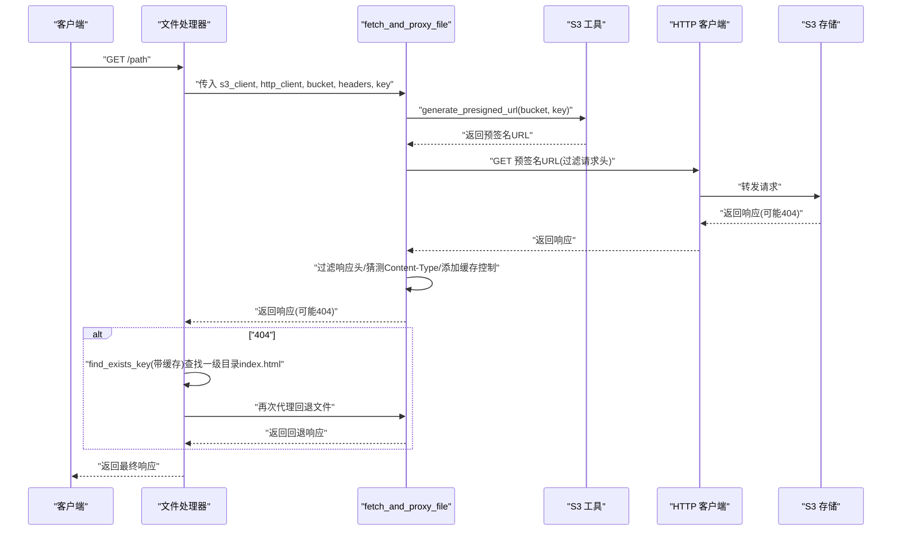
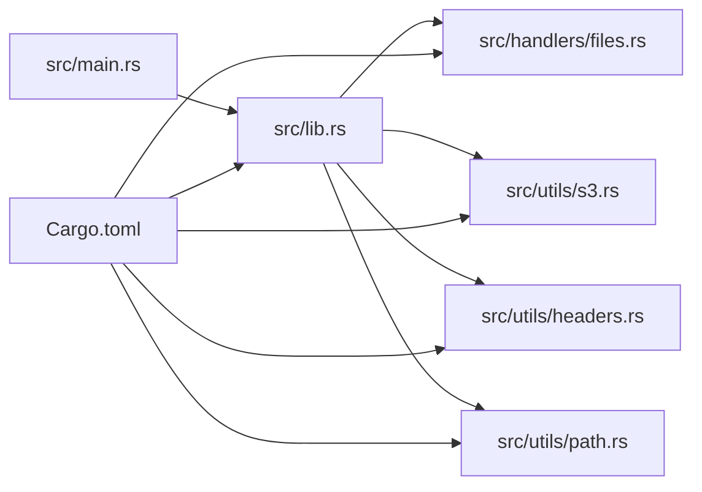

# S3文件服务

<cite>
**本文引用的文件**
- [src/main.rs](file://src/main.rs)
- [src/lib.rs](file://src/lib.rs)
- [src/handlers/files.rs](file://src/handlers/files.rs)
- [src/utils/s3.rs](file://src/utils/s3.rs)
- [src/utils/headers.rs](file://src/utils/headers.rs)
- [src/utils/path.rs](file://src/utils/path.rs)
- [Cargo.toml](file://Cargo.toml)
- [README.md](file://README.md)
</cite>

## 目录
1. [简介](#简介)
2. [项目结构](#项目结构)
3. [核心组件](#核心组件)
4. [架构总览](#架构总览)
5. [详细组件分析](#详细组件分析)
6. [依赖分析](#依赖分析)
7. [性能考量](#性能考量)
8. [故障排查指南](#故障排查指南)
9. [结论](#结论)
10. [附录](#附录)

## 简介
本文件聚焦 static-server 的 S3 文件服务实现，围绕以下目标展开：
- 解释如何通过 AWS SDK for Rust 的 S3 客户端生成预签名 URL，确保对私有存储桶资源的安全访问。
- 详解 fetch_and_proxy_file 函数如何封装“生成预签名 URL → 转发 HTTP 请求 → 处理响应流”的完整流程。
- 结合 generate_presigned_url 的缓存机制（30 分钟过期、结果缓存），阐述其性能优化策略与安全性权衡。
- 给出与 SPA 路由、缓存策略的集成关系说明，并讨论高并发场景下的性能考虑与潜在瓶颈。

## 项目结构
该项目采用模块化组织，关键文件如下：
- 应用入口与启动：src/main.rs
- 应用配置与状态：src/lib.rs
- 文件处理与代理：src/handlers/files.rs
- S3 工具：src/utils/s3.rs
- 头部与路径工具：src/utils/headers.rs、src/utils/path.rs
- 依赖与版本：Cargo.toml
- 文档与部署说明：README.md

图表来源
- [src/main.rs](file://src/main.rs#L1-L26)
- [src/lib.rs](file://src/lib.rs#L1-L61)
- [src/handlers/files.rs](file://src/handlers/files.rs#L1-L293)
- [src/utils/s3.rs](file://src/utils/s3.rs#L1-L47)
- [src/utils/headers.rs](file://src/utils/headers.rs#L1-L47)
- [src/utils/path.rs](file://src/utils/path.rs#L1-L30)
- [Cargo.toml](file://Cargo.toml#L1-L20)

章节来源
- [src/main.rs](file://src/main.rs#L1-L26)
- [src/lib.rs](file://src/lib.rs#L1-L61)
- [Cargo.toml](file://Cargo.toml#L1-L20)

## 核心组件
- S3 客户端与应用状态
  - 应用通过 aws-config 加载配置，创建 S3 客户端并注入 AppState，供路由处理器复用。
  - 同时初始化用于代理转发的 HTTP 客户端。
- 预签名 URL 生成
  - 使用 PresigningConfig 设置 URL 有效期（1 小时），调用 get_object().presigned 生成可直接访问的临时链接。
  - 通过 cached 宏缓存生成结果，键为“bucket:key”，超时 30 分钟，容量上限较大，避免频繁生成签名。
- 文件代理与响应处理
  - fetch_and_proxy_file：生成预签名 URL → 过滤并转发请求头 → 发送请求 → 过滤响应头 → 补充 Content-Type → 添加缓存控制 → 流式传输响应体。
  - 对 404 响应走 SPA 回退逻辑：find_exists_key 基于路径查找一级目录 index.html 并再次代理。
- 头部与路径工具
  - filter_headers_blacklist：黑名单模式过滤，移除跨域、缓存控制、认证、源信息等头部，避免泄露与冲突。
  - guess_mime_type：当 S3 响应缺少 Content-Type 时，按扩展名猜测 MIME 类型。
  - get_extension_lowercase：统一扩展名为小写，配合 should_cache 判断是否缓存。

章节来源
- [src/lib.rs](file://src/lib.rs#L19-L61)
- [src/utils/s3.rs](file://src/utils/s3.rs#L1-L47)
- [src/handlers/files.rs](file://src/handlers/files.rs#L1-L293)
- [src/utils/headers.rs](file://src/utils/headers.rs#L1-L47)
- [src/utils/path.rs](file://src/utils/path.rs#L1-L30)

## 架构总览
整体架构采用“反向代理 + 预签名 URL + 缓存”的设计，确保对私有 S3 资源的安全访问与高效分发。

图表来源
- [src/lib.rs](file://src/lib.rs#L31-L61)
- [src/handlers/files.rs](file://src/handlers/files.rs#L230-L293)
- [src/utils/s3.rs](file://src/utils/s3.rs#L1-L47)
- [src/utils/headers.rs](file://src/utils/headers.rs#L1-L47)
- [src/utils/path.rs](file://src/utils/path.rs#L1-L30)

## 详细组件分析

### 预签名 URL 生成与缓存（generate_presigned_url）
- 安全性
  - 通过 PresigningConfig 设置 URL 有效期（1 小时），仅允许在有效期内访问对象，降低长期暴露风险。
  - 预签名 URL 由 S3 客户端生成，包含必要的签名参数，无需在服务器侧持有长期密钥。
- 性能优化
  - 使用 cached 宏缓存生成结果，键为“bucket:key”，超时 30 分钟，容量上限较大，显著减少重复签名开销。
  - 由于签名成本较高，缓存可大幅降低 S3 API 调用次数。
- 错误处理
  - 生成失败时返回错误，上游 fetch_and_proxy_file 捕获并返回 BAD_GATEWAY，避免泄露底层错误细节。

图表来源
- [src/utils/s3.rs](file://src/utils/s3.rs#L19-L47)

章节来源
- [src/utils/s3.rs](file://src/utils/s3.rs#L19-L47)

### 文件代理与响应处理（fetch_and_proxy_file）
- 请求代理逻辑
  - 生成预签名 URL 后，使用黑名单模式过滤请求头（移除 CONNECTION、AUTHORIZATION、COOKIE、ORIGIN、REFERER 等），避免泄露内部信息与冲突。
  - 通过 HTTP 客户端发起 GET 请求，等待响应。
- 响应处理
  - 过滤响应头（移除跨域与缓存控制相关头部），避免与上游 CORS/缓存策略冲突。
  - 若响应缺少 Content-Type，按扩展名猜测并补充。
  - 对成功响应且非 HTML/HTM 的静态资源添加 30 天缓存控制头。
  - 使用流式传输 Body::from_stream，支持大文件低内存占用。
- 错误处理
  - 生成预签名 URL 失败或代理请求失败时返回 BAD_GATEWAY；响应构建失败返回 INTERNAL_SERVER_ERROR。
- 与 SPA 的集成
  - 若首次请求返回 404，触发 find_exists_key 的缓存查找（60 秒），定位一级目录 index.html 并再次代理，实现 SPA 回退。

图表来源
- [src/handlers/files.rs](file://src/handlers/files.rs#L96-L167)
- [src/handlers/files.rs](file://src/handlers/files.rs#L192-L293)
- [src/utils/s3.rs](file://src/utils/s3.rs#L19-L47)

章节来源
- [src/handlers/files.rs](file://src/handlers/files.rs#L96-L167)
- [src/handlers/files.rs](file://src/handlers/files.rs#L192-L293)

### SPA 路由与缓存策略集成
- SPA 回退逻辑
  - 首次尝试直接获取请求文件；若 404，则在 /www 前缀下查找“第一级目录/index.html”作为回退资源。
  - find_exists_key 使用缓存（60 秒），减少对 S3 的 HEAD 查询压力。
- 缓存策略
  - 静态资源（CSS、JS、图片、字体等）：30 天缓存（public, max-age=2592000）。
  - HTML/HTM：不缓存，避免前端路由更新后仍命中旧内容。
  - 预签名 URL：30 分钟缓存，平衡安全性与性能。
- MIME 类型
  - 当 S3 响应缺少 Content-Type 时，按扩展名猜测并补充，保证浏览器正确解析。

章节来源
- [src/handlers/files.rs](file://src/handlers/files.rs#L230-L293)
- [src/utils/headers.rs](file://src/utils/headers.rs#L1-L47)
- [src/utils/path.rs](file://src/utils/path.rs#L1-L30)
- [README.md](file://README.md#L81-L105)

## 依赖分析
- 外部依赖
  - AWS SDK for Rust：S3 客户端与预签名生成。
  - Reqwest：HTTP 客户端，支持流式传输与连接池。
  - cached：异步缓存宏，提供内存缓存与过期控制。
  - mime_guess：MIME 类型猜测。
  - Tower HTTP：CORS 与链路追踪中间件。
- 内部模块耦合
  - handlers/files.rs 依赖 utils/s3.rs、utils/headers.rs、utils/path.rs。
  - lib.rs 提供 AppState，贯穿应用生命周期，避免重复初始化。
  - main.rs 负责应用启动与监听。

图表来源
- [src/lib.rs](file://src/lib.rs#L1-L61)
- [src/handlers/files.rs](file://src/handlers/files.rs#L1-L293)
- [src/utils/s3.rs](file://src/utils/s3.rs#L1-L47)
- [src/utils/headers.rs](file://src/utils/headers.rs#L1-L47)
- [src/utils/path.rs](file://src/utils/path.rs#L1-L30)
- [Cargo.toml](file://Cargo.toml#L1-L20)

章节来源
- [Cargo.toml](file://Cargo.toml#L1-L20)
- [src/lib.rs](file://src/lib.rs#L1-L61)

## 性能考量
- 预签名 URL 缓存
  - 30 分钟过期，适合热点资源的高频访问；对冷门资源可接受一定延迟换取签名成本节省。
  - 缓存键包含 bucket 与 key，避免跨桶冲突。
- SPA 路由缓存
  - find_exists_key 缓存 60 秒，减少对 S3 的 HEAD 查询，缓解路径查找压力。
- 流式传输
  - 使用 bytes_stream 进行响应体流式传输，降低内存峰值，提升大文件吞吐能力。
- 连接池与并发
  - 使用单个 HTTP 客户端实例（Arc）在多协程间共享，利用连接池减少握手开销。
- 头部过滤
  - 黑名单模式减少不必要的头部传递，避免上游 CORS/缓存策略干扰。
- 潜在瓶颈
  - S3 API 限速与网络抖动：预签名 URL 生成与代理转发均受外部服务影响。
  - 高并发下的缓存竞争：cached 宏为异步缓存，但大量并发请求仍可能产生瞬时热点。
  - 大文件传输：网络带宽与下游客户端缓冲能力成为限制因素。

章节来源
- [src/handlers/files.rs](file://src/handlers/files.rs#L79-L167)
- [src/utils/s3.rs](file://src/utils/s3.rs#L19-L47)
- [README.md](file://README.md#L106-L112)

## 故障排查指南
- BAD_GATEWAY
  - 预签名 URL 生成失败或代理请求失败时返回此状态。建议检查：
    - AWS 凭证与区域配置是否正确。
    - 存储桶名称与对象键是否匹配。
    - 网络连通性与 S3 端点可达性。
- 404 未命中
  - 若直接请求未命中，系统会尝试 SPA 回退；若仍失败，确认：
    - 路径是否位于 /www 前缀下。
    - 一级目录是否存在 index.html。
- Content-Type 异常
  - 若 S3 响应缺少 Content-Type，系统会按扩展名猜测；若仍异常，检查对象元数据或扩展名。
- 缓存导致的“旧内容”
  - HTML/HTM 不缓存；静态资源缓存 30 天。若出现旧内容，清理浏览器缓存或等待过期。
- 性能问题
  - 观察预签名 URL 缓存命中率与 S3 API 调用次数；必要时调整缓存键与过期时间。

章节来源
- [src/handlers/files.rs](file://src/handlers/files.rs#L112-L167)
- [src/utils/headers.rs](file://src/utils/headers.rs#L1-L47)
- [README.md](file://README.md#L81-L105)

## 结论
该实现通过“预签名 URL + 反向代理 + 缓存”的组合，在保障私有资源安全访问的同时，兼顾了性能与可维护性。预签名 URL 的 30 分钟缓存有效降低了签名成本；SPA 回退与路径查找缓存提升了用户体验；流式传输与连接池优化了大文件与高并发场景下的表现。建议在生产环境中结合监控指标（缓存命中率、S3 API 调用次数、响应延迟）持续优化缓存策略与并发配置。

## 附录
- 环境变量与部署
  - AWS_ACCESS_KEY_ID、AWS_SECRET_ACCESS_KEY、AWS_REGION、AWS_ENDPOINT_URL、AWS_BUCKET。
  - 支持 Docker 多阶段构建与容器化部署。
- 支持的 S3 兼容服务
  - AWS S3、阿里云 OSS、腾讯云 COS、火山引擎 TOS、MinIO 等。

章节来源
- [README.md](file://README.md#L27-L40)
- [README.md](file://README.md#L60-L124)