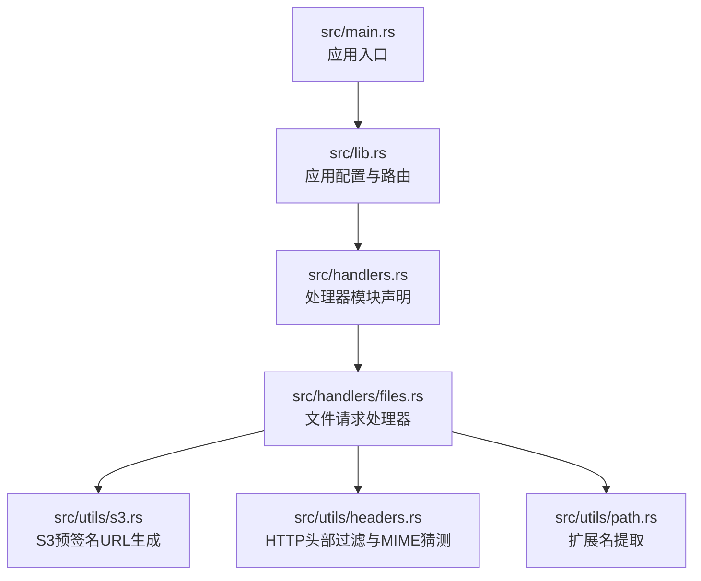
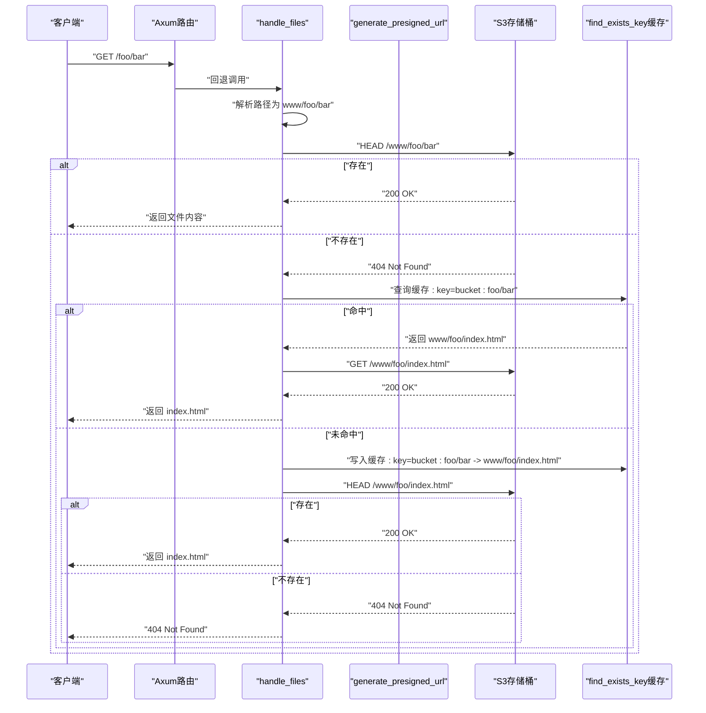
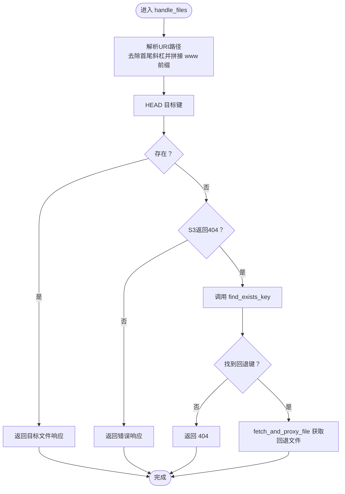
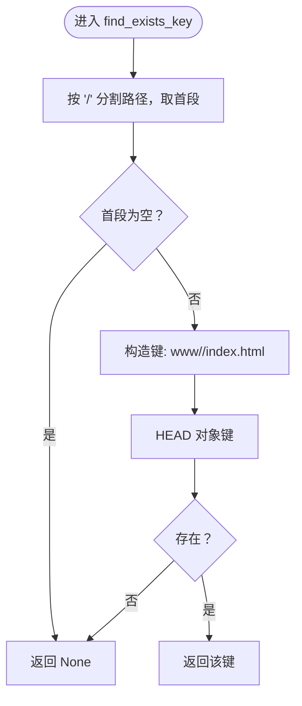
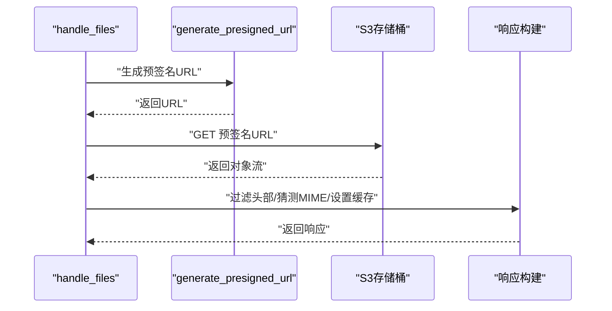
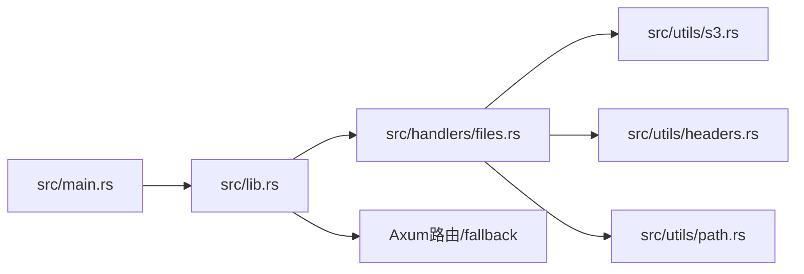

# SPA路由支持

<cite>
**本文引用的文件**
- [src/main.rs](file://src/main.rs)
- [src/lib.rs](file://src/lib.rs)
- [src/handlers.rs](file://src/handlers.rs)
- [src/handlers/files.rs](file://src/handlers/files.rs)
- [src/utils/s3.rs](file://src/utils/s3.rs)
- [src/utils/headers.rs](file://src/utils/headers.rs)
- [src/utils/path.rs](file://src/utils/path.rs)
- [Cargo.toml](file://Cargo.toml)
- [README.md](file://README.md)
</cite>

## 目录
1. [简介](#简介)
2. [项目结构](#项目结构)
3. [核心组件](#核心组件)
4. [架构总览](#架构总览)
5. [详细组件分析](#详细组件分析)
6. [依赖关系分析](#依赖关系分析)
7. [性能考量](#性能考量)
8. [故障排查指南](#故障排查指南)
9. [结论](#结论)
10. [附录](#附录)

## 简介
本文件聚焦 static-server 对单页应用（SPA）前端路由的完整支持机制，重点解析 handle_files 请求处理器中的回退逻辑：当请求的文件路径在 S3 中返回 404 时，系统如何触发 find_exists_key 函数进行回退处理；深入分析 find_exists_key 的实现细节，包括其基于“第一级目录查找 index.html”的策略（如路径 /foo/bar 触发查找 www/foo/index.html），以及该函数使用 cached 宏实现的内存缓存机制（60 秒有效期，容量 32768）。结合实际请求流程，说明从 URL 路径解析、文件存在性检查到最终返回 index.html 的完整数据流。最后给出典型使用场景与当前实现的局限性，并提出可能的扩展方向。

## 项目结构
该项目采用模块化组织，核心入口通过 lib.rs 配置应用状态与路由，handlers 模块负责请求处理，utils 模块提供 S3、HTTP 头部与路径等工具函数。

图表来源
- [src/main.rs](file://src/main.rs#L1-L26)
- [src/lib.rs](file://src/lib.rs#L1-L61)
- [src/handlers.rs](file://src/handlers.rs#L1-L9)
- [src/handlers/files.rs](file://src/handlers/files.rs#L1-L293)
- [src/utils/s3.rs](file://src/utils/s3.rs#L1-L47)
- [src/utils/headers.rs](file://src/utils/headers.rs#L1-L47)
- [src/utils/path.rs](file://src/utils/path.rs#L1-L30)

章节来源
- [src/main.rs](file://src/main.rs#L1-L26)
- [src/lib.rs](file://src/lib.rs#L1-L61)
- [src/handlers.rs](file://src/handlers.rs#L1-L9)
- [src/handlers/files.rs](file://src/handlers/files.rs#L1-L293)
- [src/utils/s3.rs](file://src/utils/s3.rs#L1-L47)
- [src/utils/headers.rs](file://src/utils/headers.rs#L1-L47)
- [src/utils/path.rs](file://src/utils/path.rs#L1-L30)

## 核心组件
- 应用状态 AppState：封装 S3 客户端、HTTP 客户端与存储桶名称，供各处理器复用。
- 路由与回退：lib.rs 中将所有未匹配的请求回退到文件处理器，确保 SPA 路由命中。
- 文件处理器 handle_files：负责路径解析、S3 查询、回退逻辑与响应构造。
- SPA 回退函数 find_exists_key：实现“按第一级目录查找 index.html”的回退策略，并带内存缓存。
- S3 工具 generate_presigned_url：为对象生成预签名 URL，用于安全访问。
- 头部与 MIME 工具：过滤敏感头部、猜测 Content-Type，保证响应质量与安全性。

章节来源
- [src/lib.rs](file://src/lib.rs#L19-L60)
- [src/handlers/files.rs](file://src/handlers/files.rs#L230-L293)
- [src/utils/s3.rs](file://src/utils/s3.rs#L1-L47)
- [src/utils/headers.rs](file://src/utils/headers.rs#L1-L47)
- [src/utils/path.rs](file://src/utils/path.rs#L1-L30)

## 架构总览
下图展示了从客户端请求到最终返回 index.html 的端到端流程，涵盖路径解析、S3 查询、回退与缓存。

图表来源
- [src/lib.rs](file://src/lib.rs#L55-L60)
- [src/handlers/files.rs](file://src/handlers/files.rs#L230-L293)
- [src/utils/s3.rs](file://src/utils/s3.rs#L1-L47)

## 详细组件分析

### 组件一：请求回退与路径解析（handle_files）
- 路由回退：lib.rs 将所有未匹配请求回退至文件处理器，确保 SPA 路由命中。
- 路径解析：去除首尾斜杠，拼接 www 前缀，形成 S3 对象键。
- 直接查询：优先尝试直接获取目标文件；若非 404 则直接返回。
- 回退触发：当 S3 返回 404 时，进入 find_exists_key 的回退逻辑。
- 缓存利用：find_exists_key 已内置缓存，避免重复 HEAD 查询。
- 最终回退：若仍无匹配，返回 404；否则再次通过 fetch_and_proxy_file 获取回退文件。

图表来源
- [src/lib.rs](file://src/lib.rs#L55-L60)
- [src/handlers/files.rs](file://src/handlers/files.rs#L230-L293)

章节来源
- [src/lib.rs](file://src/lib.rs#L55-L60)
- [src/handlers/files.rs](file://src/handlers/files.rs#L230-L293)

### 组件二：SPA回退函数（find_exists_key）
- 目标：实现“按第一级目录查找 index.html”的回退策略。
- 策略细节：
  - 从请求路径中提取第一级目录（按正斜杠分割）。
  - 若第一级目录非空，则在 www/<first>/index.html 下查找 index.html。
  - 使用 check_key_exists 进行 HEAD 查询，确认存在后返回该键。
- 缓存机制：
  - 使用 cached 宏缓存，键格式为 “bucket_name:pathname”，容量 32768，时间 120 秒。
  - 该缓存显著降低重复路径的 S3 HEAD 查询次数，提升回退效率。
- 返回值：找到则返回 S3 键，否则返回 None。

图表来源
- [src/handlers/files.rs](file://src/handlers/files.rs#L192-L228)

章节来源
- [src/handlers/files.rs](file://src/handlers/files.rs#L192-L228)

### 组件三：S3预签名URL与代理（generate_presigned_url 与 fetch_and_proxy_file）
- 预签名URL生成：
  - 为 GET 对象生成预签名 URL，有效期 1 小时。
  - 使用 cached 宏缓存，键格式为 “bucket_name:object”，容量 8192，时间 1800 秒，且缓存 Result 类型。
- 代理与响应：
  - 使用黑名单过滤请求头与响应头，避免泄露敏感信息与跨域冲突。
  - 自动猜测 Content-Type，若 S3 响应缺少该头。
  - 对非 HTML/HTM 文件添加 30 天缓存头，HTML/HTM 不缓存以避免 SPA 路由问题。

图表来源
- [src/utils/s3.rs](file://src/utils/s3.rs#L1-L47)
- [src/handlers/files.rs](file://src/handlers/files.rs#L96-L167)
- [src/utils/headers.rs](file://src/utils/headers.rs#L1-L47)
- [src/utils/path.rs](file://src/utils/path.rs#L1-L30)

章节来源
- [src/utils/s3.rs](file://src/utils/s3.rs#L1-L47)
- [src/handlers/files.rs](file://src/handlers/files.rs#L96-L167)
- [src/utils/headers.rs](file://src/utils/headers.rs#L1-L47)
- [src/utils/path.rs](file://src/utils/path.rs#L1-L30)

### 组件四：应用状态与路由（lib.rs）
- AppState：包含 S3 客户端、HTTP 客户端与存储桶名称，供各处理器复用。
- 路由：fallback 到文件处理器，确保 SPA 路由命中。
- 中间件：TraceLayer 与 CorsLayer，便于调试与跨域支持。

章节来源
- [src/lib.rs](file://src/lib.rs#L19-L60)

## 依赖关系分析
- 外部依赖：Axum、aws-sdk-s3、reqwest、cached、mime_guess、tower-http、dotenvy 等。
- 内部模块耦合：
  - handlers/files.rs 依赖 utils/s3.rs、utils/headers.rs、utils/path.rs。
  - lib.rs 依赖 handlers/files.rs 并注入 AppState。
  - main.rs 初始化 tracing、加载 .env 并启动服务。

图表来源
- [src/main.rs](file://src/main.rs#L1-L26)
- [src/lib.rs](file://src/lib.rs#L1-L61)
- [src/handlers/files.rs](file://src/handlers/files.rs#L1-L293)
- [src/utils/s3.rs](file://src/utils/s3.rs#L1-L47)
- [src/utils/headers.rs](file://src/utils/headers.rs#L1-L47)
- [src/utils/path.rs](file://src/utils/path.rs#L1-L30)

章节来源
- [Cargo.toml](file://Cargo.toml#L1-L20)
- [src/main.rs](file://src/main.rs#L1-L26)
- [src/lib.rs](file://src/lib.rs#L1-L61)
- [src/handlers/files.rs](file://src/handlers/files.rs#L1-L293)
- [src/utils/s3.rs](file://src/utils/s3.rs#L1-L47)
- [src/utils/headers.rs](file://src/utils/headers.rs#L1-L47)
- [src/utils/path.rs](file://src/utils/path.rs#L1-L30)

## 性能考量
- 缓存策略：
  - find_exists_key：内存缓存，容量 32768，过期时间 120 秒，显著降低重复路径的 S3 HEAD 查询。
  - generate_presigned_url：内存缓存，容量 8192，过期时间 1800 秒，缓存 Result 类型，减少重复签名成本。
- 响应缓存：
  - 非 HTML/HTM 文件设置 30 天缓存头，HTML/HTM 不缓存，避免 SPA 路由问题。
- 流式传输：
  - 使用 Body::from_stream 实现响应体流式传输，降低内存占用。
- 头部过滤：
  - 黑名单过滤敏感与跨域相关头部，避免不必要的泄露与冲突。

章节来源
- [src/handlers/files.rs](file://src/handlers/files.rs#L79-L94)
- [src/handlers/files.rs](file://src/handlers/files.rs#L168-L191)
- [src/utils/s3.rs](file://src/utils/s3.rs#L1-L47)
- [src/utils/headers.rs](file://src/utils/headers.rs#L1-L47)

## 故障排查指南
- 环境变量缺失：
  - AWS_BUCKET 未设置会导致应用初始化失败。请在运行前设置 AWS_BUCKET 与 AWS_* 凭证。
- S3 访问失败：
  - generate_presigned_url 返回错误时，handle_files 会返回 502 Bad Gateway；检查凭证、Endpoint 与存储桶权限。
- 404 未命中回退：
  - 若请求路径不存在且未命中 find_exists_key 缓存，将返回 404；确认路径是否符合“第一级目录回退”规则。
- CORS 与头部问题：
  - 使用 headers 工具过滤敏感头部；若前端跨域异常，请检查浏览器开发者工具中的响应头。
- MIME 类型问题：
  - 若 S3 缺少 Content-Type，系统会自动猜测；若仍不正确，请确认文件扩展名与路径。

章节来源
- [src/lib.rs](file://src/lib.rs#L43-L53)
- [src/handlers/files.rs](file://src/handlers/files.rs#L112-L167)
- [src/utils/headers.rs](file://src/utils/headers.rs#L1-L47)
- [README.md](file://README.md#L27-L41)

## 结论
本项目通过“路径解析 + 直接查询 + 回退查找 + 缓存”的组合，实现了对 SPA 路由的轻量而高效的回退支持。find_exists_key 的“按第一级目录查找 index.html”策略简单可靠，配合 cached 宏缓存有效降低了 S3 API 调用频率。当前实现明确仅支持一级目录回退，对于深层嵌套路由（如 /foo/bar/baz）不会自动回退到 www/foo/index.html。未来可考虑扩展为“逐级向上查找”或“多级目录策略”，以覆盖更复杂的 SPA 路由场景。

## 附录

### 典型使用场景
- 场景一：访问 /users/profile
  - 直接查询 www/users/profile；若不存在，回退到 www/users/index.html。
- 场景二：访问 /products/123/details
  - 直接查询 www/products/123/details；若不存在，回退到 www/products/index.html。
- 场景三：访问 /
  - 直接查询 www/index.html；若不存在，回退到 www/index.html；若仍不存在，返回 404。

章节来源
- [src/handlers/files.rs](file://src/handlers/files.rs#L230-L293)

### 当前实现局限性与扩展方向
- 局限性：
  - 仅支持“第一级目录回退”，无法覆盖深层嵌套路径。
  - 回退策略固定为 index.html，不支持自定义回退文件名或模板。
- 可能的扩展：
  - 逐级向上查找：从最深路径开始，逐步回退到上一级目录，直到根目录。
  - 配置化回退：允许通过配置指定回退文件名或模板。
  - 多级目录策略：针对特定前缀（如 /api/）跳过回退，避免误伤后端接口。
  - 缓存粒度优化：区分不同路径的缓存失效策略，提高命中率。

章节来源
- [src/handlers/files.rs](file://src/handlers/files.rs#L192-L228)
- [README.md](file://README.md#L81-L106)