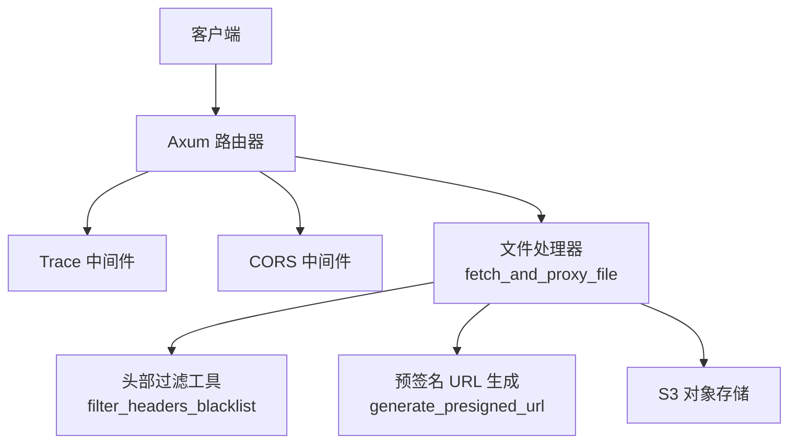
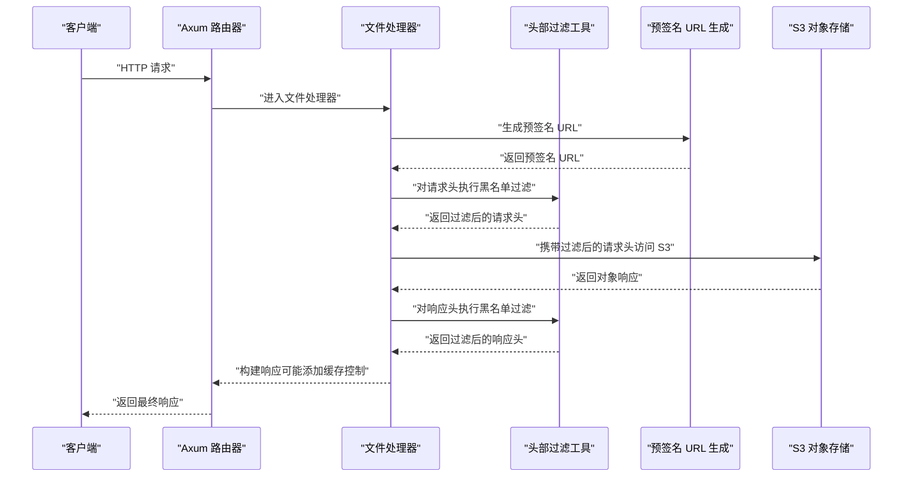
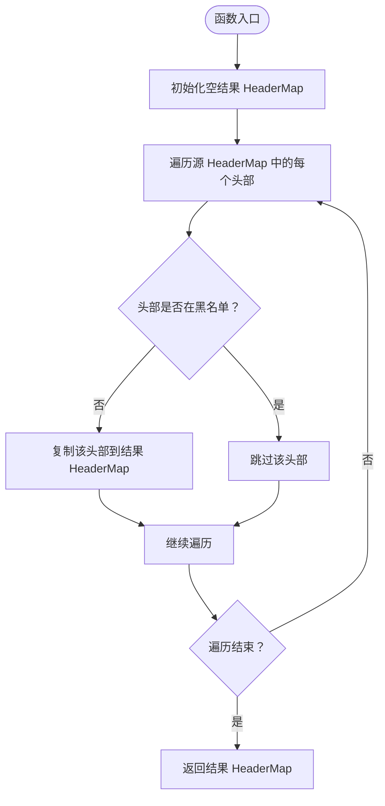
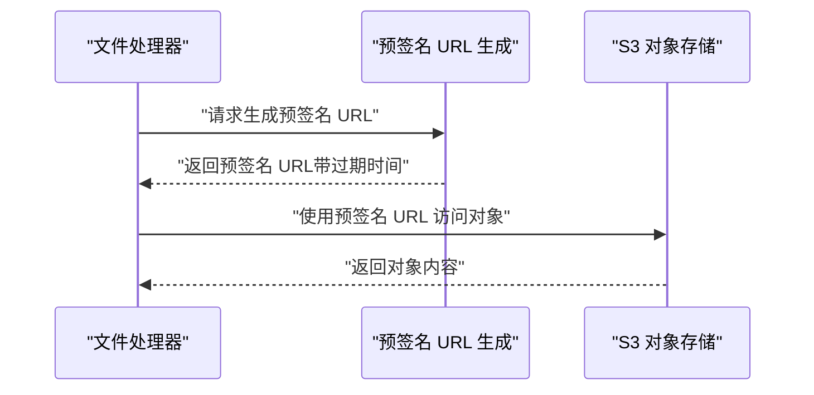
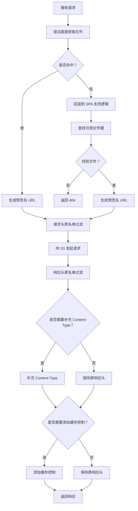
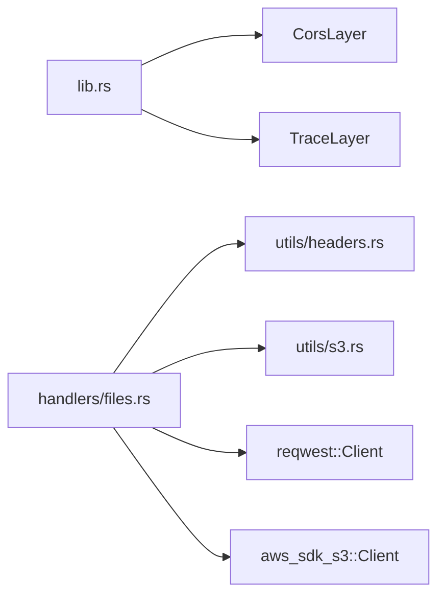

# 安全特性

<cite>
**本文引用的文件**
- [src/lib.rs](file://src/lib.rs)
- [src/handlers/files.rs](file://src/handlers/files.rs)
- [src/utils/headers.rs](file://src/utils/headers.rs)
- [src/utils/s3.rs](file://src/utils/s3.rs)
- [src/main.rs](file://src/main.rs)
</cite>

## 目录
1. [简介](#简介)
2. [项目结构](#项目结构)
3. [核心组件](#核心组件)
4. [架构总览](#架构总览)
5. [详细组件分析](#详细组件分析)
6. [依赖关系分析](#依赖关系分析)
7. [性能考量](#性能考量)
8. [故障排查指南](#故障排查指南)
9. [结论](#结论)
10. [附录：最佳实践建议](#附录最佳实践建议)

## 简介
本文件系统性阐述 static-server 的安全防护机制，重点围绕以下方面：
- HTTP 头部过滤的黑名单模式：在请求转发时移除敏感头部（如 CONNECTION、HOST、AUTHORIZATION、COOKIE、ORIGIN、REFERER），在响应中移除与服务器配置冲突的 CORS 与缓存控制头部，防止内部信息泄露与认证绕过。
- CORS 策略通过 tower-http 中间件在应用层统一配置，头部过滤作为补充安全措施。
- 预签名 URL 机制替代直接凭证传递，实现安全的资源访问授权。
- 结合 filter_headers_blacklist 工具函数的实现，展示其遍历 HeaderMap 并排除黑名单项的具体逻辑。
- 提供安全配置的最佳实践建议。

## 项目结构
该服务以 Axum 为基础，通过中间件层统一配置 CORS，并在文件处理器中实现头部过滤与预签名 URL 代理。关键文件如下：
- 应用入口与中间件配置：src/main.rs、src/lib.rs
- 文件代理与安全过滤：src/handlers/files.rs
- 通用头部过滤工具：src/utils/headers.rs
- 预签名 URL 生成：src/utils/s3.rs

图表来源
- [src/lib.rs](file://src/lib.rs#L55-L60)
- [src/handlers/files.rs](file://src/handlers/files.rs#L115-L167)
- [src/utils/headers.rs](file://src/utils/headers.rs#L1-L32)
- [src/utils/s3.rs](file://src/utils/s3.rs#L29-L46)

章节来源
- [src/lib.rs](file://src/lib.rs#L55-L60)
- [src/main.rs](file://src/main.rs#L17-L23)

## 核心组件
- CORS 统一配置：应用层通过 tower_http::cors::CorsLayer::permissive() 统一开启跨域支持，确保跨域行为可控且可审计。
- 头部过滤工具：filter_headers_blacklist 实现黑名单模式，遍历 HeaderMap，仅保留不在黑名单中的头部，避免误删与遗漏。
- 请求/响应头部黑名单：
  - 请求转发黑名单（FORWARD_BLOCKED_HEADERS）：移除 CONNECTION、HOST、AUTHORIZATION、COOKIE、ORIGIN、REFERER、CACHE_CONTROL、PRAGMA 等，防止认证泄露与内部信息暴露。
  - 响应头部黑名单（BLOCKED_HEADERS）：移除 ACCESS_CONTROL_* 与缓存控制头部，避免与服务端策略冲突。
- 预签名 URL：generate_presigned_url 生成带过期时间的临时访问链接，替代直接凭证传递，降低凭据泄露风险。

章节来源
- [src/lib.rs](file://src/lib.rs#L55-L60)
- [src/utils/headers.rs](file://src/utils/headers.rs#L1-L32)
- [src/handlers/files.rs](file://src/handlers/files.rs#L26-L77)
- [src/utils/s3.rs](file://src/utils/s3.rs#L29-L46)

## 架构总览
下图展示了从客户端到 S3 的完整请求链路，以及安全过滤点位。

图表来源
- [src/handlers/files.rs](file://src/handlers/files.rs#L115-L167)
- [src/utils/headers.rs](file://src/utils/headers.rs#L1-L32)
- [src/utils/s3.rs](file://src/utils/s3.rs#L29-L46)

## 详细组件分析

### CORS 策略与中间件配置
- 应用层通过 CorsLayer::permissive() 开启跨域支持，便于前端跨域访问静态资源。
- 该策略作为全局安全边界，与头部过滤共同作用，避免 CORS 头部与服务端策略冲突，同时减少不必要的跨域风险。

章节来源
- [src/lib.rs](file://src/lib.rs#L55-L60)

### 头部过滤工具：filter_headers_blacklist
- 黑名单模式：遍历源 HeaderMap，仅保留不在黑名单中的头部，避免误删与遗漏。
- 时间复杂度：O(n)，n 为源 HeaderMap 中头部数量。
- 适用场景：请求转发前移除敏感头部；响应返回前移除与服务端策略冲突的头部。

图表来源
- [src/utils/headers.rs](file://src/utils/headers.rs#L1-L32)

章节来源
- [src/utils/headers.rs](file://src/utils/headers.rs#L1-L32)

### 请求转发头部黑名单（FORWARD_BLOCKED_HEADERS）
- 目标：在将客户端请求转发至 S3 之前，移除潜在敏感或冲突的头部，防止认证泄露与内部信息暴露。
- 关键项：
  - 连接管理：CONNECTION、TRANSFER_ENCODING、UPGRADE
  - 代理相关：PROXY_AUTHORIZATION
  - 主机相关：HOST（由下游客户端自动设置）
  - 认证相关：AUTHORIZATION、COOKIE（S3 预签名 URL 已包含认证）
  - 源信息：ORIGIN、REFERER
  - 缓存控制：CACHE_CONTROL、PRAGMA

章节来源
- [src/handlers/files.rs](file://src/handlers/files.rs#L50-L77)

### 响应头部黑名单（BLOCKED_HEADERS）
- 目标：在将 S3 响应返回给客户端之前，移除与服务器配置冲突的 CORS 与缓存控制头部，避免双重设置导致不可预期的行为。
- 关键项：
  - 跨域相关：ACCESS_CONTROL_ALLOW_ORIGIN、ACCESS_CONTROL_ALLOW_METHODS、ACCESS_CONTROL_ALLOW_HEADERS、ACCESS_CONTROL_ALLOW_CREDENTIALS、ACCESS_CONTROL_EXPOSE_HEADERS、ACCESS_CONTROL_MAX_AGE
  - 缓存控制：CACHE_CONTROL、EXPIRES、PRAGMA、AGE

章节来源
- [src/handlers/files.rs](file://src/handlers/files.rs#L26-L44)

### 预签名 URL 机制与安全授权
- 机制：generate_presigned_url 为 S3 对象生成带过期时间的临时访问链接，默认有效期 1 小时，减少长期凭据暴露风险。
- 优势：
  - 替代直接凭证传递，避免凭据在客户端或网络中泄露。
  - 通过过期时间限制访问窗口，降低滥用风险。
  - 可结合黑名单过滤进一步降低敏感头部影响。

图表来源
- [src/handlers/files.rs](file://src/handlers/files.rs#L115-L136)
- [src/utils/s3.rs](file://src/utils/s3.rs#L29-L46)

章节来源
- [src/utils/s3.rs](file://src/utils/s3.rs#L29-L46)
- [src/handlers/files.rs](file://src/handlers/files.rs#L115-L136)

### 文件代理流程与安全要点
- 从客户端接收请求后，先尝试直接获取目标文件；若 404 则回退到 SPA 支持逻辑。
- 生成预签名 URL 后，使用黑名单过滤请求头，再向 S3 发起请求。
- 对 S3 响应头进行黑名单过滤，必要时补充 Content-Type 与缓存控制头部。
- 整体流程确保敏感头部不被透传，同时避免与服务端策略冲突。

图表来源
- [src/handlers/files.rs](file://src/handlers/files.rs#L115-L193)

章节来源
- [src/handlers/files.rs](file://src/handlers/files.rs#L115-L193)

## 依赖关系分析
- 应用层依赖：Axum、tower_http（CORS）、reqwest（HTTP 客户端）、aws_sdk_s3（S3 客户端）。
- 处理器依赖：utils.headers.filter_headers_blacklist、utils.s3.generate_presigned_url。
- 中间件依赖：TraceLayer、CorsLayer。

图表来源
- [src/lib.rs](file://src/lib.rs#L13-L20)
- [src/handlers/files.rs](file://src/handlers/files.rs#L1-L16)
- [src/utils/headers.rs](file://src/utils/headers.rs#L1-L10)
- [src/utils/s3.rs](file://src/utils/s3.rs#L1-L10)

章节来源
- [src/lib.rs](file://src/lib.rs#L13-L20)
- [src/handlers/files.rs](file://src/handlers/files.rs#L1-L16)

## 性能考量
- 预签名 URL 缓存：generate_presigned_url 使用缓存宏，按键缓存结果，减少重复生成开销，提升吞吐。
- 头部过滤：filter_headers_blacklist 为 O(n) 遍历，通常头部数量有限，开销可忽略。
- 流式响应：对 S3 响应体采用流式传输，降低内存占用，提高大文件传输效率。

章节来源
- [src/utils/s3.rs](file://src/utils/s3.rs#L22-L28)
- [src/utils/headers.rs](file://src/utils/headers.rs#L1-L32)
- [src/handlers/files.rs](file://src/handlers/files.rs#L159-L166)

## 故障排查指南
- 预签名 URL 失败：检查 S3 凭证与权限配置，确认生成函数返回错误时的状态码与消息。
- 跨域问题：确认 CORS 中间件已启用，同时注意响应头黑名单会移除 CORS 相关头部，避免与服务端策略冲突。
- 缓存异常：若发现缓存行为不符合预期，检查响应头黑名单是否移除了必要的缓存控制头部，以及是否按规则添加了缓存控制。
- 认证泄露：若仍出现认证头透传，检查请求头黑名单配置是否覆盖了 AUTHORIZATION、COOKIE、ORIGIN、REFERER 等关键头部。

章节来源
- [src/handlers/files.rs](file://src/handlers/files.rs#L115-L167)
- [src/lib.rs](file://src/lib.rs#L55-L60)

## 结论
static-server 通过“CORS 统一配置 + 头部过滤黑名单 + 预签名 URL”的组合，形成多层安全防护：
- CORS 作为全局跨域边界；
- 头部过滤在请求与响应两端消除敏感与冲突头部；
- 预签名 URL 将认证与访问控制外置，降低凭据泄露风险；
- 辅以流式传输与缓存优化，兼顾安全性与性能。

## 附录：最佳实践建议
- CORS 策略
  - 生产环境建议使用更严格的 CORS 策略，而非 permissive，明确允许的来源、方法与头部。
  - 明确暴露的响应头与凭据支持策略，避免默认 permissive 导致的跨域滥用风险。
- 头部过滤
  - 保持黑名单最小化原则，仅移除确有风险或与服务端策略冲突的头部。
  - 对新增头部进行安全评估，避免误删业务必需头部。
- 预签名 URL
  - 严格控制过期时间，结合访问频率与资源热度选择合适的 TTL。
  - 对高敏感资源建议缩短过期时间或增加一次性使用限制。
- 日志与监控
  - 记录预签名 URL 生成与访问事件，配合 Trace 中间件输出，便于审计与追踪。
- 审计与合规
  - 定期审查 CORS 与头部过滤策略，确保符合组织安全基线与合规要求。