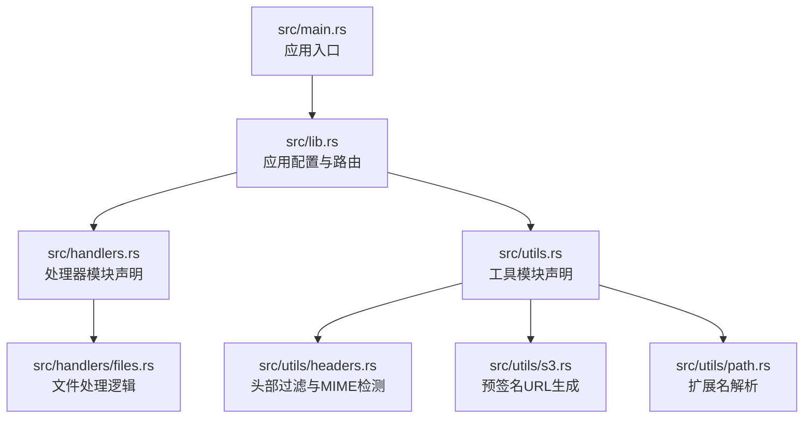
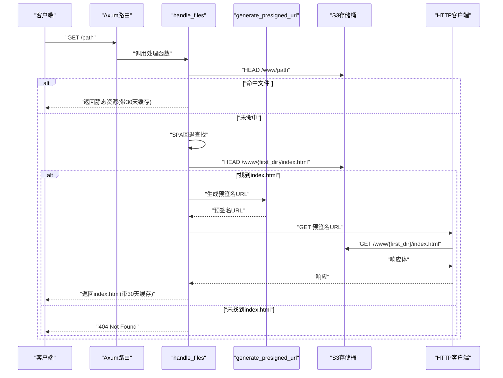
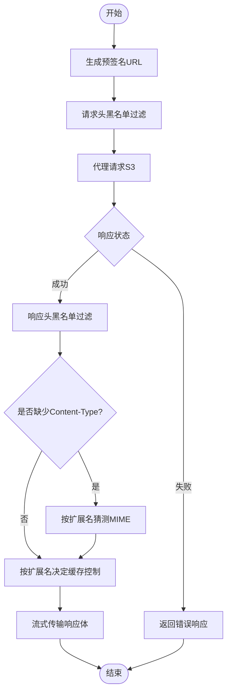
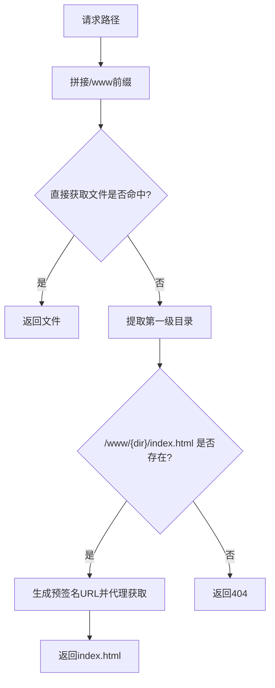
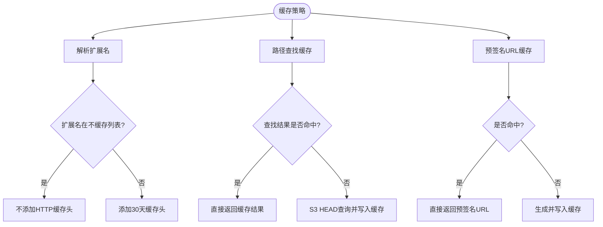
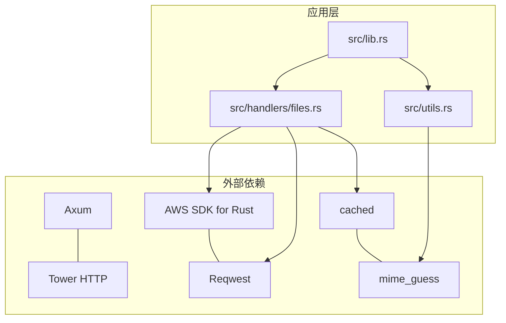

# 核心功能详解

<cite>
**本文引用的文件**
- [src/main.rs](file://src/main.rs)
- [src/lib.rs](file://src/lib.rs)
- [src/handlers.rs](file://src/handlers.rs)
- [src/handlers/files.rs](file://src/handlers/files.rs)
- [src/utils.rs](file://src/utils.rs)
- [src/utils/headers.rs](file://src/utils/headers.rs)
- [src/utils/s3.rs](file://src/utils/s3.rs)
- [src/utils/path.rs](file://src/utils/path.rs)
- [Cargo.toml](file://Cargo.toml)
- [README.md](file://README.md)
</cite>

## 目录
1. [简介](#简介)
2. [项目结构](#项目结构)
3. [核心组件](#核心组件)
4. [架构总览](#架构总览)
5. [详细组件分析](#详细组件分析)
6. [依赖关系分析](#依赖关系分析)
7. [性能考量](#性能考量)
8. [故障排查指南](#故障排查指南)
9. [结论](#结论)

## 简介
本项目是一个基于 Rust 与 Axum 的高性能静态文件服务器，具备四大核心能力：
- S3 文件服务：通过 S3 客户端生成预签名 URL 并代理请求，保障资源安全访问
- SPA 路由支持：当请求文件不存在时回退到 index.html，支持前端路由
- 缓存策略：静态资源 30 天 HTTP 缓存与路径查找结果的内存缓存（60 秒）
- 安全特性：HTTP 头部黑名单过滤、CORS 策略配置、认证信息保护

## 项目结构
项目采用模块化组织，入口在 main.rs，应用配置与路由在 lib.rs，核心业务逻辑集中在 handlers/files.rs，工具函数分布在 utils 下的 headers、s3、path 模块。

图表来源
- [src/main.rs](file://src/main.rs#L1-L26)
- [src/lib.rs](file://src/lib.rs#L1-L61)
- [src/handlers.rs](file://src/handlers.rs#L1-L9)
- [src/handlers/files.rs](file://src/handlers/files.rs#L1-L293)
- [src/utils.rs](file://src/utils.rs#L1-L11)
- [src/utils/headers.rs](file://src/utils/headers.rs#L1-L47)
- [src/utils/s3.rs](file://src/utils/s3.rs#L1-L47)
- [src/utils/path.rs](file://src/utils/path.rs#L1-L30)

章节来源
- [src/main.rs](file://src/main.rs#L1-L26)
- [src/lib.rs](file://src/lib.rs#L1-L61)
- [src/handlers.rs](file://src/handlers.rs#L1-L9)
- [src/utils.rs](file://src/utils.rs#L1-L11)

## 核心组件
- 应用状态 AppState：封装 S3 客户端、HTTP 客户端与存储桶名称，作为全局共享资源注入路由
- 文件处理器 handle_files：统一入口，负责路径解析、S3 查询、回退逻辑与响应构造
- S3 工具 generate_presigned_url：生成带过期时间的预签名 URL，避免暴露密钥
- 头部工具 filter_headers_blacklist：实现黑名单过滤，确保安全与一致性
- 路径工具 get_extension_lowercase：用于缓存策略与 MIME 推断
- 缓存宏 cached：为预签名 URL 与路径查找结果提供内存缓存

章节来源
- [src/lib.rs](file://src/lib.rs#L19-L60)
- [src/handlers/files.rs](file://src/handlers/files.rs#L96-L167)
- [src/utils/s3.rs](file://src/utils/s3.rs#L1-L47)
- [src/utils/headers.rs](file://src/utils/headers.rs#L1-L47)
- [src/utils/path.rs](file://src/utils/path.rs#L1-L30)

## 架构总览
应用启动后初始化 S3 与 HTTP 客户端，创建 AppState 注入路由。所有请求通过 fallback 路由进入文件处理器，按顺序尝试直取文件、SPA 回退与代理 S3，最终返回响应。

图表来源
- [src/lib.rs](file://src/lib.rs#L55-L60)
- [src/handlers/files.rs](file://src/handlers/files.rs#L230-L293)
- [src/utils/s3.rs](file://src/utils/s3.rs#L1-L47)

## 详细组件分析

### S3 文件服务：预签名 URL 与代理请求
- 预签名 URL 生成
  - 使用 S3 客户端生成带过期时间的预签名 URL，避免直接暴露密钥
  - 通过缓存宏对生成结果进行缓存，降低重复计算与网络开销
- 代理请求流程
  - 将请求头按黑名单过滤后再转发，移除可能泄露内部信息或影响代理行为的头部
  - 从 S3 获取响应后，再次按黑名单过滤响应头，避免跨域与缓存头污染
  - 若 S3 响应缺少 Content-Type，依据文件扩展名进行 MIME 推断并补充
  - 对非 HTML/HTM 文件添加 30 天缓存控制头，提升浏览器缓存效率

图表来源
- [src/handlers/files.rs](file://src/handlers/files.rs#L112-L167)
- [src/utils/s3.rs](file://src/utils/s3.rs#L1-L47)
- [src/utils/headers.rs](file://src/utils/headers.rs#L1-L47)
- [src/utils/path.rs](file://src/utils/path.rs#L1-L30)

章节来源
- [src/handlers/files.rs](file://src/handlers/files.rs#L96-L167)
- [src/utils/s3.rs](file://src/utils/s3.rs#L1-L47)
- [src/utils/headers.rs](file://src/utils/headers.rs#L1-L47)
- [src/utils/path.rs](file://src/utils/path.rs#L1-L30)

### SPA 路由支持：回退到 index.html
- 路径查找逻辑
  - 首先在 /www 前缀下尝试直接获取请求文件
  - 若返回 404，则检查请求路径对应的第一级目录是否存在 index.html
  - 该查找过程通过缓存宏进行内存缓存，减少 S3 HEAD 请求次数
- 回退机制
  - 找到 index.html 后，使用预签名 URL 代理获取并返回给客户端
  - 未找到时返回 404

图表来源
- [src/handlers/files.rs](file://src/handlers/files.rs#L230-L293)
- [src/handlers/files.rs](file://src/handlers/files.rs#L192-L228)

章节来源
- [src/handlers/files.rs](file://src/handlers/files.rs#L192-L228)
- [src/handlers/files.rs](file://src/handlers/files.rs#L230-L293)

### 缓存策略：HTTP 缓存与内存缓存
- 静态资源 HTTP 缓存
  - 对非 HTML/HTM 文件添加 30 天缓存控制头，提升浏览器缓存命中率
  - HTML/HTM 文件不缓存，避免前端路由更新后仍使用旧版本
- 路径查找结果内存缓存
  - 对 find_exists_key 的查找结果进行缓存，键包含存储桶名与路径，超时时间为 120 秒
  - 有效降低高频路由请求带来的 S3 HEAD 调用
- 预签名 URL 内存缓存
  - 对 generate_presigned_url 的结果进行缓存，键包含存储桶名与对象名，超时时间为 1800 秒
  - 减少重复生成预签名 URL 的成本

图表来源
- [src/handlers/files.rs](file://src/handlers/files.rs#L79-L94)
- [src/handlers/files.rs](file://src/handlers/files.rs#L230-L293)
- [src/utils/s3.rs](file://src/utils/s3.rs#L1-L47)

章节来源
- [src/handlers/files.rs](file://src/handlers/files.rs#L79-L94)
- [src/handlers/files.rs](file://src/handlers/files.rs#L230-L293)
- [src/utils/s3.rs](file://src/utils/s3.rs#L1-L47)

### 安全特性：头部过滤、CORS 与认证保护
- HTTP 头部黑名单过滤
  - 请求头过滤：移除 CONNECTION、TRANSFER_ENCODING、UPGRADE、PROXY_AUTHORIZATION、HOST、AUTHORIZATION、COOKIE、ORIGIN、REFERER、CACHE_CONTROL、PRAGMA 等，避免泄露内部信息与影响代理行为
  - 响应头过滤：移除 ACCESS_CONTROL_*、CACHE_CONTROL、EXPIRES、PRAGMA、AGE 等，防止跨域与缓存头污染
- CORS 策略
  - 应用层启用宽松的 CORS 中间件，允许跨域访问
- 认证信息保护
  - 使用预签名 URL 替代明文凭据，避免 AUTHORIZATION 与 COOKIE 泄露
  - 预签名 URL 附带过期时间，降低长期暴露风险

章节来源
- [src/handlers/files.rs](file://src/handlers/files.rs#L23-L77)
- [src/handlers/files.rs](file://src/handlers/files.rs#L112-L167)
- [src/lib.rs](file://src/lib.rs#L55-L60)

## 依赖关系分析
- 框架与运行时
  - Axum 路由与异步处理
  - Tower HTTP 中间件（CORS、Trace）
  - Tokio 异步运行时
- AWS SDK
  - aws-config 与 aws-sdk-s3 用于 S3 访问与预签名 URL 生成
- HTTP 客户端
  - reqwest 用于代理 S3 请求
- 缓存与工具
  - cached 宏提供内存缓存
  - mime_guess 用于 MIME 类型推断
  - dotenvy 用于环境变量加载

图表来源
- [src/lib.rs](file://src/lib.rs#L1-L61)
- [src/handlers/files.rs](file://src/handlers/files.rs#L1-L293)
- [src/utils.rs](file://src/utils.rs#L1-L11)
- [Cargo.toml](file://Cargo.toml#L1-L20)

章节来源
- [Cargo.toml](file://Cargo.toml#L1-L20)
- [src/lib.rs](file://src/lib.rs#L1-L61)

## 性能考量
- 异步与流式传输
  - 基于 Tokio 的异步架构与流式响应体，降低内存占用并提升吞吐
- 缓存优化
  - 预签名 URL 与路径查找结果的内存缓存显著减少 S3 API 调用
  - 静态资源 30 天缓存提升浏览器命中率
- 头部过滤
  - 移除不必要的头部，减少代理链路开销

## 故障排查指南
- 404 未找到
  - 检查请求路径是否位于 /www 前缀下
  - 确认 SPA 回退逻辑是否能找到对应的第一级目录 index.html
- S3 访问失败
  - 检查 AWS 环境变量配置（访问密钥、区域、端点、存储桶名）
  - 验证预签名 URL 生成是否成功（确认过期时间与权限）
- CORS 问题
  - 确认已启用 CORS 中间件
  - 如需更严格的策略，请自定义 CORS 配置
- 缓存问题
  - HTML/HTM 文件不缓存，若出现路由更新滞后，等待缓存过期或强制刷新
  - 检查浏览器开发者工具 Network 面板中的 Cache-Control 头

章节来源
- [src/handlers/files.rs](file://src/handlers/files.rs#L230-L293)
- [src/utils/s3.rs](file://src/utils/s3.rs#L1-L47)
- [src/lib.rs](file://src/lib.rs#L55-L60)
- [README.md](file://README.md#L27-L40)

## 结论
本项目通过预签名 URL、头部黑名单过滤与内存缓存等手段，在保证安全性的同时实现了高性能的静态文件服务。SPA 路由回退逻辑与智能缓存策略共同提升了用户体验与系统性能。建议在生产环境中结合具体的 S3 服务端点与 CORS 需求进一步细化配置。