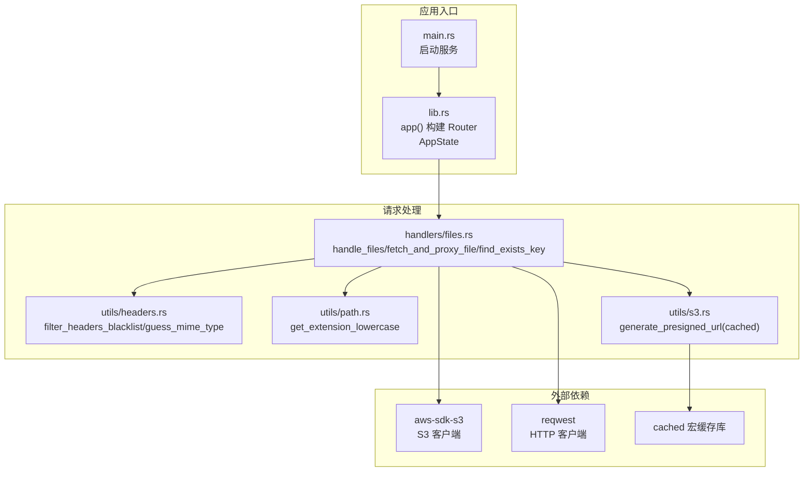
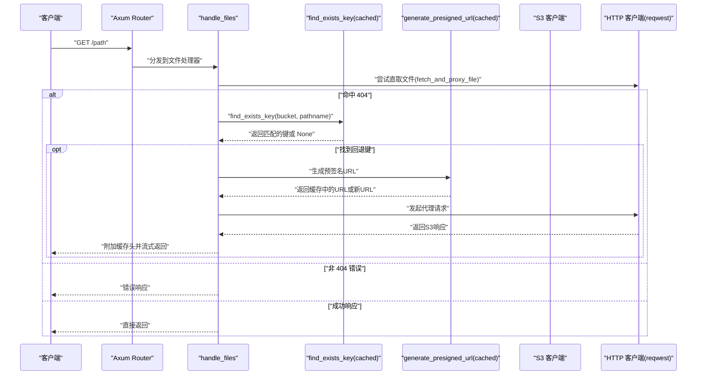
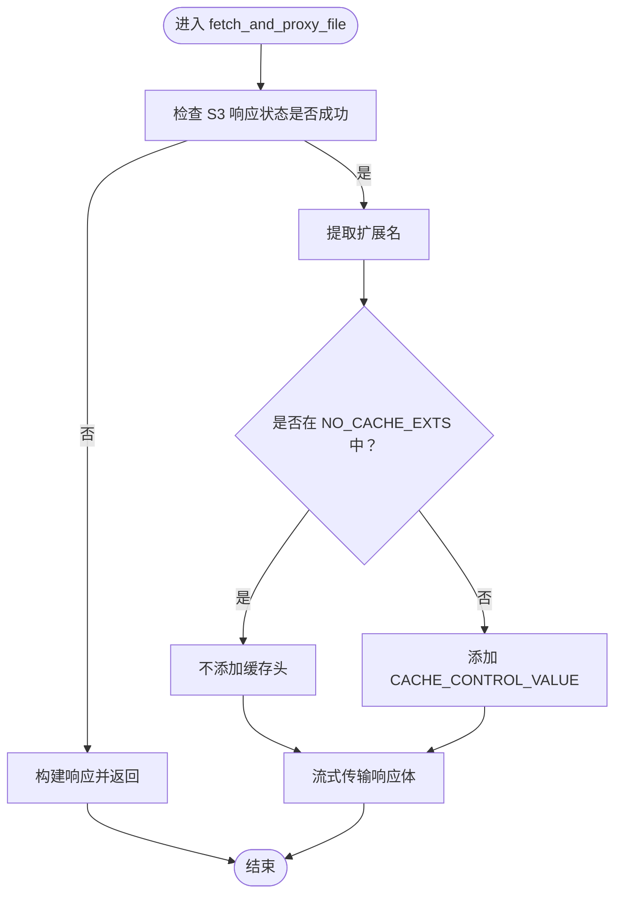
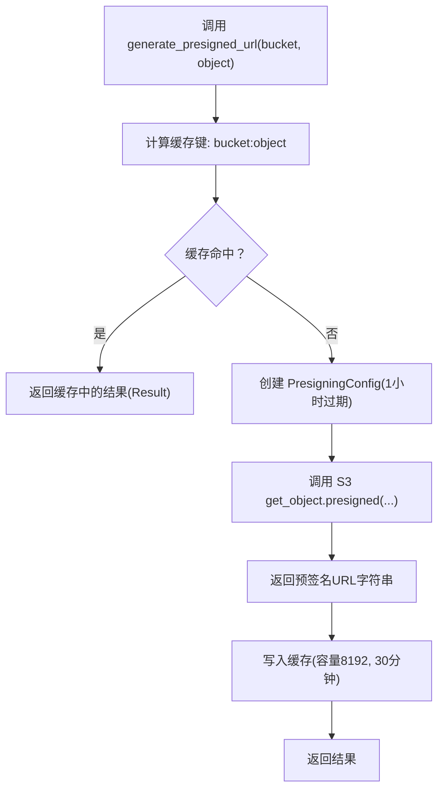
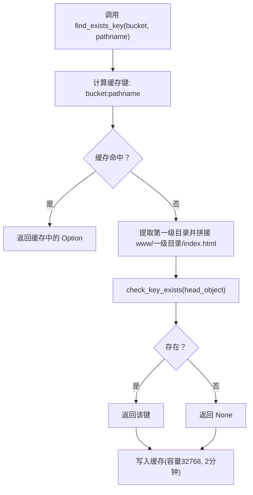
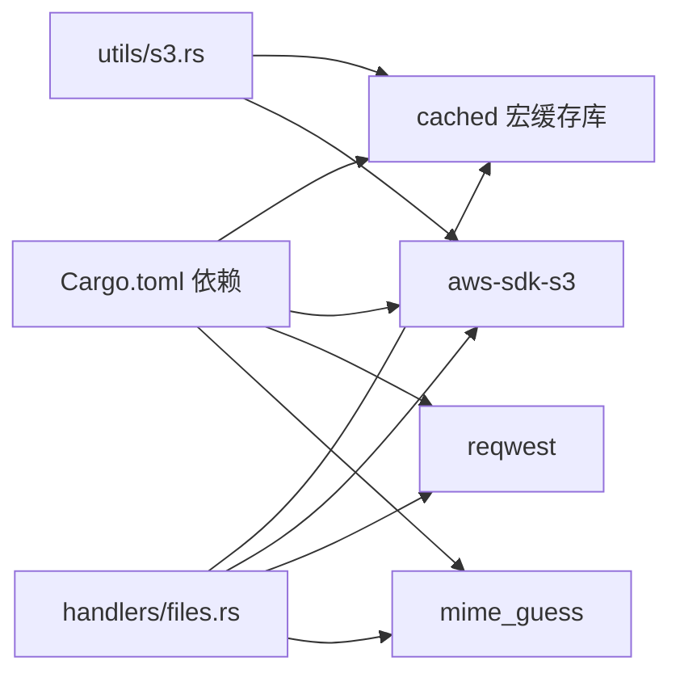

# 缓存策略

<cite>
**本文引用的文件**
- [src/main.rs](file://src/main.rs)
- [src/lib.rs](file://src/lib.rs)
- [src/handlers.rs](file://src/handlers.rs)
- [src/utils.rs](file://src/utils.rs)
- [src/handlers/files.rs](file://src/handlers/files.rs)
- [src/utils/headers.rs](file://src/utils/headers.rs)
- [src/utils/path.rs](file://src/utils/path.rs)
- [src/utils/s3.rs](file://src/utils/s3.rs)
- [Cargo.toml](file://Cargo.toml)
- [README.md](file://README.md)
</cite>

## 目录
1. [简介](#简介)
2. [项目结构](#项目结构)
3. [核心组件](#核心组件)
4. [架构总览](#架构总览)
5. [详细组件分析](#详细组件分析)
6. [依赖关系分析](#依赖关系分析)
7. [性能考量](#性能考量)
8. [故障排查指南](#故障排查指南)
9. [结论](#结论)

## 简介
本文件围绕 static-server 的多层次缓存策略展开，重点包括：
- HTTP 级缓存控制：通过 CACHE_CONTROL_VALUE 常量为静态资源设置 30 天浏览器缓存；通过 should_cache 函数与 NO_CACHE_EXTS 黑名单决定是否添加缓存头。
- 内存级缓存机制：generate_presigned_url 使用 cached 宏对预签名 URL 进行 30 分钟内存缓存（容量 8192）；find_exists_key 对路径查找结果进行 2 分钟缓存（容量 32768），显著降低 S3 API 调用次数并提升响应性能。
- 缓存键生成逻辑与失效策略：预签名 URL 缓存键为“存储桶名:对象键”，路径查找缓存键为“存储桶名:路径名”；分别依据时间过期与容量淘汰策略进行失效。
- 多层缓存协同工作方式及对系统整体性能的影响。

## 项目结构
static-server 采用模块化组织，关键与缓存相关的模块如下：
- handlers/files.rs：HTTP 级缓存控制、路径查找与回退逻辑、预签名 URL 生成与代理转发。
- utils/s3.rs：预签名 URL 的内存缓存实现。
- utils/headers.rs：HTTP 头部过滤工具（用于移除不必要的头部）。
- utils/path.rs：文件扩展名提取工具（用于 should_cache 判断）。
- lib.rs：应用状态 AppState（包含 S3 客户端、HTTP 客户端、存储桶名）。
- main.rs：应用启动入口。
- Cargo.toml：依赖 cached 宏缓存库与 AWS SDK、Axum、Reqwest 等。

图表来源
- [src/main.rs](file://src/main.rs#L1-L26)
- [src/lib.rs](file://src/lib.rs#L1-L61)
- [src/handlers/files.rs](file://src/handlers/files.rs#L1-L293)
- [src/utils/headers.rs](file://src/utils/headers.rs#L1-L47)
- [src/utils/path.rs](file://src/utils/path.rs#L1-L30)
- [src/utils/s3.rs](file://src/utils/s3.rs#L1-L47)
- [Cargo.toml](file://Cargo.toml#L1-L20)

章节来源
- [src/main.rs](file://src/main.rs#L1-L26)
- [src/lib.rs](file://src/lib.rs#L1-L61)
- [src/handlers.rs](file://src/handlers.rs#L1-L9)
- [src/utils.rs](file://src/utils.rs#L1-L11)
- [Cargo.toml](file://Cargo.toml#L1-L20)

## 核心组件
- HTTP 级缓存控制
  - CACHE_CONTROL_VALUE 常量：为静态资源设置公共缓存与 30 天 max-age。
  - NO_CACHE_EXTS 黑名单：HTML/HTM 不缓存，避免 SPA 路由问题。
  - should_cache：根据文件扩展名判断是否添加缓存头。
- 内存级缓存
  - generate_presigned_url：预签名 URL 的 30 分钟内存缓存（容量 8192），键格式为“存储桶名:对象键”，缓存 Result 类型。
  - find_exists_key：路径查找结果的 2 分钟缓存（容量 32768），键格式为“存储桶名:路径名”。

章节来源
- [src/handlers/files.rs](file://src/handlers/files.rs#L23-L49)
- [src/handlers/files.rs](file://src/handlers/files.rs#L79-L95)
- [src/utils/s3.rs](file://src/utils/s3.rs#L1-L47)
- [src/handlers/files.rs](file://src/handlers/files.rs#L192-L228)

## 架构总览
下图展示了请求从进入应用到返回响应的关键流程，以及缓存策略在各环节的作用。

图表来源
- [src/handlers/files.rs](file://src/handlers/files.rs#L230-L293)
- [src/utils/s3.rs](file://src/utils/s3.rs#L1-L47)
- [src/handlers/files.rs](file://src/handlers/files.rs#L192-L228)

## 详细组件分析

### HTTP 级缓存控制
- 常量与策略
  - CACHE_CONTROL_VALUE：为静态资源设置公共缓存与较长有效期，适用于 CSS、JS、图片、字体等。
  - NO_CACHE_EXTS：HTML/HTM 不缓存，确保 SPA 路由更新时能及时生效。
  - should_cache：通过 get_extension_lowercase 获取扩展名并判断是否在黑名单中，从而决定是否添加缓存头。
- 实施位置
  - 在 fetch_and_proxy_file 中，对成功响应且 should_cache 返回 true 的情况，追加 CACHE_CONTROL_VALUE。
- 影响
  - 显著降低浏览器重复请求静态资源的次数，减轻带宽与 S3 请求压力。

图表来源
- [src/handlers/files.rs](file://src/handlers/files.rs#L112-L167)
- [src/handlers/files.rs](file://src/handlers/files.rs#L23-L49)
- [src/handlers/files.rs](file://src/handlers/files.rs#L79-L95)
- [src/utils/path.rs](file://src/utils/path.rs#L1-L30)

章节来源
- [src/handlers/files.rs](file://src/handlers/files.rs#L23-L49)
- [src/handlers/files.rs](file://src/handlers/files.rs#L79-L95)
- [src/handlers/files.rs](file://src/handlers/files.rs#L112-L167)
- [src/utils/path.rs](file://src/utils/path.rs#L1-L30)

### 内存级缓存机制

#### 预签名 URL 的 30 分钟内存缓存
- 实现位置：generate_presigned_url 使用 cached 宏，具备以下特征：
  - 键类型：String
  - 键生成：format!("{}:{}", bucket_name, object)
  - 容量：8192
  - 时间：1800 秒（30 分钟）
  - 结果缓存：result = true（缓存 Result 类型）
- 作用：避免频繁生成相同对象的预签名 URL，减少 S3 预签名计算与网络往返。
- 失效策略：按时间过期与容量淘汰共同作用；当缓存满时，LRU 淘汰旧条目；超过 30 分钟的条目会被替换。

图表来源
- [src/utils/s3.rs](file://src/utils/s3.rs#L1-L47)

章节来源
- [src/utils/s3.rs](file://src/utils/s3.rs#L1-L47)

#### 路径查找结果的 2 分钟缓存
- 实现位置：find_exists_key 使用 cached 宏，具备以下特征：
  - 键类型：String
  - 键生成：format!("{}:{}", bucket_name, pathname)
  - 容量：32768
  - 时间：120 秒（2 分钟）
- 作用：在 SPA 回退逻辑中，避免对同一路径反复查询 S3 是否存在 index.html，减少 head_object 调用。
- 失效策略：2 分钟过期或容量淘汰；命中率高时可显著降低 S3 API 调用。

图表来源
- [src/handlers/files.rs](file://src/handlers/files.rs#L192-L228)

章节来源
- [src/handlers/files.rs](file://src/handlers/files.rs#L192-L228)

### 缓存键生成逻辑与失效策略
- 预签名 URL 缓存键：bucket_name:object
  - 保证同一存储桶内不同对象的 URL 可独立缓存。
  - 一旦对象变更（如版本号变化），生成的新 URL 会覆盖旧缓存项。
- 路径查找缓存键：bucket_name:pathname
  - 保证同一存储桶内不同路径的查找结果独立缓存。
  - 2 分钟过期确保 SPA 回退逻辑能及时感知新部署的 index.html。
- 失效策略：
  - 时间过期：30 分钟（预签名 URL）、2 分钟（路径查找）。
  - 容量淘汰：LRU 淘汰超出容量上限的最久未使用项。
  - 结果缓存：预签名 URL 对 Result<String> 进行缓存，避免错误重试时重复调用。

章节来源
- [src/utils/s3.rs](file://src/utils/s3.rs#L1-L47)
- [src/handlers/files.rs](file://src/handlers/files.rs#L192-L228)

### 多层缓存协同工作方式
- HTTP 级缓存：浏览器缓存静态资源，减少重复下载。
- 内存级缓存：在应用层缓存预签名 URL 与路径查找结果，减少 S3 API 调用与生成成本。
- 协同效果：
  - 预签名 URL 缓存降低 S3 预签名计算与网络往返。
  - 路径查找缓存降低 head_object 调用频率，提高 SPA 回退逻辑的响应速度。
  - 组合使用显著降低 S3 API 调用量，提升整体吞吐与稳定性。

章节来源
- [src/handlers/files.rs](file://src/handlers/files.rs#L112-L167)
- [src/handlers/files.rs](file://src/handlers/files.rs#L192-L228)
- [src/utils/s3.rs](file://src/utils/s3.rs#L1-L47)

## 依赖关系分析
- cached 宏缓存库：提供 async 版本的 cached 宏，支持 key、convert、size、time、result 等参数。
- aws-sdk-s3：提供预签名 URL 生成与对象元数据查询能力。
- reqwest：用于代理转发 S3 响应，支持流式传输。
- mime_guess：用于在 S3 响应缺少 Content-Type 时进行 MIME 类型猜测。

图表来源
- [Cargo.toml](file://Cargo.toml#L1-L20)
- [src/handlers/files.rs](file://src/handlers/files.rs#L1-L293)
- [src/utils/s3.rs](file://src/utils/s3.rs#L1-L47)

章节来源
- [Cargo.toml](file://Cargo.toml#L1-L20)

## 性能考量
- 预签名 URL 缓存
  - 30 分钟有效期与 8192 容量适合高频访问的静态资源，减少 S3 预签名开销。
  - 键格式明确，避免跨存储桶或跨对象的误命中。
- 路径查找缓存
  - 2 分钟有效期与 32768 容量适合 SPA 回退场景，兼顾命中率与新鲜度。
  - 降低 head_object 调用，提升回退逻辑响应速度。
- HTTP 级缓存
  - 30 天 max-age 有效减少浏览器重复请求，降低带宽与 S3 请求压力。
  - HTML/HTM 不缓存，避免 SPA 路由更新延迟。
- 流式传输
  - 使用 Body::from_stream 进行响应体流式传输，降低内存占用，提升大文件性能。

章节来源
- [src/handlers/files.rs](file://src/handlers/files.rs#L112-L167)
- [src/handlers/files.rs](file://src/handlers/files.rs#L192-L228)
- [README.md](file://README.md#L81-L112)

## 故障排查指南
- 预签名 URL 一直返回旧内容
  - 现象：浏览器显示旧资源，即使对象已更新。
  - 排查：确认对象版本或命名是否改变；预签名 URL 缓存键包含对象键，对象不变则复用缓存。
  - 处置：等待 30 分钟过期或更换对象键以触发新 URL 生成。
- SPA 回退未生效
  - 现象：访问 /foo 未返回 index.html。
  - 排查：检查路径查找缓存是否命中；2 分钟内可能仍缓存旧结果。
  - 处置：等待 2 分钟过期或清理缓存（重启服务）。
- HTML/HTM 资源未更新
  - 现象：修改后的页面未即时生效。
  - 排查：HTML/HTM 不缓存，需检查浏览器缓存或强制刷新。
- S3 API 调用过多
  - 现象：head_object 或预签名 URL 调用频繁。
  - 排查：确认缓存容量与过期时间是否合理；检查键生成是否一致。
  - 处置：调整容量与过期时间；确保对象键稳定。

章节来源
- [src/utils/s3.rs](file://src/utils/s3.rs#L1-L47)
- [src/handlers/files.rs](file://src/handlers/files.rs#L192-L228)
- [src/handlers/files.rs](file://src/handlers/files.rs#L23-L49)

## 结论
static-server 的缓存策略通过“HTTP 级缓存 + 内存级缓存”的组合，在浏览器与应用层形成双重保护：
- HTTP 级缓存针对静态资源，显著降低重复请求；
- 内存级缓存针对预签名 URL 与路径查找，大幅减少 S3 API 调用；
- 通过合理的键生成与过期策略，平衡命中率与新鲜度，提升整体性能与稳定性。