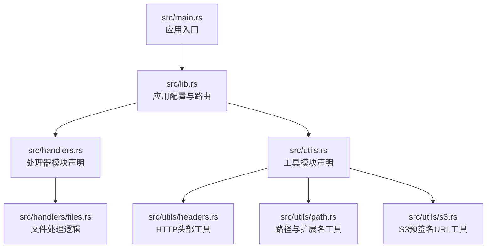
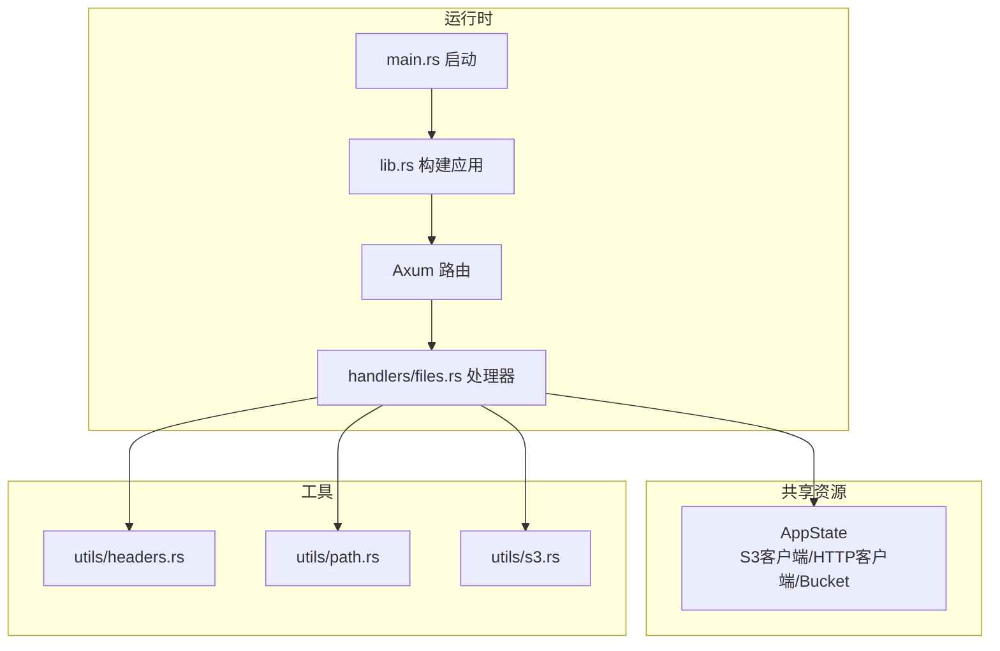
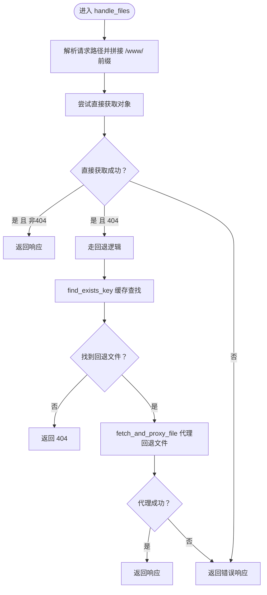
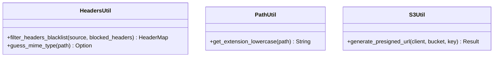
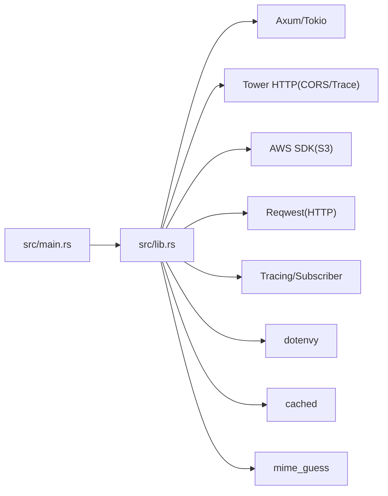

# 贡献指南

<cite>
**本文引用的文件**
- [README.md](file://README.md)
- [Cargo.toml](file://Cargo.toml)
- [src/main.rs](file://src/main.rs)
- [src/lib.rs](file://src/lib.rs)
- [src/handlers.rs](file://src/handlers.rs)
- [src/handlers/files.rs](file://src/handlers/files.rs)
- [src/utils.rs](file://src/utils.rs)
- [src/utils/headers.rs](file://src/utils/headers.rs)
- [src/utils/path.rs](file://src/utils/path.rs)
- [src/utils/s3.rs](file://src/utils/s3.rs)
- [Dockerfile](file://Dockerfile)
- [build.ps1](file://build.ps1)
</cite>

## 目录
1. [简介](#简介)
2. [项目结构](#项目结构)
3. [核心组件](#核心组件)
4. [架构总览](#架构总览)
5. [详细组件分析](#详细组件分析)
6. [依赖关系分析](#依赖关系分析)
7. [性能与质量要求](#性能与质量要求)
8. [测试与验证](#测试与验证)
9. [提交与审查流程](#提交与审查流程)
10. [故障排查](#故障排查)
11. [结语](#结语)

## 简介
本项目是一个基于 Rust 与 Axum 的高性能静态文件服务器，支持从 S3 兼容存储桶提供文件服务，具备 SPA 路由回退、智能缓存、MIME 类型检测、CORS 支持、预签名 URL 安全访问、以及 Docker 容器化部署能力。欢迎社区贡献者参与改进，包括但不限于：文档完善、新功能建议、Bug 修复、性能优化与代码风格提升。

## 项目结构
项目采用按功能模块划分的组织方式，入口位于 src/main.rs，应用配置与路由集中在 src/lib.rs，请求处理与工具函数分别位于 src/handlers 与 src/utils 下。README.md 中提供了清晰的目录结构说明，便于新贡献者快速定位代码位置。

图表来源
- [src/main.rs](file://src/main.rs#L1-L26)
- [src/lib.rs](file://src/lib.rs#L1-L61)
- [src/handlers.rs](file://src/handlers.rs#L1-L9)
- [src/handlers/files.rs](file://src/handlers/files.rs#L1-L293)
- [src/utils.rs](file://src/utils.rs#L1-L11)
- [src/utils/headers.rs](file://src/utils/headers.rs#L1-L47)
- [src/utils/path.rs](file://src/utils/path.rs#L1-L30)
- [src/utils/s3.rs](file://src/utils/s3.rs#L1-L47)

章节来源
- [README.md](file://README.md#L124-L142)
- [src/main.rs](file://src/main.rs#L1-L26)
- [src/lib.rs](file://src/lib.rs#L1-L61)
- [src/handlers.rs](file://src/handlers.rs#L1-L9)
- [src/utils.rs](file://src/utils.rs#L1-L11)

## 核心组件
- 应用入口与启动：负责加载环境变量、初始化日志、绑定监听地址并启动服务。
- 应用配置与状态：集中初始化 S3 客户端、HTTP 客户端、CORS 与链路追踪层，并通过 AppState 统一注入到路由。
- 文件处理器：实现 S3 对象获取、预签名 URL 生成、响应头过滤与缓存控制、SPA 回退逻辑、流式传输等。
- 工具模块：
  - headers：提供头部黑名单过滤与 MIME 类型猜测。
  - path：提供文件扩展名小写化工具。
  - s3：提供预签名 URL 生成与缓存。

章节来源
- [src/main.rs](file://src/main.rs#L1-L26)
- [src/lib.rs](file://src/lib.rs#L1-L61)
- [src/handlers/files.rs](file://src/handlers/files.rs#L1-L293)
- [src/utils/headers.rs](file://src/utils/headers.rs#L1-L47)
- [src/utils/path.rs](file://src/utils/path.rs#L1-L30)
- [src/utils/s3.rs](file://src/utils/s3.rs#L1-L47)

## 架构总览
系统采用异步架构，Axum 路由统一入口，通过 AppState 注入共享资源；文件请求经由文件处理器完成 S3 对象查询、预签名 URL 生成与代理转发；工具模块提供通用能力复用；Dockerfile 与 build.ps1 支持多阶段构建与产物导出。

图表来源
- [src/main.rs](file://src/main.rs#L1-L26)
- [src/lib.rs](file://src/lib.rs#L1-L61)
- [src/handlers/files.rs](file://src/handlers/files.rs#L1-L293)
- [src/utils/headers.rs](file://src/utils/headers.rs#L1-L47)
- [src/utils/path.rs](file://src/utils/path.rs#L1-L30)
- [src/utils/s3.rs](file://src/utils/s3.rs#L1-L47)

## 详细组件分析

### 文件处理器（handlers/files.rs）
- 关键职责
  - 生成预签名 URL 并代理请求，同时过滤敏感或冲突的头部。
  - 根据文件扩展名决定缓存策略，避免 HTML/HTM 缓存导致 SPA 路由问题。
  - 实现 SPA 回退：当请求对象不存在时，尝试在 /www/<first-level>/index.html 查找回退文件。
  - 流式传输响应体，降低内存占用。
- 数据与算法要点
  - 扩展名小写化与黑名单判定：O(1) 判断，常量时间。
  - 预签名 URL 生成与缓存：使用缓存宏，命中率高时显著减少 S3 API 调用。
  - 路径查找缓存：对 find_exists_key 使用缓存，减少重复 HEAD 查询。
- 错误处理
  - S3 错误与代理错误统一映射为 HTTP 502。
  - 404 时返回 NotFound，避免错误传播。
- 性能影响
  - 多级缓存（路径查找与预签名 URL）降低外部依赖调用频率。
  - 流式传输减少内存峰值。

图表来源
- [src/handlers/files.rs](file://src/handlers/files.rs#L1-L293)

章节来源
- [src/handlers/files.rs](file://src/handlers/files.rs#L1-L293)

### 工具模块（utils）
- headers：提供头部黑名单过滤与 MIME 类型猜测，避免跨域与缓存头部冲突，保障响应正确性。
- path：提供扩展名小写化工具，用于缓存策略与 MIME 判定。
- s3：提供预签名 URL 生成与缓存，提高访问安全性与性能。

图表来源
- [src/utils/headers.rs](file://src/utils/headers.rs#L1-L47)
- [src/utils/path.rs](file://src/utils/path.rs#L1-L30)
- [src/utils/s3.rs](file://src/utils/s3.rs#L1-L47)

章节来源
- [src/utils/headers.rs](file://src/utils/headers.rs#L1-L47)
- [src/utils/path.rs](file://src/utils/path.rs#L1-L30)
- [src/utils/s3.rs](file://src/utils/s3.rs#L1-L47)

## 依赖关系分析
- 运行时依赖：Tokio 异步运行时、Axum Web 框架、Reqwest HTTP 客户端、Tower HTTP 中间件（CORS、Trace）。
- AWS SDK：aws-config 与 aws-sdk-s3 用于 S3 配置与对象访问。
- 日志与配置：Tracing 与 Tracing Subscriber 用于可观测性；dotenvy 用于环境变量加载。
- 缓存与 MIME：cached 用于预签名 URL 与路径查找缓存；mime_guess 用于 MIME 类型猜测。
- 构建与打包：Dockerfile 多阶段构建；build.ps1 用于 Windows 一键构建与产物导出。

图表来源
- [src/main.rs](file://src/main.rs#L1-L26)
- [src/lib.rs](file://src/lib.rs#L1-L61)
- [Cargo.toml](file://Cargo.toml#L1-L20)

章节来源
- [Cargo.toml](file://Cargo.toml#L1-L20)
- [src/lib.rs](file://src/lib.rs#L1-L61)

## 性能与质量要求
- 异步与流式：系统基于 Tokio 与流式传输，建议在新增功能时延续异步模型与流式处理，避免阻塞与高内存占用。
- 缓存策略：优先利用现有缓存（预签名 URL 与路径查找），减少对外部依赖的频繁调用。
- 头部与 MIME：严格使用工具模块进行头部过滤与 MIME 猜测，避免跨域与缓存头部冲突，确保浏览器正确渲染。
- 可观测性：保持日志级别与 Trace 层配置，便于问题定位与性能分析。

章节来源
- [src/handlers/files.rs](file://src/handlers/files.rs#L1-L293)
- [src/utils/headers.rs](file://src/utils/headers.rs#L1-L47)
- [src/lib.rs](file://src/lib.rs#L1-L61)

## 测试与验证
- 当前仓库未发现显式的单元测试文件或 #[cfg(test)] 标记，建议新增功能时补充单元测试与集成测试。
- 建议覆盖范围
  - 文件处理器：预签名 URL 生成、头部过滤、缓存策略、SPA 回退、流式传输。
  - 工具模块：MIME 类型猜测、扩展名小写化、路径查找缓存命中。
  - 集成测试：端到端请求验证（S3 对象存在/不存在、404、CORS、缓存控制）。
- 本地验证
  - 使用 README.md 中的本地开发命令进行基本验证。
  - 使用 Dockerfile 与 build.ps1 进行构建与产物导出验证。

章节来源
- [README.md](file://README.md#L42-L80)
- [Dockerfile](file://Dockerfile#L1-L25)
- [build.ps1](file://build.ps1#L1-L18)

## 提交与审查流程
- 许可证与合规
  - 本项目采用 MIT 许可证，请在贡献前确认遵守许可证条款。
- 讨论与设计
  - 若变更较大或涉及架构调整，建议先通过 issue 讨论设计思路，达成共识后再实施。
- 分支与提交
  - Fork 仓库，在特性分支上进行开发，提交前请确保通过本地验证与格式化。
- 代码风格
  - 遵循 Rust 官方格式化规范 rustfmt，保持一致的代码风格与可读性。
- 提交与审查
  - 提交 Pull Request，描述变更动机、影响范围与验证方法。
  - 代码审查关注点：模块化设计、清晰注释、错误处理、性能与可维护性。
- 文档与变更
  - 新增功能或行为变更需同步更新 README.md 或相关文档，确保信息一致性。

章节来源
- [README.md](file://README.md#L144-L147)

## 故障排查
- 环境变量
  - 确认 AWS_* 与 AWS_BUCKET 等环境变量已正确设置，否则应用无法初始化 S3 客户端。
- 端口与监听
  - 默认监听 0.0.0.0:3000，若端口占用请检查进程或修改地址。
- CORS 与缓存
  - 若遇到跨域或缓存异常，检查响应头过滤逻辑与缓存控制策略。
- Docker 构建
  - 使用 Dockerfile 多阶段构建；Windows 用户可用 build.ps1 一键构建并导出可执行文件。

章节来源
- [src/main.rs](file://src/main.rs#L1-L26)
- [src/lib.rs](file://src/lib.rs#L1-L61)
- [Dockerfile](file://Dockerfile#L1-L25)
- [build.ps1](file://build.ps1#L1-L18)

## 结语
感谢您对本项目的关注与贡献！请在提交前确保遵循上述流程与规范，共同维护高质量、可维护的代码库。对于大型变更，建议先通过 issue 讨论，以便获得更广泛的反馈与支持。