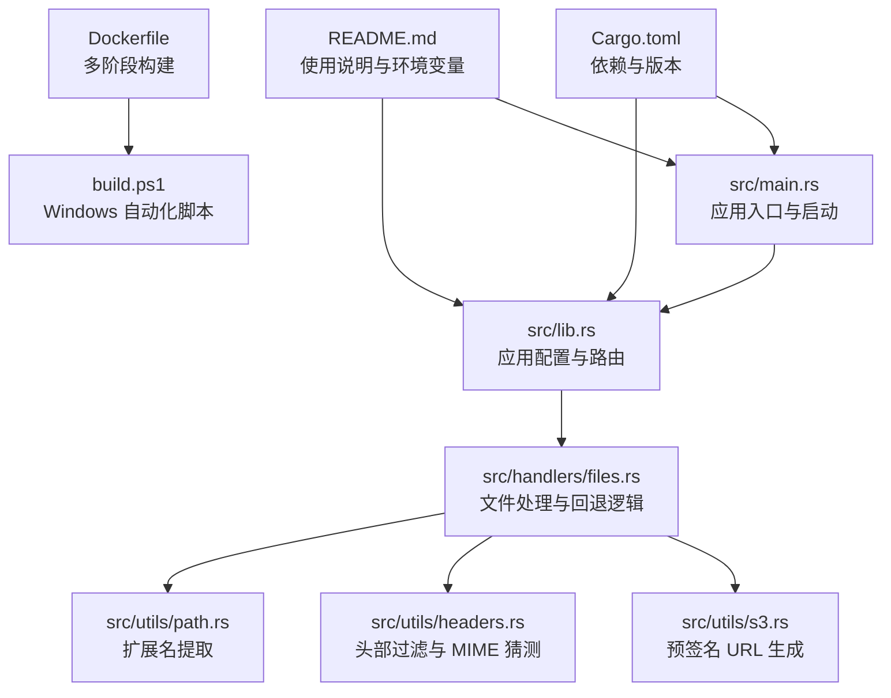
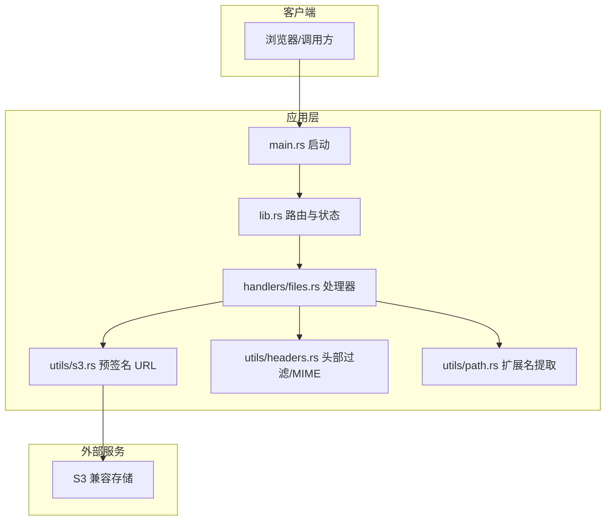
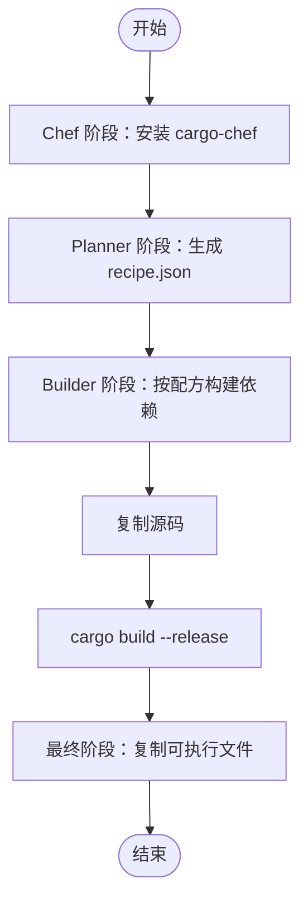
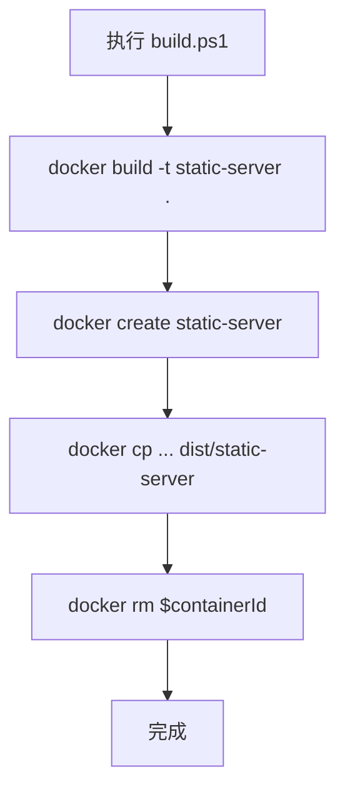
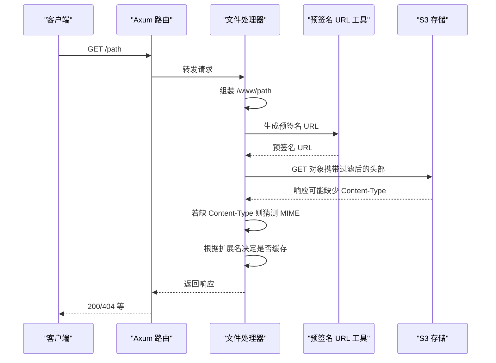
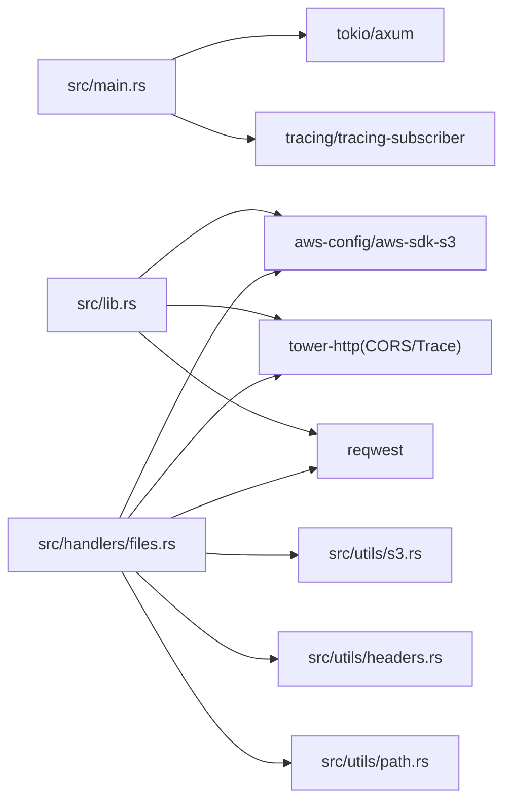

# 配置与部署

<cite>
**本文引用的文件**
- [Cargo.toml](file://Cargo.toml)
- [Dockerfile](file://Dockerfile)
- [build.ps1](file://build.ps1)
- [README.md](file://README.md)
- [src/main.rs](file://src/main.rs)
- [src/lib.rs](file://src/lib.rs)
- [src/utils/s3.rs](file://src/utils/s3.rs)
- [src/handlers/files.rs](file://src/handlers/files.rs)
- [src/utils/headers.rs](file://src/utils/headers.rs)
- [src/utils/path.rs](file://src/utils/path.rs)
</cite>

## 目录
1. [简介](#简介)
2. [项目结构](#项目结构)
3. [核心组件](#核心组件)
4. [架构总览](#架构总览)
5. [详细组件分析](#详细组件分析)
6. [依赖关系分析](#依赖关系分析)
7. [性能考量](#性能考量)
8. [故障排查指南](#故障排查指南)
9. [结论](#结论)
10. [附录](#附录)

## 简介
本指南面向生产部署与运维团队，提供静态文件服务器的完整配置与部署方案。内容涵盖：
- 环境变量的含义与设置方法（AWS 凭证、区域、端点、存储桶）
- Dockerfile 多阶段构建流程解析（Chef 预配方 + 依赖缓存 + 可执行文件复制）
- Windows 下 build.ps1 自动化构建与二进制提取逻辑
- Docker 镜像构建与容器运行最佳实践（端口映射、环境变量注入、日志输出）
- 生产环境建议配置（tracing 日志、资源限制、健康检查）

## 项目结构
该仓库采用标准 Rust 项目布局，核心逻辑集中在 src 目录，包含应用入口、库模块、处理器与工具函数；根目录提供构建与打包脚本及说明文档。

图表来源
- [src/main.rs](file://src/main.rs#L1-L26)
- [src/lib.rs](file://src/lib.rs#L1-L61)
- [src/handlers/files.rs](file://src/handlers/files.rs#L1-L293)
- [src/utils/s3.rs](file://src/utils/s3.rs#L1-L47)
- [src/utils/headers.rs](file://src/utils/headers.rs#L1-L47)
- [src/utils/path.rs](file://src/utils/path.rs#L1-L30)
- [Dockerfile](file://Dockerfile#L1-L25)
- [build.ps1](file://build.ps1#L1-L18)
- [Cargo.toml](file://Cargo.toml#L1-L20)
- [README.md](file://README.md#L1-L147)

章节来源
- [Cargo.toml](file://Cargo.toml#L1-L20)
- [README.md](file://README.md#L1-L147)

## 核心组件
- 应用入口与启动：负责加载环境变量、初始化日志、绑定监听地址并启动服务。
- 应用配置与路由：初始化 S3 客户端、HTTP 客户端、读取 AWS_BUCKET，注册 Trace/CORS 中间件与回退路由。
- 文件处理器：实现 SPA 回退、预签名 URL 生成、响应头过滤、MIME 类型猜测与缓存控制。
- S3 工具：基于 AWS SDK 生成预签名 URL 并带缓存。
- 头部与路径工具：提供黑名单头部过滤与扩展名提取。

章节来源
- [src/main.rs](file://src/main.rs#L1-L26)
- [src/lib.rs](file://src/lib.rs#L1-L61)
- [src/handlers/files.rs](file://src/handlers/files.rs#L1-L293)
- [src/utils/s3.rs](file://src/utils/s3.rs#L1-L47)
- [src/utils/headers.rs](file://src/utils/headers.rs#L1-L47)
- [src/utils/path.rs](file://src/utils/path.rs#L1-L30)

## 架构总览
系统通过 Axum 提供 HTTP 服务，将静态文件请求代理至 S3 兼容存储，使用预签名 URL 实现安全访问。应用具备 CORS 与请求追踪中间件，文件处理器负责 SPA 回退与缓存控制。

图表来源
- [src/main.rs](file://src/main.rs#L1-L26)
- [src/lib.rs](file://src/lib.rs#L1-L61)
- [src/handlers/files.rs](file://src/handlers/files.rs#L1-L293)
- [src/utils/s3.rs](file://src/utils/s3.rs#L1-L47)
- [src/utils/headers.rs](file://src/utils/headers.rs#L1-L47)
- [src/utils/path.rs](file://src/utils/path.rs#L1-L30)

## 详细组件分析

### 环境变量与 AWS 配置
- AWS_ACCESS_KEY_ID / AWS_SECRET_ACCESS_KEY：S3 访问凭据，支持所有 S3 兼容服务。
- AWS_REGION：S3 所属区域。
- AWS_ENDPOINT_URL：S3 兼容服务端点（如 OSS、COS、MinIO 等）。
- AWS_BUCKET：S3 存储桶名称，必须设置。
- DOTENV 支持：应用启动时会尝试加载 .env 文件，便于本地开发。

建议设置方式
- Linux/macOS：export AWS_* 与 AWS_BUCKET，或在 systemd/docker 环境中注入。
- Windows：PowerShell 使用 $env:AWS_* 或在 Docker 环境变量中设置。
- 生产环境：优先使用 IAM 角色或托管凭据，避免硬编码密钥。

章节来源
- [README.md](file://README.md#L27-L41)
- [src/lib.rs](file://src/lib.rs#L37-L46)
- [src/main.rs](file://src/main.rs#L9-L15)

### Dockerfile 多阶段构建流程
- Chef 阶段：安装 cargo-chef，准备配方。
- Planner 阶段：复制项目，生成 recipe.json，用于后续缓存依赖。
- Builder 阶段：复制 recipe.json，按配方构建依赖（可缓存），再复制源码并构建 release。
- 最终阶段：从 builder 镜像复制可执行文件到最终镜像，减小体积。

图表来源
- [Dockerfile](file://Dockerfile#L1-L25)

章节来源
- [Dockerfile](file://Dockerfile#L1-L25)

### build.ps1 脚本逻辑（Windows）
- 构建镜像：docker build -t static-server .
- 创建临时容器：docker create static-server
- 提取二进制：docker cp ${containerId}:/root/static-server ./dist/static-server
- 清理临时容器：docker rm $containerId

图表来源
- [build.ps1](file://build.ps1#L1-L18)

章节来源
- [build.ps1](file://build.ps1#L1-L18)

### 应用启动与日志
- 启动流程：加载 .env，初始化 tracing 日志（DEBUG 级别），绑定 0.0.0.0:3000，启动 Axum 服务。
- 生产建议：将日志级别调整为 INFO，结合容器日志收集系统统一采集。

章节来源
- [src/main.rs](file://src/main.rs#L9-L23)
- [README.md](file://README.md#L50-L58)

### 文件处理与回退（SPA）
- 路径映射：请求路径前加 /www 前缀，优先尝试直接获取文件。
- 回退逻辑：若 404，检查第一级目录下的 index.html（在 www 前缀下），返回前端路由所需的入口。
- 预签名 URL：为对象生成带过期时间的 URL，避免暴露真实凭据。
- 头部过滤：移除跨域与缓存相关头部，避免污染上游响应。
- MIME 类型：若 S3 未提供 Content-Type，按扩展名猜测。
- 缓存控制：对非 HTML/HTM 文件添加长缓存头。

图表来源
- [src/handlers/files.rs](file://src/handlers/files.rs#L112-L167)
- [src/utils/s3.rs](file://src/utils/s3.rs#L1-L47)
- [src/utils/headers.rs](file://src/utils/headers.rs#L1-L47)
- [src/utils/path.rs](file://src/utils/path.rs#L1-L30)

章节来源
- [src/handlers/files.rs](file://src/handlers/files.rs#L1-L293)
- [src/utils/s3.rs](file://src/utils/s3.rs#L1-L47)
- [src/utils/headers.rs](file://src/utils/headers.rs#L1-L47)
- [src/utils/path.rs](file://src/utils/path.rs#L1-L30)

### CORS 与请求追踪
- CORS：使用 permissive 层，允许任意来源、方法与头部，适合开发与受控环境。
- TraceLayer：记录请求/响应元数据，便于调试与审计。

章节来源
- [src/lib.rs](file://src/lib.rs#L55-L60)

## 依赖关系分析
- 运行时依赖：Tokio、Axum、tower-http（CORS/Trace）、aws-config/aws-sdk-s3、reqwest、cached、mime_guess、tracing/tracing-subscriber、dotenvy。
- 构建阶段：cargo-chef（多阶段构建缓存）。

图表来源
- [Cargo.toml](file://Cargo.toml#L1-L20)
- [src/main.rs](file://src/main.rs#L1-L26)
- [src/lib.rs](file://src/lib.rs#L1-L61)
- [src/handlers/files.rs](file://src/handlers/files.rs#L1-L293)
- [src/utils/s3.rs](file://src/utils/s3.rs#L1-L47)
- [src/utils/headers.rs](file://src/utils/headers.rs#L1-L47)
- [src/utils/path.rs](file://src/utils/path.rs#L1-L30)

章节来源
- [Cargo.toml](file://Cargo.toml#L1-L20)

## 性能考量
- 异步与流式传输：基于 Tokio 的异步处理与流式响应体，降低内存占用。
- 预签名 URL 缓存：对生成的 URL 进行缓存，减少重复签名开销。
- 路径查找缓存：对 SPA 回退路径查找进行缓存，减少 S3 HEAD 调用。
- 头部过滤：避免不必要的头部传递，减少上游响应污染与重定向风险。
- 缓存策略：对静态资源（CSS/JS/图片/字体）设置长缓存，对 HTML/HTM 不缓存，避免 SPA 路由问题。

章节来源
- [src/handlers/files.rs](file://src/handlers/files.rs#L1-L293)
- [src/utils/s3.rs](file://src/utils/s3.rs#L1-L47)

## 故障排查指南
- 环境变量缺失
  - 现象：启动时报错提示未设置 AWS_BUCKET。
  - 处理：确认已设置 AWS_BUCKET，并确保 AWS_ACCESS_KEY_ID、AWS_SECRET_ACCESS_KEY、AWS_REGION、AWS_ENDPOINT_URL 正确。
- S3 访问失败
  - 现象：返回 BAD_GATEWAY。
  - 处理：检查网络连通性、端点 URL、存储桶权限与对象存在性；查看预签名 URL 生成日志。
- MIME 类型缺失
  - 现象：浏览器无法正确渲染资源。
  - 处理：确认扩展名有效，或在 S3 上设置正确的 Content-Type。
- CORS 问题
  - 现象：跨域请求被阻止。
  - 处理：生产环境建议自定义 CORS 策略，而非 permissive。
- 日志级别
  - 现象：日志过多影响性能或难以定位问题。
  - 处理：将日志级别调整为 INFO/ERROR，结合容器日志系统集中采集。

章节来源
- [src/lib.rs](file://src/lib.rs#L43-L46)
- [src/handlers/files.rs](file://src/handlers/files.rs#L122-L136)
- [src/utils/headers.rs](file://src/utils/headers.rs#L1-L47)
- [src/main.rs](file://src/main.rs#L11-L15)

## 结论
本项目提供了从开发到生产的完整能力：多阶段 Docker 构建、S3 兼容访问、预签名 URL 安全分发、SPA 回退与智能缓存。生产部署时建议明确环境变量、合理设置日志级别、限制资源使用并配置健康检查，以确保服务稳定可靠。

## 附录

### 环境变量清单与设置方法
- AWS_ACCESS_KEY_ID：S3 访问密钥 ID
- AWS_SECRET_ACCESS_KEY：S3 访问密钥
- AWS_REGION：S3 所属区域
- AWS_ENDPOINT_URL：S3 兼容服务端点
- AWS_BUCKET：S3 存储桶名称
- DOTENV：可选，用于本地开发加载 .env

设置方式
- Linux/macOS：export 或 systemd 环境变量
- Windows：PowerShell $env: 或 Docker 环境变量
- 生产：优先使用 IAM 角色或托管凭据

章节来源
- [README.md](file://README.md#L27-L41)
- [src/lib.rs](file://src/lib.rs#L37-L46)
- [src/main.rs](file://src/main.rs#L9-L15)

### Docker 镜像构建与运行最佳实践
- 构建镜像
  - 使用 Dockerfile 进行多阶段构建，确保依赖缓存与最小化镜像体积。
  - Windows 用户可用 build.ps1 自动化构建并提取二进制。
- 运行容器
  - 端口映射：将容器 3000 映射到宿主端口。
  - 注入环境变量：通过 -e 或 compose env_file 注入 AWS_* 与 AWS_BUCKET。
  - 日志输出：使用容器日志系统（如 journald、Fluent Bit、ELK）集中采集。
- 资源限制
  - CPU/内存限额：根据并发与流量设定 limits。
  - 文件句柄：适当提高 ulimit。
- 健康检查
  - 建议实现 HTTP 健康检查端点（如 /health），周期性探测服务可用性。
- 安全加固
  - 仅暴露必要端口；使用只读根文件系统；禁用不必要的特权。
  - 使用非 root 用户运行（需注意端口权限与文件系统权限）。

章节来源
- [Dockerfile](file://Dockerfile#L1-L25)
- [build.ps1](file://build.ps1#L1-L18)
- [src/main.rs](file://src/main.rs#L19-L23)

### 生产环境建议配置
- 日志
  - 将日志级别设为 INFO 或更高，避免 DEBUG 产生的大量日志。
  - 使用 JSON 格式日志，便于日志系统解析。
- 资源
  - 设置 CPU/内存限额，防止突发流量导致 OOM。
  - 合理配置线程数与连接池大小。
- 健康检查
  - 实现 /health 探针，定期检查服务可用性与依赖健康状况。
- CORS
  - 生产环境建议自定义 CORS 策略，限制来源与方法。
- 缓存
  - 保持现有缓存策略，避免对 HTML/HTM 设置长缓存。
- 预签名 URL
  - 控制过期时间，平衡安全性与用户体验。

章节来源
- [src/main.rs](file://src/main.rs#L11-L15)
- [src/handlers/files.rs](file://src/handlers/files.rs#L147-L157)
- [src/utils/s3.rs](file://src/utils/s3.rs#L34-L46)