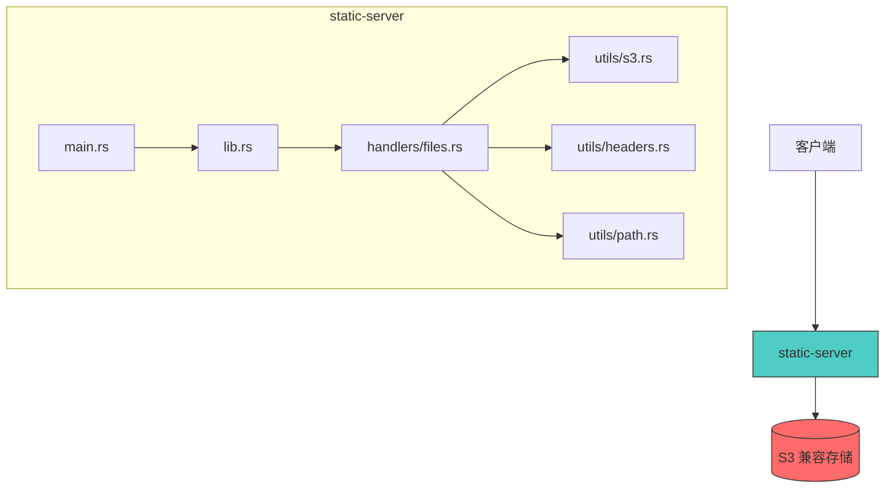
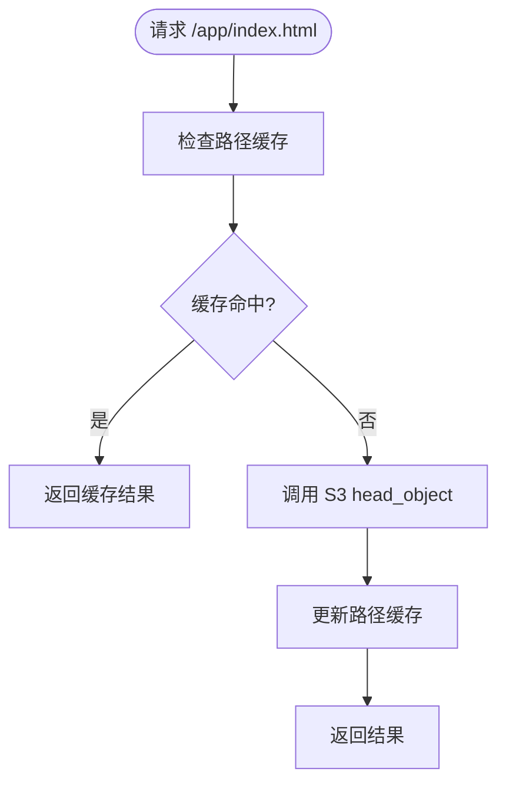
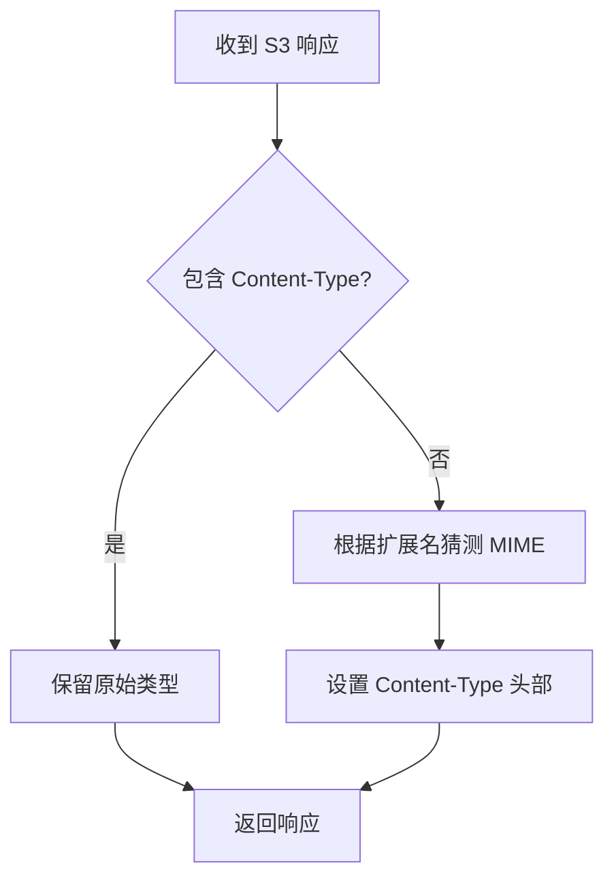
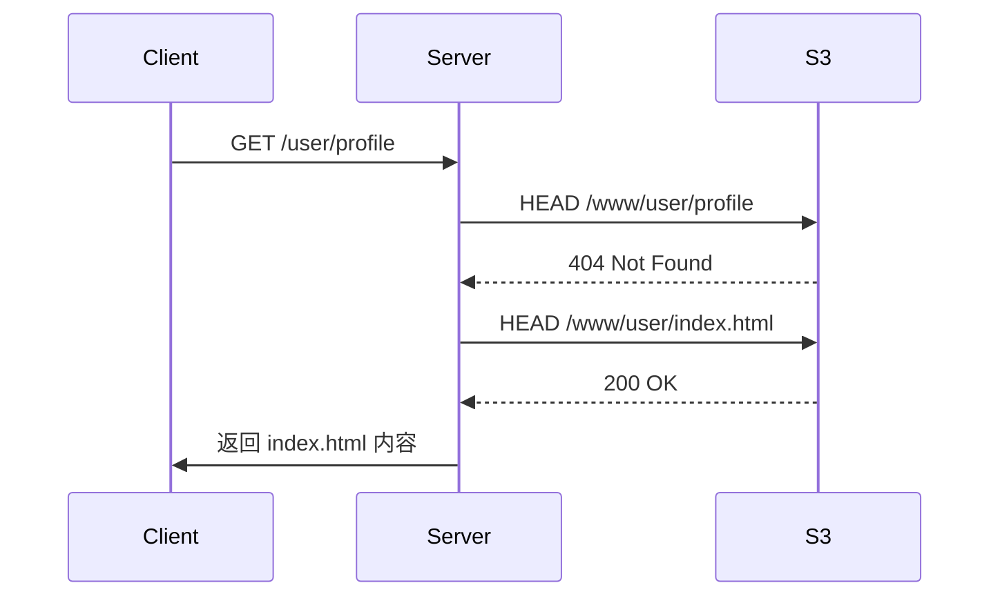

# 项目概述

<cite>
**本文档引用的文件**  
- [README.md](file://README.md)
- [Cargo.toml](file://Cargo.toml)
- [src/main.rs](file://src/main.rs)
- [src/lib.rs](file://src/lib.rs)
- [src/handlers/files.rs](file://src/handlers/files.rs)
- [src/utils/s3.rs](file://src/utils/s3.rs)
- [src/utils/headers.rs](file://src/utils/headers.rs)
- [src/utils/path.rs](file://src/utils/path.rs)
- [Dockerfile](file://Dockerfile)
- [build.ps1](file://build.ps1)
</cite>

## 目录

1. [简介](#简介)
2. [项目结构](#项目结构)
3. [核心功能与设计目标](#核心功能与设计目标)
4. [技术架构分析](#技术架构分析)
5. [智能缓存机制](#智能缓存机制)
6. [MIME类型自动检测](#mimetype自动检测)
7. [单页应用（SPA）路由支持](#单页应用spa路由支持)
8. [安全的预签名URL访问](#安全的预签名url访问)
9. [性能优化策略](#性能优化策略)
10. [支持的S3兼容服务](#支持的s3兼容服务)
11. [部署与运行方式](#部署与运行方式)
12. [典型应用场景](#典型应用场景)

## 简介

`static-server` 是一个基于 Rust 语言和 Axum 异步 Web 框架构建的高性能静态文件服务器，专为从 S3 兼容对象存储中提供静态资源而设计。该项目结合了现代云原生架构的最佳实践，具备异步处理、流式传输、多级缓存等特性，适用于前端应用托管、微前端资源分发等多种场景。

其核心设计理念是通过轻量级、高并发的 Rust 运行时，实现对大规模静态资源的高效、安全分发。项目支持 SPA 路由回退、智能缓存控制、MIME 类型自动识别以及基于 S3 预签名 URL 的安全访问机制，确保在复杂网络环境下仍能提供稳定可靠的服务。

**Section sources**  
- [README.md](file://README.md#L3-L15)

## 项目结构

项目采用模块化组织方式，代码结构清晰，职责分明：

```
src/
├── main.rs              # 应用入口点
├── lib.rs               # 应用配置与路由定义
├── handlers.rs          # 请求处理器模块声明
├── handlers/
│   └── files.rs         # 文件请求处理逻辑
├── utils.rs             # 工具函数模块声明
└── utils/
    ├── headers.rs       # HTTP 头部处理工具
    ├── path.rs          # 路径处理工具
    └── s3.rs            # S3 相关操作工具
```

此外，项目还包含 `Cargo.toml`（依赖管理）、`Dockerfile`（容器化构建）和 `build.ps1`（Windows 构建脚本），支持本地开发与容器化部署一体化流程。

**Section sources**  
- [README.md](file://README.md#L126-L142)

## 核心功能与设计目标

`static-server` 的设计初衷是解决现代前端应用在云环境下的静态资源托管难题。其主要功能包括：

- **S3 兼容存储支持**：可对接 AWS S3、阿里云 OSS、MinIO 等所有 S3 兼容服务。
- **SPA 路由支持**：自动回退到 `index.html`，支持前端路由。
- **智能缓存策略**：根据文件扩展名动态设置缓存策略。
- **MIME 类型自动检测**：当 S3 未返回 Content-Type 时自动推断。
- **预签名 URL 安全访问**：避免长期暴露访问密钥。
- **CORS 支持**：便于跨域资源访问。
- **流式传输**：支持大文件传输且内存占用低。

这些功能共同构成了一个适用于生产环境的静态资源服务解决方案。

**Section sources**  
- [README.md](file://README.md#L7-L13)

## 技术架构分析



**Diagram sources**  
- [src/main.rs](file://src/main.rs#L1-L26)
- [src/lib.rs](file://src/lib.rs#L1-L61)
- [src/handlers/files.rs](file://src/handlers/files.rs#L1-L293)

### 架构组件说明

- **main.rs**：程序入口，初始化日志与事件循环（Tokio）。
- **lib.rs**：构建 Axum 路由器，初始化 S3 和 HTTP 客户端，并注入共享状态。
- **handlers/files.rs**：核心请求处理器，负责文件查找、代理转发与响应构建。
- **utils/**：提供路径处理、头部过滤、MIME 推断等通用工具。

整个系统基于完全异步架构，所有 I/O 操作均非阻塞，极大提升了并发处理能力。

**Section sources**  
- [src/main.rs](file://src/main.rs#L1-L26)
- [src/lib.rs](file://src/lib.rs#L1-L61)

## 智能缓存机制

服务器实现了多层级缓存策略，以减少对 S3 的频繁调用并提升响应速度：

1. **内容缓存**：对 CSS、JS、图片等静态资源设置 30 天缓存（`Cache-Control: public, max-age=2592000`）。
2. **路径查找缓存**：使用 `cached` 宏对 `find_exists_key` 函数进行内存缓存，有效期 60 秒，容量 32768 条，显著降低 S3 `HEAD` 请求次数。
3. **预签名 URL 缓存**：对生成的预签名 URL 进行缓存，有效期 30 分钟，避免重复签名开销。

不缓存 `.html` 和 `.htm` 文件，防止 SPA 页面更新后缓存导致内容陈旧。



**Diagram sources**  
- [src/handlers/files.rs](file://src/handlers/files.rs#L206-L228)
- [src/utils/s3.rs](file://src/utils/s3.rs#L22-L28)

**Section sources**  
- [src/handlers/files.rs](file://src/handlers/files.rs#L79-L94)
- [src/utils/s3.rs](file://src/utils/s3.rs#L22-L28)

## MIME类型自动检测

当 S3 存储桶未正确设置 `Content-Type` 响应头时，服务器会根据文件扩展名自动推断 MIME 类型：

- 使用 `mime_guess` 库进行类型猜测。
- 支持数百种常见文件格式（如 `.css`, `.js`, `.png`, `.json` 等）。
- 仅在原始响应缺失 `Content-Type` 时补充，不影响已有设置。
- 确保浏览器能正确解析和渲染各类资源。

该机制增强了系统的健壮性，避免因存储配置不当导致资源加载失败。



**Diagram sources**  
- [src/handlers/files.rs](file://src/handlers/files.rs#L147-L152)
- [src/utils/headers.rs](file://src/utils/headers.rs#L34-L46)

**Section sources**  
- [src/handlers/files.rs](file://src/handlers/files.rs#L147-L152)
- [src/utils/headers.rs](file://src/utils/headers.rs#L34-L46)

## 单页应用（SPA）路由支持

为支持前端单页应用（如 React、Vue 等），服务器实现了智能回退机制：

1. 接收请求路径（如 `/dashboard/settings`）。
2. 尝试在 S3 中查找对应文件。
3. 若文件不存在（404），则查找第一级目录下的 `index.html`（如 `/www/dashboard/index.html`）。
4. 若存在，则返回该 `index.html`，由前端路由接管。

此机制确保前端路由在刷新或直接访问时仍能正常工作。



**Diagram sources**  
- [src/handlers/files.rs](file://src/handlers/files.rs#L230-L292)
- [README.md](file://README.md#L98-L105)

**Section sources**  
- [src/handlers/files.rs](file://src/handlers/files.rs#L230-L292)

## 安全的预签名URL访问

服务器通过 AWS SDK 为每个 S3 对象生成预签名 URL，实现安全访问：

- 预签名 URL 有效期为 1 小时（可配置）。
- 使用 `cached` 宏缓存签名结果，减少重复计算。
- 避免在客户端暴露长期有效的访问密钥。
- 支持所有 S3 兼容服务的身份验证机制。

该设计在保证安全性的同时，兼顾了性能与可用性。

**Section sources**  
- [src/utils/s3.rs](file://src/utils/s3.rs#L29-L46)

## 性能优化策略

`static-server` 采用多种技术手段优化性能：

- **异步架构**：基于 Tokio 运行时，所有操作非阻塞。
- **流式传输**：使用 `Body::from_stream(response.bytes_stream())` 实现大文件流式响应，避免内存溢出。
- **连接池**：`reqwest` 客户端自动管理 HTTP 连接复用。
- **多级缓存**：路径查找、预签名 URL、响应头部等均进行缓存。
- **头部过滤**：移除不必要的请求/响应头部，减少网络开销。

这些优化使得服务器在高并发场景下仍能保持低延迟和高吞吐。

**Section sources**  
- [src/handlers/files.rs](file://src/handlers/files.rs#L159-L166)
- [Cargo.toml](file://Cargo.toml#L7-L14)

## 支持的S3兼容服务

项目支持所有 S3 兼容的对象存储服务，包括：

- AWS S3
- 阿里云 OSS
- 腾讯云 COS
- 火山引擎 TOS
- MinIO（自建对象存储）
- 其他兼容 S3 API 的服务

通过配置 `AWS_ENDPOINT_URL` 和 `AWS_REGION`，可无缝切换不同服务商，具备良好的可移植性。

**Section sources**  
- [README.md](file://README.md#L117-L122)

## 部署与运行方式

### 本地运行

```bash
# 开发模式
cargo run

# 生产模式
cargo run --release
```

### Docker 部署

```bash
# 构建镜像
docker build -t static-server .

# 运行容器
docker run -p 3000:3000 static-server
```

项目采用多阶段构建策略，显著减小最终镜像体积。`build.ps1` 脚本还支持从容器中提取可执行文件，便于跨平台分发。

**Section sources**  
- [Dockerfile](file://Dockerfile#L1-L25)
- [build.ps1](file://build.ps1#L1-L18)
- [README.md](file://README.md#L62-L79)

## 典型应用场景

### 前端应用托管

将 React、Vue 等构建产物上传至 S3，通过 `static-server` 提供服务，支持 SPA 路由与缓存优化。

### 微前端架构资源分发

在微前端架构中，各子应用资源可独立部署至不同 S3 路径，由统一的 `static-server` 实例按需加载。

### 内部工具静态资源服务

为内部管理系统、文档站点等提供高性能、低延迟的静态资源访问服务。

### CDN 回源服务器

作为 CDN 的源站服务器，利用 S3 存储与预签名机制实现安全、可扩展的内容分发。